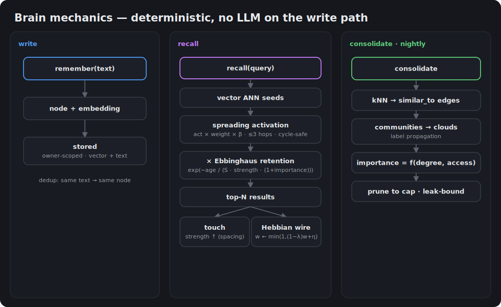
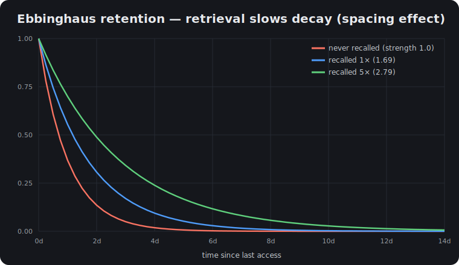

<p align="center">
  
</p>

# SNDR Core Engine

> **Genesis vLLM Patches** — runtime patch-overlay for vLLM on consumer NVIDIA
> Ampere / Ada / Blackwell.

[](LICENSE)
[](https://github.com/vllm-project/vllm)
[](docs/PATCHES.md)
[](CHANGELOG.md)
[](docs/memory/MANUAL.md)
[](docs/HARDWARE.md)

<!-- Topics for GitHub indexing/discovery (set via repo Settings → Topics):
     vllm · llm-inference · qwen · gemma · spec-decode · kv-cache-quantization ·
     gpu · cuda · memory · pgvector · rag · knowledge-graph · openai-api ·
     llm-proxy · obsidian · self-hosted · ampere · ada · blackwell -->

**Turn a consumer NVIDIA card into a production local-AI server.** SNDR Core
transforms the open-source [vLLM](https://github.com/vllm-project/vllm) engine
*in memory at boot* — no fork, no rebuild — so a frontier-class **35B** model runs
**~1.5× faster than stock vLLM**, with a **256K-token context** and tool-calling
that actually works, on hardware you can actually buy (A5000, RTX 4090 / 5090,
A6000 — and yes, the 3090). One paste installs it; a real **GUI Control Center**
drives it — no `docker` flags to memorize.

**Two products, one engine:** ⚙️ the runtime **vLLM patch-overlay** (faster
inference) **+** 🧠 a **persistent neural-graph memory** that makes every model —
local *and* cloud — remember and get smarter over time. Apache-2.0, self-hosted,
fully auditable. 324 patches across ~23 families.

## Get running — two commands

```bash
curl -sSL https://raw.githubusercontent.com/Sandermage/sndr_core_engine/main/install.sh | bash
sndr up          # auto-picks a preset for your GPU → downloads the model → launches → opens the GUI
```

That's it — `sndr up` detects your rig, downloads the weights (skipped if
present), starts the engine **and** the Control Center, and opens your browser.
Prefer the terminal? `sndr run` does the same and drops you straight into a chat
prompt. New here? Start with [`docs/GETTING_STARTED.md`](docs/GETTING_STARTED.md).

---

> 🚀 **New here?** → [`docs/GETTING_STARTED.md`](docs/GETTING_STARTED.md) — who it's for, what you get, and the one install line.
> 🧠 **New to local AI?** → [`docs/LOCAL_AI_PRIMER.md`](docs/LOCAL_AI_PRIMER.md) — GPUs, engines, MoE, and quants in plain English.
> 📖 **Hit an unfamiliar term** (TPS · KV · MTP · TurboQuant · GDN)? → [`docs/GLOSSARY.md`](docs/GLOSSARY.md).
> 💸 **Self-host or cloud?** → [`docs/COMPARISONS.md`](docs/COMPARISONS.md) — the cost-crossover trade.

## Why SNDR Core — what you get

| You get | How |
| --- | --- |
| **A frontier-class 35B model with 256K context on a card you can buy** | No A100/H100 needed — TurboQuant k8v4 KV-cache quant makes the context fit; consumer Ampere / Ada / Blackwell are first-class targets, not an afterthought. |
| **~1.5× the tokens/sec of stock vLLM — measured, not projected** | MTP speculative decode + surgical kernel/scheduler patches. Same wheel, transformed at boot. The numbers below are reproduced on a 2× A5000 rig. |
| **Tool-calling and agent workflows that don't break** | The speed patches keep function-call output clean — 7/7 on the 35B, 8/8 on the 27B in the tool-call harness. |
| **A long-term memory for every model — local *and* cloud** | A brain-like neural-graph memory in one CPU container: recall by meaning, self-organizing "clouds", human-like decay/reinforcement. Zero GPU on the hot path. |
| **Nothing to memorize — one paste, then a real GUI** | `install.sh` + `sndr up` gets you a running server; the Control Center drives launch, live patch summary, benches, remote hosts, and the memory graph. |
| **Never stuck on a stale fork** | It is the *same* upstream vLLM wheel, patched in memory — and each patch removes itself the moment upstream merges the underlying fix. |
| **Fully yours** | Apache-2.0, self-hosted, every applied patch logged and auditable. No black box; nothing phones home. |

## What it is

A **drop-in runtime patcher** for vLLM. It pins to a specific vLLM nightly
commit and applies 324 small, surgical changes — text edits at known anchors,
class-rebind wrappers, and FastAPI middleware — that together turn an
out-of-the-box vLLM into a production-grade Qwen3.6 inference server on
*consumer* NVIDIA hardware (A5000, RTX 4090 / 5090, A6000, 3090, …) where vLLM
upstream mostly targets datacenter SKUs.

It is **not** a fork of vLLM, a quantizer, a new inference engine, or a
training framework. Patches retire automatically when upstream merges the
underlying fix.

## How it works

**The overlay / apply model.** Genesis never edits vLLM on disk. At every
process start the plugin registers via vLLM's `vllm.general_plugins` entry
point (loaded in the main process, the engine, and every worker rank) and
the dispatcher walks `PATCH_REGISTRY`. Each patch declares an `applies_to`
version range and an apply method — a **text edit at a unique source
anchor**, a **class-rebind wrapper**, or **FastAPI middleware**. Patches
whose anchors match and whose range covers the live pin apply; the rest
print `[SKIP — applies_to mismatch]` and no-op. The result is an in-memory
overlay: the same wheel, transformed at boot, with a structured apply
summary (`applied=N skipped=M failed=0`) and an audit trail. Nothing is
written to the vLLM package tree.

**Patch families.** The 324 entries group into ~23 canonical families. The
largest: `attention.turboquant` (k8v4 KV-cache quant), `spec_decode` (MTP /
ngram speculative decoding), `attention.gdn` (hybrid Gated-DeltaNet linear
attention), `gemma4` (Gemma-4 enablement), `kv_cache`, `compile_safety`,
`worker`, `serving`, `tool_parsing`, and `moe`. The full table is
[`docs/PATCHES.md`](docs/PATCHES.md) (curated) +
[`docs/PATCHES_AUTO.md`](docs/PATCHES_AUTO.md) (generated from the registry).

**Pin lifecycle.** Genesis pins to one canonical vLLM nightly at a time,
plus an optional previous pin held for rollback during validation — at most
two ("≤2-pin policy"). A bump happens only on an explicit instruction
naming the target pin; there are **no proactive pulls**. The candidate is
validated before promotion (anchor-drift resolved, the `bump-preflight`
gate clean, boot-smoke + tokenizer-fingerprint + canonical bench), then the
old 2-back pin is dropped. Current: `dev714` (`09663abde`); rollback:
`dev672` (`93d8f834`). See [`docs/PIN_BUMP_PLAYBOOK.md`](docs/PIN_BUMP_PLAYBOOK.md)
(canonical) + [`docs/ANCHOR_SOT.md`](docs/ANCHOR_SOT.md).

**Model catalog (current registry).**

| Model | Quant | KV cache | Spec-decode | Status |
| --- | --- | --- | --- | --- |
| Qwen3.6-35B-A3B-FP8 | FP8 dense MoE | TurboQuant k8v4 | MTP K=5 | ✅ PROD (default) |
| Qwen3.6-27B-int4-AutoRound | INT4 AutoRound (hybrid GDN+Mamba) | TurboQuant k8v4 | MTP K=4 | ✅ PROD |
| Gemma-4-31B | INT4 / kv-auto | TurboQuant or uniform fp16 | MTP K=3 (separate drafter) | ⚙️ boots + patches apply; serving needs MM-budget config |
| DiffusionGemma-26B-A4B-FP8 | FP8-dynamic block-diffusion MoE | TP=2 | — | ✅ serving at TP=2 |

Per-model deep-dives + the V2 layered config system:
[`docs/MODELS.md`](docs/MODELS.md). Hardware envelope:
[`docs/HARDWARE.md`](docs/HARDWARE.md).

**Launching.** Boot any model through a preset — the launcher resolves the
preset, runs preflight, and renders the `docker run` (or podman / bare-metal
/ k8s) command for you with the correct pin, mounts, and env:

```bash
sndr launch prod-qwen3.6-35b-balanced            # boot a preset
sndr launch prod-qwen3.6-35b-balanced --dry-run  # inspect the rendered command, no boot
```

Full operator manual: [`docs/USAGE.md`](docs/USAGE.md).

## Headline numbers (v12.0.0 current registry)

Reference rig: **2× RTX A5000 24 GB** (Ampere SM 8.6), driver 580.142,
CUDA 13.0.2, TurboQuant k8v4, TP=2 (35B at MTP K=5; 27B at MTP K=4 — the max
coherent K for its INT4 tool-calls).

| Model | Stock vLLM | Genesis | Δ |
| --- | ---: | ---: | ---: |
| Qwen3.6-35B-A3B-FP8 (single-conc, K=5) | ~157 t/s | **239.7 t/s** | +53 % |
| Qwen3.6-35B-A3B-FP8 (8-way multi-conc, K=3) | n/a | **~672 t/s agg** | 8-way scaling |
| Qwen3.6-27B-int4-AutoRound (single-conc, K=4) | ~87 t/s | **~125 t/s** | +44 % |
| Tool-call clean rate (35B / 27B) | 2–6 / 10 | **7/7 · 8/8** | qualitative |

256K context hardware-verified on both models. Full methodology, historical
comparisons, and per-rig reproduction recipes:
[`docs/BENCHMARKS.md`](docs/BENCHMARKS.md).


> **Current pin (2026-07-03):** vLLM `0.23.1rc1.dev714+g09663abde` (commit
> `09663abde`, image `vllm/vllm-openai:nightly-09663abde…`). Per the ≤2-pin
> policy, `dev672` (`0.23.1rc1.dev672+g93d8f834d`, commit `93d8f834`) is retained
> as the rollback pin; `dev424` is **dropped**. dev714 was validated in a live
> 35B window (boot apply failed=0, decode within CV of dev672, tool-call 7/7) —
> see [`docs/PIN_BUMP_PLAYBOOK.md`](docs/PIN_BUMP_PLAYBOOK.md) (canonical) and
> [`docs/ANCHOR_SOT.md`](docs/ANCHOR_SOT.md). The per-model bench table below is
> the canonical dev148 K-tune cycle, carried forward across each subsequent bump
> with no decode regression (anchor regen confirmed at each).

### Validated rig baseline — 2026-06-19 (measured on pin `0.23.1rc1.dev148+gb4c80ec0f`)

Full model-cycle re-test on the reference 2× A5000 rig after the MTP K=3→K=5 re-tune. These are
the canonical sustained-bench numbers; the pin has since bumped dev148 → dev301 → dev424 → dev672
→ **dev714** (current) with the decode results carried forward (no regression — anchor regen
confirmed at each bump). Each model boots the Genesis apply pipeline, applies its patch set, and is
benchmarked / smoke-tested live (`tools/genesis_bench_suite.py`, single-stream warm sweep). The 35B
and 27B single-stream rows are the dev148 K=5 re-tune record; Gemma stays K=3 (its separate drafter
is optimal at K=3). **Note:** the live 27B config has since moved to **MTP K=4** — the max coherent
K for its INT4 tool-calls (K=5 emitted unparseable tool-call tokens on dev714); K=4 warm decode is
~125 t/s, within CV of the K=5 record below.

| Model | Quant / KV | Patches | Decode TPS | Tool-call | Status |
| --- | --- | ---: | ---: | :---: | --- |
| Qwen3.6-35B-A3B-FP8 | FP8 dense · TQ k8v4 · MTP K=5 | 95 | **239.7** (CV 4.9 %) | 7/7 | ✅ serving — +15.8 % vs K=3 |
| Qwen3.6-27B-int4-AutoRound | INT4 AutoRound · TQ k8v4 · MTP K=5 *(dev148 record; live now K=4)* | 93 | **127.4** (CV 8.3 %) | 7/7 | ✅ serving — +8.2 % vs K=3 |
| Gemma-4-31B | INT4 · TQ k8v4 · MTP K=3 | 81 | — | — | ⚙️ boots + patches apply; serving needs MM-budget config (multimodal-bidirectional × spec-decode) |
| DiffusionGemma-26B-A4B-FP8 | FP8-dynamic · block-diffusion · TP=2 | 45 | coherent | — | ✅ **serving at TP=2** — `PN-FP8MOE-KPAD` (Marlin N=352) + `G4_26` (TP-vocab soft-embed); enforce-eager · max-num-seqs 2 · gpu-util 0.80 |

The 35B and 27B clear their historical peak band — the K=5 re-tune lifts single-stream decode
to 239.7 / 127.4 t/s (+15.8 % / +8.2 % vs K=3) within CV → the v12 platform carries **no decode
regression**. `PN-FP8MOE-KPAD` (backport of open vLLM
PR [#45703](https://github.com/vllm-project/vllm/pull/45703), model-agnostic Marlin-MoE
intermediate-pad) plus `G4_26` (backport of [#45774](https://github.com/vllm-project/vllm/pull/45774),
DiffusionGemma TP>1 vocab-sharded soft-embed all-gather) make
**DiffusionGemma the first block-diffusion FP8-MoE checkpoint to boot AND serve coherently
at TP=2 on consumer Ampere** without a kernel rebuild — validated 2026-06-17 (clears the
Marlin N=352 thread-tile crash, then the `probs @ embed_weight` `[131072,2816]` TP-vocab
shape mismatch; the coherent generation confirms the soft-embed all-gather yields correct
TP=2 output).

## 🧠 Persistent Memory — neural-graph (new in v12)

A brain-like **persistent memory** that makes every model — the internal vLLM
engines **and** external models behind your proxy — smarter over time. Knowledge
is stored as a graph whose nodes auto-form connections and cluster into "clouds"
(like Obsidian), is recalled by vector similarity **plus** spreading activation
across the graph, and **decays / reinforces like human memory**. It ships as one
**CPU-only container** (Postgres + pgvector + API + GUI + gateway) — the GPU
engines are untouched.

<p align="center">
  
</p>

**By the numbers (v12, all verified):** 2 storage backends (in-memory + Postgres/
pgvector) proven *identical* in CI · real CPU embedder (Model2Vec) semantic match
**0.85** related vs **0.01** unrelated · ~100 unit tests + a leak-soak, run on both
backends (Postgres against a live pgvector in CI) · one container · zero GPU on the
hot path.

<p align="center">
  
</p>

**The brain mechanics** (deterministic, no per-write LLM):

<p align="center">
  
</p>

<p align="center">
  
</p>

**Tuned constants** (one source of truth, `sndr/memory/model.py`; both backends identical):

| Mechanic | Formula | Constant |
|---|---|---|
| Hebbian co-access | `w ← min(1, (1−λ)·w + η)` | η = 0.02 · λ = 0.995 |
| Ebbinghaus decay | `R = exp(−age / (S·strength·(1+importance)))` | S = 86 400 s |
| Strength reinforce | `strength = 1 + ln(1 + access_count)` | (unbounded, log) |
| Spreading activation | `act × weight × β` per hop | β = 0.5 · depth ≤ 3 |
| Semantic auto-link | kNN cosine ≥ τ → `similar_to` | τ = 0.8 |

| Capability | What it does |
|---|---|
| **Storage** | Postgres + pgvector (HNSW ANN + lexical GIN); pure-stdlib in-memory reference backend (identical results, CI-verified) |
| **Recall** | vector ANN seeds → bounded, cycle-safe spreading activation over the graph, blended with decay; operator-tunable **limit** + **expand-depth** |
| **Brain mechanics** | Hebbian co-access, Ebbinghaus decay + **strength reinforcement** (spacing effect), communities ("clouds"), importance, bi-temporal edge invalidation |
| **Search** | `vector` · `keyword` · `hybrid` (catches exact terms / names / IDs) |
| **Universal augment** | OpenAI-compatible **gateway**: recall → inject (plain-text system block) → forward → capture, for **any** model. Multi-upstream — choose per request (`X-Memory-Upstream`) |
| **Ingest** | **Obsidian** vault import (notes → nodes, `[[wikilinks]]` → edges, `#tags`), path-confined; wikilinks resolve case-insensitively and by H1 title, not just exact filename |
| **Manage** | remember · **forget** (delete node + its edges, owner-scoped) · **export** (whole graph → JSON backup) · **import** (Obsidian vault) — all from the GUI or CLI |
| **GUI** | Obsidian-like force-directed graph (Sigma.js + ForceAtlas2): nodes colored by community, sized by importance. Toolbar shows nodes/edges/**communities**; List⇄Graph toggle; recall with operator **limit** + **expand-depth**; node-detail card with importance/strength/cloud badges + typed connections; Forget/Export/Import actions |
| **Embedders** | `Model2Vec` (real static CPU, 256-dim, no torch) · `HashEmbedder` (dependency-free) |
| **CLI** | `sndr mem remember\|recall\|search\|stats` (+ TUI Memory panel) — same engine, no GUI required |
| **Ops** | API-key auth · owner-scoping · auto consolidate + prune (**leak-bounded**) · graceful Postgres-down fallback · upstream-error 502/504 |

**Use it** (one container) — point any OpenAI client at the gateway and it gains memory:

```bash
docker build -f deploy/memory/Dockerfile -t genesis-memory:dev .
docker run -d --name genesis-memory -p 8811:8800 \
  -e GENESIS_MEMORY_EMBEDDER=model2vec -e GENESIS_MEMORY_API_KEY="$(openssl rand -base64 24)" \
  -e GATEWAY_UPSTREAMS='{"local":{"url":"http://vllm:8102/v1","key":"…"},"cliproxy":{"url":"http://cliproxyapi:8317/v1","key":"…"}}' \
  -v genesis_memory_pgdata:/var/lib/postgresql/data genesis-memory:dev

curl -s localhost:8811/api/v1/memory/remember -H 'X-Owner-Id:1' -H 'Authorization:Bearer …' \
  -H content-type:application/json -d '{"text":"the deploy server is 192.0.2.10:8811"}'
```

**GUI — Memory panel** (Control Center → Engine → 🧠 Memory; served same-origin).
Real screenshots of the live Control Center (dark theme, captured from `:8811`):

<p align="center">
  
</p>

<p align="center">
  
</p>

Full operational + developer reference (architecture, every endpoint, config,
security, deployment, troubleshooting, examples): **[`docs/memory/MANUAL.md`](docs/memory/MANUAL.md)**.

## Pick your path

| You have | Start here |
| --- | --- |
| **1× consumer card** (A5000 / 4090 / 5090 / 3090) | [`docs/SINGLE_CARD.md`](docs/SINGLE_CARD.md) |
| **2× cards** (TP=2 — the reference topology) | [`docs/HARDWARE.md`](docs/HARDWARE.md) + [`docs/MODELS.md`](docs/MODELS.md) |
| **A model not in the catalog** | [`docs/MODELS.md`](docs/MODELS.md) (add-a-model + the V2 config system) |
| **Brand-new / weighing self-host vs cloud** | [`docs/GETTING_STARTED.md`](docs/GETTING_STARTED.md) · [`docs/COMPARISONS.md`](docs/COMPARISONS.md) |

## Install & run

```bash
# 1. install — detects OS / Python / GPU / vLLM, installs the plugin + `sndr` CLI
curl -sSL https://raw.githubusercontent.com/Sandermage/sndr_core_engine/main/install.sh | bash

# 2. run — auto-picks a preset for your GPU, downloads the model, launches, opens the GUI
sndr up            # …or `sndr run` for a terminal chat prompt instead of the GUI
```

`sndr up` and `sndr run` both **download the model if it isn't already present**
(skipped when it is), so step 2 is genuinely one command. Want to see the plan
first? Add `--dry-run`. Pick a named preset with `sndr up <preset>` (browse them
with `sndr preset list`).

Five-minute walk-through + Day-1 acceptance: [`docs/QUICKSTART.md`](docs/QUICKSTART.md).
A different vLLM pin, workload, or non-interactive flag set:
[`docs/INSTALL.md`](docs/INSTALL.md).

## Documentation map

| If you want to... | Read |
| --- | --- |
| One-page operator manual (installer → launcher → configs → patches) | [`docs/USAGE.md`](docs/USAGE.md) |
| 🧠 Persistent memory — full reference (API, gateway, embedders, Obsidian, deploy) | [`docs/memory/MANUAL.md`](docs/memory/MANUAL.md) |
| Install + first boot | [`docs/INSTALL.md`](docs/INSTALL.md) → [`docs/QUICKSTART.md`](docs/QUICKSTART.md) |
| Browse `sndr` commands | [`docs/CLI_REFERENCE.md`](docs/CLI_REFERENCE.md) |
| Pick a model + hardware combo | [`docs/MODELS.md`](docs/MODELS.md) + [`docs/HARDWARE.md`](docs/HARDWARE.md) |
| Tune an env-var flag | [`docs/CONFIGURATION.md`](docs/CONFIGURATION.md) |
| Browse the patch catalogue + compatibility matrix | [`docs/PATCHES.md`](docs/PATCHES.md) |
| Diagnose an OOM, cliff, or boot failure | [`docs/TROUBLESHOOTING.md`](docs/TROUBLESHOOTING.md) |
| Roll a broken release back | [`docs/TROUBLESHOOTING.md`](docs/TROUBLESHOOTING.md) |
| See current bench numbers + reproduce | [`docs/BENCHMARKS.md`](docs/BENCHMARKS.md) |
| Author a patch or community plugin | [`docs/CONTRIBUTING.md`](docs/CONTRIBUTING.md) |
| Sponsorship / hardware loan / business invoicing | [`docs/SPONSORS.md`](docs/SPONSORS.md) |
| Disclose a security issue | [`SECURITY.md`](SECURITY.md) |

Full docs index: [`docs/README.md`](docs/README.md).

## Repository structure

The layout separates the shippable engine from the maintainer tooling and
vendored third-party code, so the published wheel stays small and the apply
pipeline stays auditable.

| Path | What it is |
| --- | --- |
| [`sndr/`](sndr) | The engine. The `PATCH_REGISTRY` + dispatcher, the apply pipeline (text-anchor / class-rebind / middleware patchers), per-engine patch sets (`sndr/engines/vllm/...`), the V2 layered model-config system, the universal launcher, the CLI (`sndr`/`genesis`), and the read-only product API the GUI consumes. This is the only tree the Apache wheel ships. |
| [`gui/`](gui) | The control center — a desktop/web front-end (`gui/web`, `gui/desktop`) that drives the `sndr` product API: launch presets, inspect the live apply summary, browse the patch catalogue, run benches, manage remote hosts, **and the 🧠 Memory graph panel**. Built static assets are served by the product API. |
| [`sndr/memory/`](sndr/memory) | The **persistent neural-graph memory engine** — storage interface + in-memory & Postgres/pgvector backends, embedders, the brain mechanics (recall / Hebbian / decay / communities / prune), the `ConversationMemory` augment-capture middleware, the HTTP client, and the Obsidian importer. Exposed via `sndr/product_api/routes/{memory,gateway}.py`. See [`docs/memory/MANUAL.md`](docs/memory/MANUAL.md). |
| [`deploy/memory/`](deploy/memory) | The unified **genesis-memory** container (Postgres + pgvector + product-API + GUI + gateway in one image) — `Dockerfile`, `entrypoint.sh`, README. |
| [`tests/`](tests) | The pytest suite (13k+ collected). Unit tests per subsystem under `tests/unit/...`, contract/bundle/proof tests, and the load-bearing CI gate. Excluded from the wheel. |
| [`docs/`](docs) | All public documentation (USAGE, INSTALL, MODELS, HARDWARE, PATCHES, BENCHMARKS, the pin-bump playbook, anchor SOT, …). `docs/README.md` is the index. |
| [`scripts/`](scripts) + [`tools/`](tools) | Maintainer tooling — the audit gates (`make gates`), doc-sync / link / attribution / drift checkers, anchor-SOT regeneration, bench harnesses, and pin-bump preflight. Not shipped in the wheel. |
| [`third_party/`](third_party) | Vendored upstream kernel source (a curated subset of TurboMind's int4 grouped-MoE GEMM, used by the experimental `G4_85` MoE kernel patch). See [`third_party/tm_int4_moe/README.md`](third_party/tm_int4_moe/README.md) for provenance + license. |
| [`compose/`](compose) | Reference `docker-compose` files for the canonical prod presets (35B / 27B, single- and multi-concurrency, long-context). |
| [`benchmarks/`](benchmarks) + [`evidence/`](evidence) | Bench harness/data and per-patch proof artefacts (`evidence/patch_proof/`) plus the A/B validation evidence the registry cites for default-on/off decisions. |
| [`schemas/`](schemas) + [`plugins/`](plugins) + [`assets/`](assets) + [`release/`](release) | JSON schemas (patch-entry, config), community plugin samples, README/chart/logo assets, and release artefacts (SBOM, constraints). |
| `pyproject.toml` | Single source of truth for packaging **and** all tool config — `[tool.pytest.ini_options]`, `[tool.ruff]`, `[tool.mypy]`, and the setuptools package layout. |
| `Makefile` | The maintainer entry point: `make gates` (CI gates), `make test`, `make docs`, `make gui-build`, pin-bump preflight, audits. |

## Contributing

Bug reports, new patches with empirical evidence, new model recipes, and
cross-rig bench reports are all welcome. The full workflow (anchor
conventions, lifecycle ratchet, pin-bump playbook, PR template) is in
[`docs/CONTRIBUTING.md`](docs/CONTRIBUTING.md). Security disclosures go
through [`SECURITY.md`](SECURITY.md).

## Ecosystem / Related

- **[vLLM](https://github.com/vllm-project/vllm)** — the upstream engine SNDR
  Core patches. Genesis is an overlay, not a fork; each patch retires as
  upstream merges the underlying fix.
- **[Hugging Face](https://huggingface.co)** — where the model weights the
  presets pull come from.
- A community multi-engine recipe hub cross-references Genesis as its canonical
  deep-dive for the TurboQuant + MTP vLLM path.

## Credits + license

Apache-2.0 (see [`LICENSE`](LICENSE)). Per-patch attribution and upstream
PR linkage in [`docs/CREDITS.md`](docs/CREDITS.md).

Author: Sandermage (Aleksandr Barzov), Odessa, Ukraine.
Sponsorship channels (voluntary, no obligations) and hardware-loan
contact: [`docs/SPONSORS.md`](docs/SPONSORS.md).
