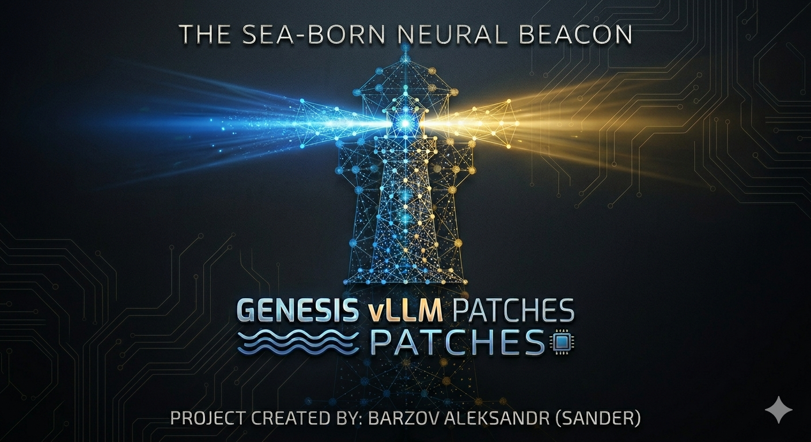

<p align="center">
  
</p>

# Genesis vLLM Patches

[](LICENSE)
[](https://github.com/vllm-project/vllm)
[](docs/PATCHES.md)
[](CHANGELOG.md)
[](docs/HARDWARE.md)

**Runtime patches for [vLLM](https://github.com/vllm-project/vllm) — Qwen3.6-class
inference on consumer NVIDIA Ampere / Ada / Blackwell with TurboQuant k8v4 KV
cache, MTP K=3 spec-decode, tool-calling, and 256K-class context. 230 patches
across 23 families. Apache 2.0.**

---

## What it is

A **drop-in runtime patcher** for vLLM. It pins to a specific vLLM nightly
commit and applies 254 small, surgical changes — text edits at known anchors,
class-rebind wrappers, and FastAPI middleware — that together turn an
out-of-the-box vLLM into a production-grade Qwen3.6 inference server on
*consumer* NVIDIA hardware (3090, 4090, 5090, A5000, A6000, …) where vLLM
upstream mostly targets datacenter SKUs.

It is **not** a fork of vLLM, a quantizer, a new inference engine, or a
training framework. Patches retire automatically when upstream merges the
underlying fix.

## Headline numbers (v12.0.0 current registry)

Reference rig: **2× RTX A5000 24 GB** (Ampere SM 8.6), driver 580.142,
CUDA 13.0.2, MTP K=3 + TurboQuant k8v4, TP=2.

| Model | Stock vLLM | Genesis (v12.0.0) | Δ |
| --- | ---: | ---: | ---: |
| Qwen3.6-35B-A3B-FP8 (single-conc) | ~157 t/s | **216 t/s** | +38 % |
| Qwen3.6-35B-A3B-FP8 (8-way multi-conc) | n/a | **~675 t/s agg** | 3.21× scaling |
| Qwen3.6-27B-int4-AutoRound | ~87 t/s | **133 t/s** | +52 % |
| Tool-call clean rate (35B / 27B) | 2–6 / 10 | **7/7 · 8/8** | qualitative |

256K context hardware-verified on both models. Full methodology, historical
comparisons, and per-rig reproduction recipes:
[`docs/BENCHMARKS.md`](docs/BENCHMARKS.md).


## Quick install

```bash
curl -sSL https://raw.githubusercontent.com/Sandermage/genesis-vllm-patches/main/install.sh | bash
```

The installer detects your OS / Python / GPU / vLLM presence, clones into
`~/.sndr/`, installs the plugin, writes a tailored launch script, and runs a
60-second smoke test. Five-minute walk-through and Day-1 acceptance steps:
[`docs/QUICKSTART.md`](docs/QUICKSTART.md).

To pick a different vLLM pin, workload, or non-interactive flag set:
[`docs/INSTALL.md`](docs/INSTALL.md).

## Documentation map

| If you want to... | Read |
| --- | --- |
| One-page operator manual (installer → launcher → configs → patches) | [`docs/USAGE.md`](docs/USAGE.md) |
| Install + first boot | [`docs/INSTALL.md`](docs/INSTALL.md) → [`docs/QUICKSTART.md`](docs/QUICKSTART.md) |
| Browse `sndr` commands | [`docs/CLI_REFERENCE.md`](docs/CLI_REFERENCE.md) |
| Pick a model + hardware combo | [`docs/MODELS.md`](docs/MODELS.md) + [`docs/HARDWARE.md`](docs/HARDWARE.md) |
| Tune an env-var flag | [`docs/CONFIGURATION.md`](docs/CONFIGURATION.md) |
| Browse the patch catalogue + compatibility matrix | [`docs/PATCHES.md`](docs/PATCHES.md) |
| Diagnose an OOM, cliff, or boot failure | [`docs/TROUBLESHOOTING.md`](docs/TROUBLESHOOTING.md) |
| Roll a broken release back | [`docs/TROUBLESHOOTING.md`](docs/TROUBLESHOOTING.md) |
| See current bench numbers + reproduce | [`docs/BENCHMARKS.md`](docs/BENCHMARKS.md) |
| Author a patch or community plugin | [`docs/CONTRIBUTING.md`](docs/CONTRIBUTING.md) |
| Sponsorship / hardware loan / business invoicing | [`docs/SPONSORS.md`](docs/SPONSORS.md) |
| Disclose a security issue | [`SECURITY.md`](SECURITY.md) |

Full docs index: [`docs/README.md`](docs/README.md).

## Contributing

Bug reports, new patches with empirical evidence, new model recipes, and
cross-rig bench reports are all welcome. The full workflow (anchor
conventions, lifecycle ratchet, pin-bump playbook, PR template) is in
[`docs/CONTRIBUTING.md`](docs/CONTRIBUTING.md). Security disclosures go
through [`SECURITY.md`](SECURITY.md).

## Credits + license

Apache-2.0 (see [`LICENSE`](LICENSE)). Per-patch attribution and upstream
PR linkage in [`docs/CREDITS.md`](docs/CREDITS.md).

Author: Sandermage (Aleksandr Barzov), Odessa, Ukraine.
Sponsorship channels (voluntary, no obligations) and hardware-loan
contact: [`docs/SPONSORS.md`](docs/SPONSORS.md).
