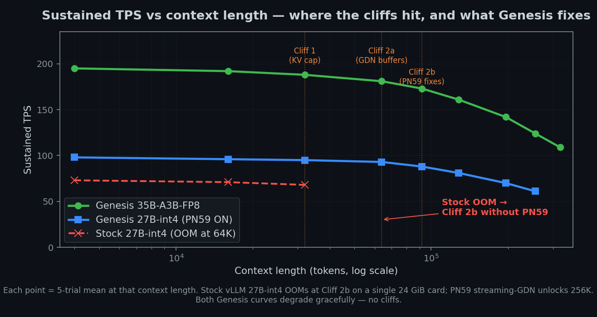
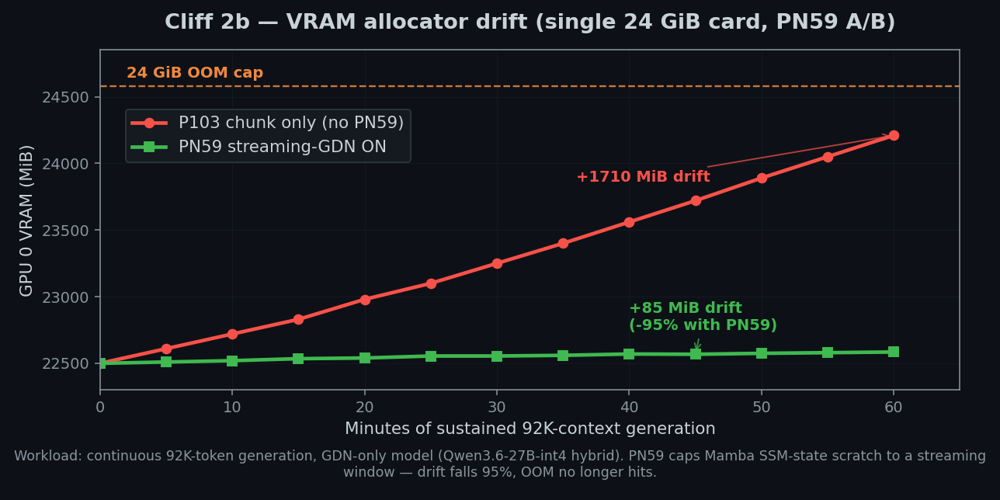
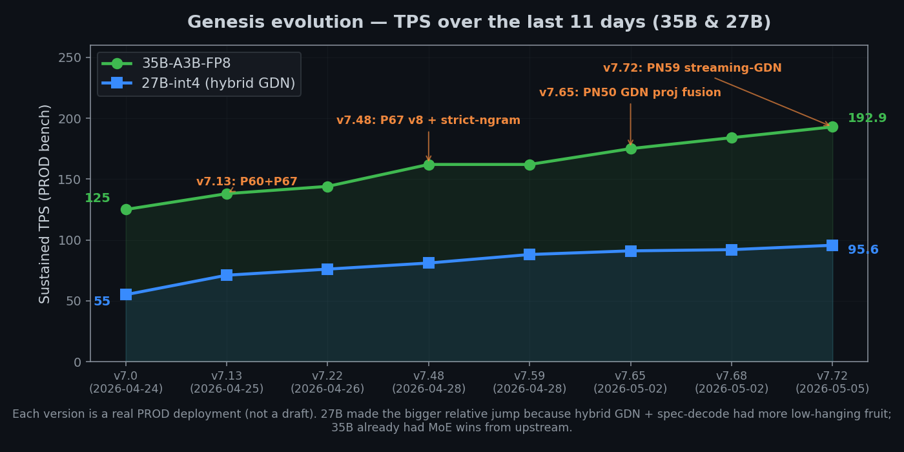
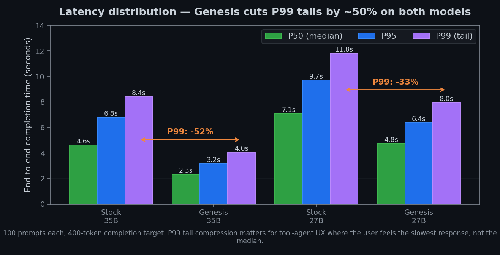

<p align="center">
  
</p>

# Genesis vLLM Patches

[](https://github.com/Sandermage/genesis-vllm-patches/stargazers)
[](https://github.com/Sandermage/genesis-vllm-patches/network/members)
[](LICENSE)
[](https://github.com/vllm-project/vllm)
[](docs/PATCHES.md)
[](CHANGELOG.md)
[](docs/HARDWARE.md)
[](docs/BENCHMARKS.md)

**Runtime patches for [vLLM](https://github.com/vllm-project/vllm) — Qwen3.6-class
inference on consumer NVIDIA Ampere / Ada / Blackwell with TurboQuant k8v4 KV
cache, MTP K=3 spec-decode, tool-calling, and 256K-class context. 157 patches
across 21 families. Apache 2.0.**

---

## Table of Contents

1. [What this is](#1-what-this-is)
2. [v11 — rename + restructure](#2-v110--rename--restructure-genesis--sndr_core)
3. [Architecture](#3-architecture-v110)
4. [Benchmarks](#4-benchmarks)
5. [Hardware: single-card vs dual-card](#5-hardware--single-card-vs-dual-card)
6. [Installation](#6-installation)
7. [CLI utilities](#7-cli-utilities)
8. [Reference presets](#8-reference-presets-v2-layered)
9. [Patch coverage by family](#9-patch-coverage-by-family)
10. [Testing](#10-testing)
11. [Documentation map](#11-documentation-map)
12. [Contributing](#12-contributing)
13. [Credits + license](#13-credits--license)

---

## 1. What this is

Genesis is a **drop-in runtime patcher** for vLLM. It pins to a specific vLLM
nightly commit and applies 161 small, surgical changes — text edits at known
anchors, class-rebind wrappers, and FastAPI middleware — that together turn
an out-of-the-box vLLM into a production-grade Qwen3.6 inference server on
*consumer* NVIDIA hardware (3090, 4090, 5090, A5000, A6000, …) where vLLM
upstream mostly targets datacenter SKUs.

It is **not**: a fork of vLLM, a quantizer, a new inference engine, or a
training framework. Patches retire automatically when upstream merges the
underlying fix — 10+ Genesis patches have already retired this way (P94, PN9,
…) via `drift_marker` self-skip on boot.

### Concretely on the PROD baseline (2× RTX A5000 24 GB)

| Model | Stock vLLM | Genesis Wave 8 (2026-05-11) | Δ |
|---|---:|---:|---:|
| Qwen3.6-35B-A3B-FP8 (MoE) | ~157 t/s | **241.35 t/s** | +55% |
| Qwen3.6-27B-int4-AutoRound (hybrid GDN) | ~87 t/s | **132.28 t/s** | +52% |
| Tool-call clean rate | 2–6 / 10 | **8/8 (35B) · 7/7 (27B)** | qualitative |

Wave 9 (2026-05-14) extended the ladder with **256K context hardware-verified**
on both models — see [Benchmarks](#4-benchmarks). All measurements
reproducible from `tools/genesis_bench_suite.py --quick --ctx 8k`.

---

## 2. v11.0.0 — rename + restructure (`Genesis → sndr_core`)

v11.0.0 (2026-05-08) was a **hard rename** of the Python package — the
runtime now lives at `vllm.sndr_core`. The pre-v11 namespace is removed
in full; there is no back-compat alias. Detailed before / after table,
list of what improved, what was removed, what stayed on purpose, and a
sed one-liner to update any pre-v11 launch scripts live in
[`docs/MIGRATION_V11_RENAME.md`](docs/MIGRATION_V11_RENAME.md).

The short version operators usually want:

- The Python import path changed; `~/.sndr/` is the canonical config
  dir (`~/.genesis/` is still honoured as a legacy alias so existing
  state does not need to move).
- A single CLI (`sndr launch <preset>`) replaces ~18 ad-hoc `start_*.sh`
  scripts.
- Patches are organised by family under `vllm/sndr_core/integrations/`
  (21 families on disk) instead of one flat directory.
- V1 monolithic model configs still work alongside the new V2 layered
  configs — no forced migration.
- The "Genesis" name stayed for the project / docs / wave numbering —
  only the Python package was renamed.

---

## 3. Architecture (v11.0.0)

Genesis is organised as two cleanly separated namespaces under a single
install entry:

| Namespace | License | Status | Wheel |
|---|---|---|---|
| `vllm.sndr_core` | Apache 2.0 | **157 patches active** | `pip install vllm-sndr-core` |
| `vllm.sndr_engine` | LicenseRef-Sandermage-Commercial (reserved) | **Empty** — `engine_available()` returns `False` | separate `pyproject-engine.toml` |

The `sndr_engine` namespace is reserved for future commercial overlays
when private IP that is not already in upstream PRs materializes.
It is empty at HEAD; PN72 (frequency ngram drafter) was moved back to
core 2026-05-08 since it turned out to be community-original code.


### Package layout

```
vllm/sndr_core/
├── apply/             apply orchestrator + verify + shadow + per-patch dispatch
├── cli/               sndr command (launch, doctor, verify, deps, patches, …)
├── compat/            version_check, predicates, lifecycle, doctor, init_wizard
├── deps/              host inspection + plan_changes (Docker, driver, models)
├── detection/         GPU class, hybrid arch, quantization scheme, MoE detection
├── dispatcher/        registry (157 entries) + audit + decision + spec
├── integrations/      patches grouped by family (20 directories on disk)
│   ├── attention/      ── GDN / FA2 / FA3 / TurboQuant subdirs (3 sub-families)
│   ├── compile_safety/ ── torch.compile + cudagraph capture guards
│   ├── kernels/        ── Marlin / Triton wrappers
│   ├── kv_cache/       ── KV dtype, prefix cache, hash backends
│   ├── loader/
│   ├── lora/
│   ├── memory/
│   ├── middleware/     ── PN65 API access log, telemetry, lazy reasoner
│   ├── moe/
│   ├── multimodal/
│   ├── observability/
│   ├── offload/        ── PrefetchOffloader pinned-allocator pool (PN102)
│   ├── quantization/
│   ├── reasoning/
│   ├── scheduler/
│   ├── serving/
│   ├── spec_decode/    ── MTP, ngram, DFlash, EAGLE
│   ├── streaming/
│   ├── tool_parsing/
│   └── worker/
├── kernels/           Marlin per-SM tuning, Triton wrappers
├── locations/         canonical path resolution
├── model_configs/     V1 monolithic + V2 layered
│   └── builtin/
│       ├── model/      ── V2: model definition (checkpoint, KV format, spec)
│       ├── hardware/   ── V2: rig definition (GPU, VRAM, CPU, RAM, mounts)
│       ├── profile/    ── V2: env / runtime tuning deltas
│       ├── presets/    ── V2: composed alias = (model, hardware, profile)
│       └── community/  ── community-contributed samples / templates
├── observability/     per-patch metrics, audit instrumentation
├── proof/             text-patch anchor verification (`prove --all`)
└── runtime/           boot summary, structured logger
```

### 21 families in the registry

| Family | Patches | Family | Patches |
|---|---:|---|---:|
| `attention.turboquant` | 24 | `compile_safety` | 6 |
| `attention.gdn` | 19 | `tool_parsing` | 5 |
| `spec_decode` | 15 | `memory` | 5 |
| `kv_cache` | 13 | `moe` | 5 |
| `worker` | 11 | `quantization` | 4 |
| `reasoning` | 9 | `middleware` | 4 |
| `scheduler` | 8 | `offload` | 3 |
| `kernels` | 7 | `loader` | 2 |
| `serving` | 7 | `attention.flash` | 2 |
| | | `lora` | 1 |
| | | `observability` | 1 |
| | | `multimodal` | 1 |
| **Total** | | | **157** |

**32 of 157** are default-ON in PROD scripts. The remaining 120 are opt-in
via `GENESIS_ENABLE_<id>=1` env flags.

### Boot-time decision waterfall (35B PROD, 2× A5000)


Of 161 registry entries, ~49–56 actually `APPLY` on a typical 35B PROD
boot — the rest skip cleanly via env flags, `applies_to` hardware filters,
`conflicts_with` rules, or upstream-merged drift markers. Per-patch
`elapsed_ms` and `rss_delta` are visible at boot when
`GENESIS_OBSERVABILITY=1`.

### What is enforced at boot

- **Lazy imports** — `vllm.sndr_core.integrations` is torch-less importable
  so CI / preflight / Mac dev rigs can analyse the registry without CUDA.
- **License gate** — `tier="engine"` patches consult
  `vllm.sndr_core.license.check_engine_tier_eligible()` (Ed25519-signed
  token).
- **Apply shadow gate** — `python -m vllm.sndr_core.apply.shadow --strict`
  fails on any unexpected divergence between the legacy
  `_per_patch_dispatch` registry and the spec-driven `iter_patch_specs()`
  loop.
- **Stable lifecycle ratchet** — promoting a patch to `lifecycle="stable"`
  requires anchor-manifest coverage; the ratchet test in
  `tests/unit/infra/test_stable_manifest_policy.py` blocks otherwise. See
  [`docs/upstream/STABLE_PROMOTION_CHECKLIST.md`](docs/upstream/STABLE_PROMOTION_CHECKLIST.md).

---

## 4. Benchmarks

### Wave 8 canonical PROD bench (2026-05-11)

_2× RTX A5000 24 GB · vLLM `0.20.2rc1.dev93+g51f22dcfd` · MTP K=3 ·
TurboQuant k8v4 KV cache · TP=2 · driver 580.142 · CUDA 13.0.2_

| Model | wall_TPS | decode_TPOT | CV % | Tool-call | Command |
|---|---:|---:|---:|:---:|---|
| Qwen3.6-27B-int4-AutoRound | **132.28** | **7.31 ms** | 5.29 % | 8 / 8 | `genesis_bench_suite.py --quick --ctx 8k` |
| Qwen3.6-35B-A3B-FP8 (Sprint 1) | **241.35** | **3.85 ms** | 3.02 % | 7 / 7 | same |

### Wave 8 Δ vs Wave 7 baseline (27B PROD)

| Metric | Wave 7 (2026-05-09) | Wave 8 (2026-05-11) | Δ |
|---|---:|---:|---:|
| wall_TPS | 124.29 | **132.28** | **+ 6.43 %** |
| decode_TPOT (ms) | 7.78 | **7.31** | − 6.0 % (faster) |
| TTFT (ms) | 108.25 | 100.9 | − 6.8 % |

Wave 8 components: PN90 + PN16 V8 (drift recovery) + P82=1, thr=0.1
(Sprint 1 sweep) + GroupAB additions (P70 / PN12 / PN14 / P94 / P103) +
`P67_NUM_KV_SPLITS 32→16` + removed retired/broken patches
(P61 / P71-broken-on-GQA=6 / P100-Blackwell / PN13 / P83+P85 broken dep).

### Wave 9 — 256K context hardware-verified (2026-05-14)

Both target models hit 256K end-to-end on the same `dcacdf9a` pin with
the canonical V2 preset and the full Wave 9 env-flag matrix:

| Model | 200 K | 230 K | 256 K |
|---|---|---|---|
| **27B INT4 TQ k8v4** | 886 s · 113 t/s | 1190 s · 97 t/s | 1487 s · 86 t/s |
| **35B-A3B FP8** | 381 s · 263 t/s | 495 s · 233 t/s | 620 s · 207 t/s |

Drift is graceful — `wall_TPS` decays as context grows but does not OOM
within the 256K budget. Raw run logs are kept as an internal artefact
and are not published; the bench numbers above are reproducible from
the commands in the next section.

### Visual comparison











Charts are regenerated by `python3 assets/charts/_generate.py`. Numbers
come from [`docs/BENCHMARKS.md`](docs/BENCHMARKS.md) — change the data
source there + re-run the script and every chart updates atomically.

### Reproducing the bench

```bash
# Boot the PROD 27B preset
sndr launch prod-27b-tq

# In a second shell — short-context canonical bench
python3 tools/genesis_bench_suite.py --quick --ctx 8k

# Long-context ladder (200K / 230K / 256K)
./scripts/probe_max_ctx.sh --start 200000 --max 262144

# Cross-rig markdown for a PR
python3 tools/genesis_bench_suite.py --quick --ctx 8k --markdown \
  > benchmarks/cross_rig_reports/<gpu>_<date>.md
```

Full bench history: [`docs/BENCHMARKS.md`](docs/BENCHMARKS.md).

---

## 5. Hardware — Single-card vs Dual-card

The PROD baseline is **2× RTX A5000 24 GB** (Ampere SM 8.6), but single-card
configurations are supported and exercised by cross-rig collaborators on
RTX 3090 / 4090 / 5090.

### Dual-card (recommended for 27B / 35B)

- TurboQuant k8v4 KV cache fits **256K context** on 2 × 24 GB
  (~22.7 GB steady per GPU).
- TP=2 splits attention + MoE shards across two GPUs; aggregate memory
  bandwidth doubles.
- MTP K=3 spec-decode delivers **241 t/s on 35B-A3B-FP8** (Wave 8).
- All 157 patches are testable.

**Cost:** ~$1 400 used (2 × A5000) or ~$2 000 (2 × 3090).
Idle ~120 W combined; under load ~520 W combined.

**Reference preset:** `sndr launch prod-27b-tq` or `prod-35b`.

### Single-card (RTX 3090 / 4090 / 5090 / A5000 24 GB)

| Workload | Verdict | Notes |
|---|:---:|---|
| 27B INT4 + fp8_e5m2 KV + short ctx ≤ 32 K | ✅ | TP=1, ~110 t/s |
| 27B INT4 + long ctx 64 K – 92 K | ✅ (PN59 default-ON) | streaming GDN saves −142 MiB at boot + 95 % drift reduction |
| 27B INT4 + long ctx ≥ 128 K | 🟡 | OOM risk approaching 200 K — `PN95` tier-aware KV cache helps |
| 35B-A3B-FP8 (MoE) | ❌ | 35B FP8 weights ≈ 40 GB — requires TP=2 minimum |
| qwen3_vl (multi-modal) + NVFP4 | ✅ (PN61 + PN62) | text-only auto-fallback + ViT scratch skip |

**Single-card limits at a glance:**
- No 35B / 80B / DeepSeek-class models.
- 27B INT4 stable up to ~96 K context; beyond that PN59 + PN95 buy
  more but accept VRAM drift.
- No tensor parallelism — single-stream only.
- Some patches auto-skip (e.g. P95 Marlin TP cudagraph cap → no-op on
  TP=1).

**Reference preset:** `sndr launch qa-27b-tq-1x` (single-card 27B INT4
QA-validated profile).

### Compute-capability matrix

| Arch | SM | Cards | TQ k8v4 | MTP K=3 | NVFP4 | Marlin MoE | Status |
|---|---:|---|:-:|:-:|:-:|:-:|:-:|
| Ampere datacenter | 8.0 | A100 | ✅ | ✅ | ❌ | ✅ | tested |
| Ampere consumer | 8.6 | 3090, A5000, A6000 | ✅ | ✅ | ❌ | ✅ | **PROD** |
| Ada consumer | 8.9 | 4070–4090 | ✅ | ✅ | ✅ | ✅ (cross-rig) | tested |
| Hopper | 9.0 | H100, H200 | ✅ | ✅ | ✅ | ✅ | partial |
| Blackwell datacenter | 10.0 | B100, B200 | 🟡 | 🟡 | ✅ | 🟡 | placeholder |
| Blackwell consumer | 12.0 | 5070–5090 | ✅ | ✅ | ✅ | PN64 placeholder | cross-rig |

`sndr doctor` prints the matched row for your hardware at boot.

---

## 6. Installation

Three install paths, in order of preference:

### Path A — installer wizard

```bash
curl -sSL https://raw.githubusercontent.com/Sandermage/genesis-vllm-patches/main/install.sh | bash
```

The wizard executes:

1. Pre-flight (OS, Python ≥ 3.10, `git`, `curl`, ≥ 200 MiB free disk)
2. GPU detection (32-card class map; warns on driver < 580.x)
3. vLLM importability check (warns on pin drift)
4. Runtime-caveat probe (Proxmox VE 8.x kernel 6.17.x → auto
   `--bare-metal`)
5. Workload pick (one interactive question, or `--workload <name>` flag)
6. Pin resolve (`stable` → latest tag, `dev` → branch tip, or explicit ref)
7. Clone to `~/.sndr/` (legacy `~/.genesis/` and `--home` / `SNDR_HOME`
   honoured)
8. Plugin install (`pip install -e .` registers
   `vllm.general_plugins → genesis_v7 = vllm.sndr_core.plugin:register`)
9. Host-path detection → `~/.sndr/host.yaml`
10. Launch script generation for the matched preset
11. Smoke test (`apply.run(apply=False)` dispatcher dry-run; exits 2 on
    any failed patch)

Non-interactive variant (CI / scripted):

```bash
curl -sSL .../install.sh | bash -s -- --pin v11.0 --workload tool_agent -y
```

Bare-metal variant (skip Docker checks):

```bash
curl -sSL .../install.sh | bash -s -- --bare-metal
```

Clean rollback (removes plugin entry, leaves source intact):

```bash
curl -sSL .../install.sh | bash -s -- --uninstall
```

### Path B — Docker (recommended for PROD)

```bash
git clone https://github.com/Sandermage/genesis-vllm-patches
cd genesis-vllm-patches
./scripts/fetch_models.sh Lorbus/Qwen3.6-27B-int4-AutoRound ~/models
sndr launch prod-27b-tq
```

`sndr launch` bind-mounts `sndr_core/` into a stock
`vllm/vllm-openai:nightly` image, the runtime dispatcher applies all
registered integrations at boot, and then `exec vllm serve` takes over.
No fork or rebuild of vLLM is required.

### Path C — bare metal (no Docker)

```bash
git clone https://github.com/Sandermage/genesis-vllm-patches
cd genesis-vllm-patches
pip install -e .
python3 -m vllm.sndr_core.apply        # apply text-patches in-place
vllm serve /path/to/model --tensor-parallel-size 2 ...
```

Bare-metal is auto-suggested on Proxmox VE 8.x because the upstream
`vllm/vllm-openai:nightly` image's uvloop crashes on PVE 6.17.x kernels
([club-3090#49](https://github.com/noonghunna/club-3090/issues/49)).

See [`docs/INSTALL.md`](docs/INSTALL.md) for the full driver matrix,
troubleshooting tree, and env-var reference.

---

## 7. CLI utilities

`sndr` is short-hand for `python3 -m vllm.sndr_core.cli`.

### Launch

```bash
sndr launch <preset>                    # boot
sndr launch <preset> --dry-run          # render the bash, do not exec
sndr launch <preset> --preflight-only   # env check (driver, mounts, model dir)
sndr launch <preset> --check-deps       # planner (Docker, NVIDIA driver, …)
sndr launch                             # interactive preset picker (TTY)
```

### Inspect

```bash
sndr model-config list                  # 11 V2 presets + V1 monoliths
sndr model-config validate <key>        # schema + audit-rules R-001 … R-016
sndr model-config diagnose <key>        # check a running container
sndr model-config verify <key>          # bench-vs-reference (CI gate)
sndr doctor                             # full system diagnostic
sndr doctor --patches                   # patch matrix without booting vLLM
```

### Patches

```bash
sndr patches list                       # 157 entries, family / lifecycle
sndr patches show <id>                  # one-patch deep-dive
sndr patches prove --all                # text-patch anchor verification
sndr patches prove <id> --dead-detect   # is the patch reachable?
```

### Plan host changes

```bash
sndr deps inspect                       # host snapshot (driver, Docker, models)
sndr deps plan                          # blockers + suggested fixes
sndr deps plan --strict                 # exit 2 on any blocker (CI gate)
sndr deps apply --dry-run               # show the apt / snap commands, do not run
```

### Benchmarks + scripts

```bash
# Comprehensive bench → README-ready markdown table
GENESIS_MODEL=qwen3.6-27b python3 tools/genesis_bench_suite.py --quick --ctx 8k

# 7-stage smoke test (server + tool-call + SSE + thinking + needle)
ENDPOINT=http://127.0.0.1:8000 MODEL=qwen3.6-27b ./scripts/verify-full.sh

# Auto-binary-search for max stable --max-model-len
./scripts/probe_max_ctx.sh --start 16384 --max 320000

# SHA-verified HF model download (idempotent, resumable)
./scripts/fetch_models.sh Lorbus/Qwen3.6-27B-int4-AutoRound ~/models
```

Full reference: [`docs/COMMANDS.md`](docs/COMMANDS.md).

---

## 8. Reference presets (V2 layered)

Eleven composed presets ship in
`vllm/sndr_core/model_configs/builtin/presets/`:

| Preset | Model | Hardware | Profile | Lifecycle |
|---|---|---|---|---|
| `prod-35b` | qwen3.6-35b-a3b-fp8 | a5000-2x-24gb | 35b-balanced | stable |
| `prod-27b-tq` | qwen3.6-27b-int4-autoround-tq-k8v4 | a5000-2x-24gb | 27b-tq-k8v4 | stable |
| `prod-35b-dflash` | qwen3.6-35b-a3b-fp8-dflash | a5000-2x-24gb | 35b-dflash | stable |
| `prod-27b-dflash` | qwen3.6-27b-dflash | a5000-2x-24gb | 27b-dflash | stable |
| `long-ctx-27b` | qwen3.6-27b-int4-autoround-fp8kv | a5000-2x-24gb | 27b-long-ctx | stable |
| `qa-27b-tested` | qwen3.6-27b-int4-autoround-fp8kv | a5000-2x-24gb | qa-27b-fp8kv | tested (QA) |
| `qa-27b-tq-1x` | qwen3.6-27b-int4-autoround-tq-k8v4 | a5000-1x-24gb | qa-27b-tq-1x | tested (single-card) |
| `experimental-27b-tq-dflash-ab` | qwen3.6-27b-int4-autoround-tq-k8v4 | a5000-2x-24gb | ab-27b-tq-dflash | experimental |
| `example-2x-tier-aware` | qwen3.6-27b-int4-autoround-tq-k8v4 | a5000-2x-24gb | tier-aware-2x | experimental |
| `example-3090-dense-cpu-offload` | qwen3.6-7b-dense | single-3090-24gb | cpu-offload-3090 | experimental |
| `example-3090-tier-aware` | qwen3.6-27b-int4-autoround-tq-k8v4 | single-3090-24gb | tier-aware-3090 | experimental |

Picking a preset:

```bash
sndr launch prod-27b-tq         # 27B INT4 + TurboQuant k8v4 + MTP K=3 (2× A5000)
sndr launch qa-27b-tq-1x        # 27B INT4 single-card (3090 / 4090 / A5000 24 GB)
sndr launch long-ctx-27b        # 27B + fp8 KV + 256K context budget
sndr launch prod-35b            # 35B-A3B-FP8 (highest TPS)
```

Each preset composes three layers:

- `model/` — checkpoint, KV format, spec-decode method, patch matrix
- `hardware/` — rig (GPU class, VRAM, CPU, RAM, host mounts)
- `profile/` — env / runtime tuning deltas

`make audit-configs` walks every preset on every PR and verifies the
triplet composes cleanly. See
[`docs/CONFIG_SYSTEM_V2.md`](docs/CONFIG_SYSTEM_V2.md) and
[`docs/MODEL_CONFIG_LAUNCHER.md`](docs/MODEL_CONFIG_LAUNCHER.md) for the
authoring guide.

---

## 9. Patch coverage by family


The 157 entries in `PATCH_REGISTRY` split across 21 families:

| Family | Count | What lives here |
|---|---:|---|
| `attention.turboquant` | 24 | TQ kernels (P17 / P18 / P67), k8v4 KV cache helpers |
| `attention.gdn` | 19 | Hybrid GDN streaming (PN59), Mamba SSM state, P103 chunked fwd |
| `spec_decode` | 15 | MTP K=3, ngram, DFlash, EAGLE backends, acceptance boosters |
| `kv_cache` | 13 | Page-size unification, prefix-cache cake-and-eat, hash backends |
| `worker` | 11 | gpu_model_runner integrations, profile_run, thinking-budget |
| `reasoning` | 9 | Qwen3 reasoning parser, `<think>` handling, multi-turn boundary |
| `scheduler` | 8 | Async scheduling, batching, chunked-prefill clamp |
| `serving` | 7 | OpenAI chat-completions, stream gens, MTP truncation detector |
| `kernels` | 7 | Triton wrappers, Marlin per-SM tuning, sparse-V |
| `compile_safety` | 6 | torch.compile guards, cudagraph capture safety |
| `tool_parsing` | 5 | Qwen3Coder XML fallback, tool-call argument parsing |
| `memory` | 5 | Allocator scoping, fragmentation mitigation, cache release |
| `moe` | 5 | Fused MoE, router softmax, expert intermediate cache |
| `quantization` | 4 | FP8 block-scaled, AutoRound row-parallel, FP8 lm_head |
| `middleware` | 4 | API access log (PN65), telemetry, lazy reasoner |
| `offload` | 3 | CPU offload, PrefetchOffloader pinned pool (PN102) |
| `loader` | 2 | Weight loading, quantization checkpoint routing |
| `attention.flash` | 2 | FA2 / FA3 specifics |
| `lora` | 1 | LoRA adapter integration |
| `observability` | 1 | Per-patch metrics |
| `multimodal` | 1 | Vision encoder scratch sizing |
| **Total** | **157** | (32 default-ON, 120 opt-in) |

Every patch carries: `applies_to` (gating predicate), `default_on` (bool),
`family` (str), `credit` (author + upstream PR), `conflicts_with` (mutex
peers), `requires_patches` (dependencies), `lifecycle` (experimental /
stable / legacy / retired / research / coordinator).

Full table: [`docs/PATCHES.md`](docs/PATCHES.md). Auto-generated extended
view: [`docs/PATCHES_AUTO.md`](docs/PATCHES_AUTO.md).

---

## 10. Testing

```
2 994 unit tests · 0 failures · 94 skipped (CPU-only env)
  ↳ Per-patch TDD: every wiring patch has test_pNN_*.py
  ↳ Integration: test_streaming_gdn_numerical, test_gdn_composability_matrix
  ↳ Sync gates: test_apply_all_dispatcher_sync, test_patches_md_sync
  ↳ Schema validators: test_self_test, test_validate_schema
  ↳ Family contracts: 18 directories under tests/unit/integrations/
  ↳ Bench harness: tools/genesis_bench_suite.py (6-stage README-ready)
```

Run everything:

```bash
pytest -q
```

Per-area:

```bash
pytest tests/unit/integrations/attention/     # GDN + TQ + FA
pytest tests/unit/dispatcher/                 # registry / decision / audit
pytest tests/unit/test_phase9_v1_freeze.py    # V1 frozen baseline
```

CI gates (every PR + nightly):

```bash
make evidence                  # 40-gate release-tier audit (40/40 green at HEAD)
make audit-public-paths        # no hardcoded /home/<user>, LAN IPs
make audit-no-hardcoded-paths  # portable env-var references
make security-scan             # SAST against the runtime tree
make release-check             # final release gate
```

---

## 11. Documentation map

### Getting started

| File | Purpose |
|---|---|
| [README.md](README.md) | This file — overview, install, benchmarks |
| [docs/QUICKSTART.md](docs/QUICKSTART.md) | Step-by-step first-time install |
| [docs/INSTALL.md](docs/INSTALL.md) | Detailed installer reference |
| [docs/COMMANDS.md](docs/COMMANDS.md) | Single-page command reference |
| [docs/FAQ.md](docs/FAQ.md) | Frequently asked questions |
| [docs/GLOSSARY.md](docs/GLOSSARY.md) | Cliffs / TQ / MTP / DFlash terminology |

### Reference

| File | Purpose |
|---|---|
| [docs/PATCHES.md](docs/PATCHES.md) | 157-patch table (id, env_flag, status, credit) |
| [docs/PATCHES_AUTO.md](docs/PATCHES_AUTO.md) | Auto-generated extended view |
| [docs/CONFIGURATION.md](docs/CONFIGURATION.md) | Env-flag reference + tunables |
| [docs/CONFIGS.md](docs/CONFIGS.md) | Per-launch env block reference |
| [docs/CONFIGS_AUTO.md](docs/CONFIGS_AUTO.md) | Auto-generated preset matrix |
| [docs/CONFIG_SYSTEM_V2.md](docs/CONFIG_SYSTEM_V2.md) | V2 layered architecture |
| [docs/MODEL_CONFIG_LAUNCHER.md](docs/MODEL_CONFIG_LAUNCHER.md) | Launcher reference |
| [docs/HARDWARE.md](docs/HARDWARE.md) | Tested hardware envelope |
| [docs/COMPATIBILITY.md](docs/COMPATIBILITY.md) | vLLM / torch / triton pin matrix |
| [docs/MODELS.md](docs/MODELS.md) | Curated model registry |
| [docs/CLIFFS.md](docs/CLIFFS.md) | Memory cliffs + mitigation patches |
| [docs/OOM_RECIPES.md](docs/OOM_RECIPES.md) | Common OOM patterns + fixes |

### Benchmarks + testing

| File | Purpose |
|---|---|
| [docs/BENCHMARKS.md](docs/BENCHMARKS.md) | Full bench history (Wave 1 → Wave 9) |
| [docs/BENCHMARK_GUIDE.md](docs/BENCHMARK_GUIDE.md) | How to run + interpret a bench |
| [docs/SELF_TEST.md](docs/SELF_TEST.md) | Acceptance test runbook |

### Contributing

| File | Purpose |
|---|---|
| [docs/CONTRIBUTING.md](docs/CONTRIBUTING.md) | PR + issue + security disclosure |
| [docs/PLUGINS.md](docs/PLUGINS.md) | Author + ship a community patch |
| [docs/COMMUNITY_PATCHES.md](docs/COMMUNITY_PATCHES.md) | Patches contributed by users |
| [docs/CREDITS.md](docs/CREDITS.md) | Authors, backports, cross-rig collaborators |

### History

| File | Purpose |
|---|---|
| [CHANGELOG.md](CHANGELOG.md) | Per-release detail (v7.x → v11.0.0+wave9) |

---

## 12. Contributing

1. **Bug report** — open an issue at
   [Sandermage/genesis-vllm-patches/issues](https://github.com/Sandermage/genesis-vllm-patches/issues)
   with: GPU + driver + vLLM pin + Genesis structured boot summary
   excerpt + minimal reproducer.
2. **Cross-rig benchmark** — run
   `python3 tools/genesis_bench_suite.py --quick --ctx 8k` and PR the
   markdown to `benchmarks/cross_rig_reports/`.
3. **New patch** — see [`docs/PLUGINS.md`](docs/PLUGINS.md) for the
   wiring template + TDD requirements.
4. **Doc fix** — all PRs welcome; install pre-commit hooks via
   `bash scripts/git/install.sh`.

---

## 13. Credits + license

Genesis stands on:

- **vLLM core team** ([@WoosukKwon](https://github.com/WoosukKwon),
  [@zhuohan123](https://github.com/zhuohan123),
  [@simon-mo](https://github.com/simon-mo) and many others) — for the
  engine.
- **Beidi Chen + TurboQuant team** — for the k8v4 KV cache that makes
  256K context possible on consumer Ampere.
- **27 upstream PR authors we backport** — see
  [`docs/CREDITS.md`](docs/CREDITS.md) for the full list.
- **Cross-rig collaborators** —
  [@noonghunna](https://github.com/noonghunna),
  [@apnar](https://github.com/apnar),
  [@tfriedel](https://github.com/tfriedel),
  [@Quentin-M](https://github.com/Quentin-M),
  [@MidasMining](https://github.com/MidasMining),
  [@thc1006](https://github.com/thc1006),
  [@JartX](https://github.com/JartX),
  [@jhsmith409](https://github.com/jhsmith409),
  [@webcodes-cz](https://github.com/webcodes-cz).

Apache 2.0. AS-IS. No warranty, no SLA.

**Repo:** https://github.com/Sandermage/genesis-vllm-patches
**Discussions:** https://github.com/Sandermage/genesis-vllm-patches/discussions
**License:** [Apache-2.0](LICENSE)

---

*Genesis vLLM Patches — empirical, attribution-rich, AS-IS. Built on
Ampere. Tested on Blackwell.*
