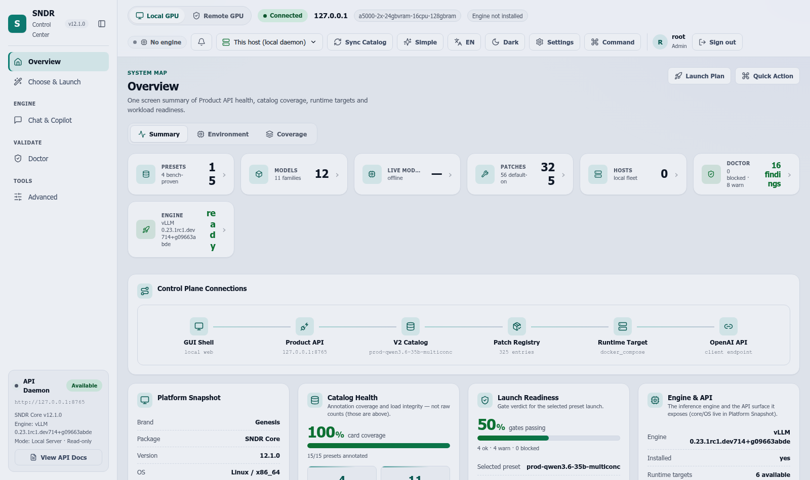
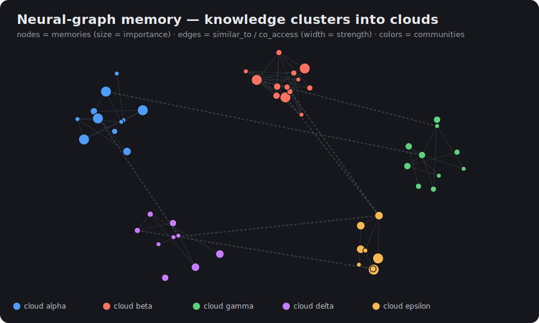
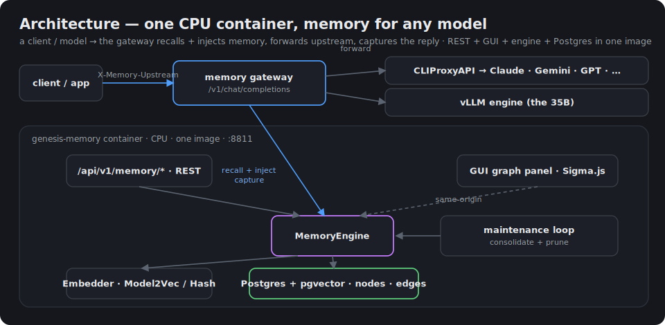

<p align="center">
  
</p>

# SNDR Core Engine

> **Genesis vLLM Patches** — runtime vLLM patches that run a frontier-class
> **35B** model on **consumer NVIDIA GPUs with 24 GB** (RTX 3090 / 4090 /
> 5090, RTX A5000 / A6000): ~1.5× faster inference, **quantized tool calling**
> that works, **MTP speculative decoding**, and a **280K-token context** —
> no fork, no rebuild.

> 🎮 **Own a different card?** The 24 GiB envelope is class-wide, and `sndr up`
> auto-projects VRAM for *your* GPU. **[RTX 4090](docs/FAQ.md#q-can-i-use-an-rtx-4090-instead-of-a-3090)** ·
> **[RTX 5090 (32 GiB)](docs/FAQ.md#q-can-i-use-an-rtx-5090)** ·
> **[dual RTX 3090](docs/FAQ.md#q-dual-rtx-3090--is-that-the-same-as-the-reference-rig)** —
> honest per-class gotchas (Ampere-calibrated tuning, no-NVLink P2P, idle-VRAM headroom) in the FAQ.

[](LICENSE)
[](https://github.com/Sandermage/sndr_core_engine/actions/workflows/test.yml)
[](https://github.com/Sandermage/sndr_core_engine/actions/workflows/codeql.yml)
[](https://github.com/vllm-project/vllm)
[](docs/PATCHES.md)
[](CHANGELOG.md)
[](docs/memory/MANUAL.md)
[](docs/HARDWARE.md)

<!-- Topics for GitHub indexing/discovery (set via repo Settings → Topics):
     vllm · llm-inference · llm-serving · local-llm · self-hosted · qwen · gemma ·
     speculative-decoding · spec-decode · tool-calling · quantization · awq ·
     kv-cache-quantization · consumer-gpu · rtx-3090 · rtx-4090 · gpu · cuda ·
     memory · pgvector · rag · knowledge-graph · openai-api · llm-proxy ·
     obsidian · ampere · ada · blackwell -->

**Contents:**
[Get running](#get-running--two-commands) ·
[Who is this for](#who-is-this-for) ·
[Why SNDR Core](#why-sndr-core--what-you-get) ·
[How it compares](#how-it-compares) ·
[What it is](#what-it-is) ·
[How it works](#how-it-works) ·
[The platform end-to-end](#what-the-platform-does-end-to-end) ·
[Headline numbers](#headline-numbers-v1200-current-registry) ·
[Fleet validation](#validated-across-the-fleet--7-models-dev748-2026-07-04-window--2026-07-05-re-run) ·
[Persistent memory](#persistent-memory--neural-graph-new-in-v12) ·
[Pick your path](#pick-your-path) ·
[Install & run](#install--run) ·
[FAQ](#faq) ·
[Documentation map](#documentation-map) ·
[Repository structure](#repository-structure) ·
[Contributing](#contributing)

**Turn a consumer NVIDIA card into a production local-AI server.** SNDR Core
transforms the open-source [vLLM](https://github.com/vllm-project/vllm) engine
*in memory at boot* — no fork, no rebuild — so a frontier-class **35B** model
runs **~1.5× faster than stock vLLM** with a **280K-token served context**, on
hardware you can actually buy (A5000, RTX 4090 / 5090, A6000 — and yes, the
3090). One paste installs it; a real **GUI Control Center** drives it.

**Two products, one engine:** ⚙️ the runtime **vLLM patch-overlay** (faster
inference) **+** 🧠 a **persistent neural-graph memory** that makes every model —
local *and* cloud — remember and get smarter over time. Apache-2.0, self-hosted,
fully auditable. 329 patches across ~23 families.

**Sound familiar?**

- You want 70B-class quality but only have 24 GB of VRAM.
- Tool calls break the moment you quantize the model.
- vLLM OOMs on consumer GPUs the moment you ask for long context.

That is exactly the gap this project closes — measured, reproducible, on
hardware you already own.

## Get running — two commands

```bash
curl -sSL https://raw.githubusercontent.com/Sandermage/sndr_core_engine/main/install.sh | bash
sndr up          # auto-picks a preset for your GPU → downloads the model → launches → opens the GUI
```

That's it — `sndr up` detects your rig, downloads the weights (skipped if
present), starts the engine **and** the Control Center, and opens your browser
at the Control Center (`http://127.0.0.1:8765`). Prefer the terminal?
`sndr run` does the same and drops you straight into a chat prompt. New here?
Start with [`docs/GETTING_STARTED.md`](docs/GETTING_STARTED.md).

> **The engine needs Linux + CUDA + Docker.** On a Mac or Windows laptop you
> can't run the engine locally — but you *can* drive a Linux rig remotely with
> the same `sndr` CLI and GUI. See [`docs/RUN_ON_MAC.md`](docs/RUN_ON_MAC.md)
> (Mac), [`docs/RUN_ON_WINDOWS_WSL.md`](docs/RUN_ON_WINDOWS_WSL.md) (Windows),
> [`docs/RUN_ON_LINUX.md`](docs/RUN_ON_LINUX.md) (full local stack), and
> [`docs/REMOTE_ENGINE.md`](docs/REMOTE_ENGINE.md) (client-mode reference).



## Who is this for

- **Homelab operators** — you own (or can buy) a 24 GB-class NVIDIA card and
  want frontier-class local inference without datacenter hardware. Start:
  [`docs/SINGLE_CARD.md`](docs/SINGLE_CARD.md).
- **On-prem / privacy deployments** — data can't leave the building.
  Self-hosted, Apache-2.0, every applied patch logged; nothing phones home.
- **Agent builders** — you need an OpenAI-compatible endpoint with tool
  calling that survives quantization, long agentic tool-chains, and a
  persistent memory gateway. Start: [`docs/MCP.md`](docs/MCP.md) +
  [`docs/memory/MANUAL.md`](docs/memory/MANUAL.md).
- **Researchers / performance engineers** — a 329-entry patch registry with
  per-patch evidence, a bench suite with CV methodology, and reproducible
  numbers. Start: [`docs/BENCHMARKS.md`](docs/BENCHMARKS.md) +
  [`docs/PATCHES.md`](docs/PATCHES.md).

---

> 🚀 **New here?** → [`docs/GETTING_STARTED.md`](docs/GETTING_STARTED.md) — who it's for, what you get, and the one install line.
> ❓ **Quick answers** → [`docs/FAQ.md`](docs/FAQ.md) — the questions everyone asks first.
> 🧠 **New to local AI?** → [`docs/LOCAL_AI_PRIMER.md`](docs/LOCAL_AI_PRIMER.md) — GPUs, engines, MoE, and quants in plain English.
> 📖 **Hit an unfamiliar term** (TPS · KV · MTP · TurboQuant · GDN)? → [`docs/GLOSSARY.md`](docs/GLOSSARY.md).
> 💸 **Self-host or cloud?** → [`docs/COMPARISONS.md`](docs/COMPARISONS.md) — the cost-crossover trade.

## Why SNDR Core — what you get

| You get | How |
| --- | --- |
| **A frontier-class 35B model with 280K served context on a card you can buy** | No A100/H100 needed — TurboQuant k8v4 KV-cache quant makes 280K fit (above the model's published 256K limit); consumer Ampere / Ada / Blackwell are first-class targets, not an afterthought. |
| **~1.5× the tokens/sec of stock vLLM — measured, not projected** | MTP speculative decode + surgical kernel/scheduler patches. Same wheel, transformed at boot. The numbers below are reproduced on a 2× A5000 rig. |
| **Tool-calling and agent workflows that don't break** | The speed patches keep function-call output clean — 7/7 PASS on the dev748 promotion gate and 8/8 on the extended same-day canonical suite (thinking + non-thinking, multi-tool, error-recovery, denial; dev714, 2026-07-04), via the native `qwen3_xml` streaming parser. |
| **A long-term memory for every model — local *and* cloud** | A brain-like neural-graph memory in one CPU container: recall by meaning, self-organizing "clouds", human-like decay/reinforcement. Zero GPU on the hot path. |
| **Nothing to memorize — one paste, then a real GUI** | `install.sh` + `sndr up` gets you a running server; the Control Center drives launch, live patch summary, benches, remote hosts, and the memory graph. |
| **Never stuck on a stale fork** | It is the *same* upstream vLLM wheel, patched in memory — and each patch removes itself the moment upstream merges the underlying fix. |
| **Fully yours** | Apache-2.0, self-hosted, every applied patch logged and auditable. No black box; nothing phones home. |


### How it compares

Honest snapshot: the SNDR and stock-vLLM cells are measured on our reference
rig; the rest are qualitative — we have not benched Ollama / llama.cpp / TGI
here (the repo ships a `llamacpp-qwen3.6-27b-q4km-1x` preset if you want a
measured llama.cpp row on your own rig).

| | SNDR Core | Stock vLLM | Ollama | llama.cpp | TGI |
| --- | --- | --- | --- | --- | --- |
| 35B-class single-stream TPS, 2× 24 GB | **242.5 t/s** (dev748 promotion gate, 2026-07-04) | ~157 t/s (same rig, same model class) | not measured here | not measured here | not measured here |
| Long-context KV on 24 GB-class cards | 280K served (TurboQuant k8v4 KV quant) | fp16 KV — context bounded by VRAM | engine defaults, GGUF KV options | GGUF KV-quant options, manual tuning | fp16 KV by default |
| Tool-call reliability on quantized models | **7/7** promotion gate (dev748) · **8/8** extended harness (dev714, same day) — native `qwen3_xml` streaming parser | parser shipped, untuned for these quants | varies by model/template | varies by model/template | varies by model/template |
| OpenAI-compatible API | ✅ (vLLM server + GUI Control Center) | ✅ | ✅ (compat endpoint) | ✅ (server mode) | partial (Messages API) |
| MoE + MTP speculative decode together | ✅ MTP K=5 on a 35B MoE, measured | model/pin-dependent | no MTP path | draft-model spec-decode only | engine-dependent (Medusa/ngram) |

The longer self-host vs cloud (and engine-alternative) discussion lives in
[`docs/COMPARISONS.md`](docs/COMPARISONS.md).

## What it is

A **drop-in runtime patcher** for vLLM. It pins to a specific vLLM nightly
commit and applies 329 small, surgical changes — text edits at known anchors,
class-rebind wrappers, and FastAPI middleware — that together turn an
out-of-the-box vLLM into a production-grade Qwen3.6 inference server on
*consumer* NVIDIA hardware (A5000, RTX 4090 / 5090, A6000, 3090, …) where vLLM
upstream mostly targets datacenter SKUs.

It is **not** a fork of vLLM, a quantizer, a new inference engine, or a
training framework. Patches retire automatically when upstream merges the
underlying fix.

## How it works

**The overlay / apply model.** Genesis never edits vLLM on disk. At every
process start the plugin registers via vLLM's `vllm.general_plugins` entry
point (loaded in the main process, the engine, and every worker rank) and
the dispatcher walks `PATCH_REGISTRY`. Each patch declares an `applies_to`
version range and an apply method — a **text edit at a unique source
anchor**, a **class-rebind wrapper**, or **FastAPI middleware**. Patches
whose anchors match and whose range covers the live pin apply; the rest
print `[SKIP — applies_to mismatch]` and no-op. The result is an in-memory
overlay: the same wheel, transformed at boot, with a structured apply
summary (`applied=N skipped=M failed=0`) and an audit trail. Nothing is
written to the vLLM package tree.

**Patch families.** The 329 entries group into ~23 canonical families. The
largest: `attention.turboquant` (k8v4 KV-cache quant), `spec_decode` (MTP /
ngram speculative decoding), `attention.gdn` (hybrid Gated-DeltaNet linear
attention), `gemma4` (Gemma-4 enablement), `kv_cache`, `compile_safety`,
`worker`, `serving`, `tool_parsing`, and `moe`. The full table is
[`docs/PATCHES.md`](docs/PATCHES.md) (curated) +
[`docs/PATCHES_AUTO.md`](docs/PATCHES_AUTO.md) (generated from the registry).

**Pin lifecycle.** Genesis pins to one canonical vLLM nightly at a time,
plus an optional previous pin held for rollback during validation — at most
two ("≤2-pin policy"). A bump happens only on an explicit instruction
naming the target pin; there are **no proactive pulls**. The candidate is
validated before promotion (anchor-drift resolved, the `bump-preflight`
gate clean, boot-smoke + tokenizer-fingerprint + canonical bench), then the
old 2-back pin is dropped. Current: `dev748` (`2dfaae752`); rollback:
`dev714` (`09663abde`). See [`docs/PIN_BUMP_PLAYBOOK.md`](docs/PIN_BUMP_PLAYBOOK.md)
(canonical) + [`docs/ANCHOR_SOT.md`](docs/ANCHOR_SOT.md).

**Model catalog (current registry).**

| Model | Quant | KV cache | Spec-decode | Status |
| --- | --- | --- | --- | --- |
| Qwen3.6-35B-A3B | AWQ (live PROD checkpoint; an FP8 model preset also ships) | TurboQuant k8v4 | MTP K=5 | ✅ PROD (default) |
| Qwen3.6-27B-int4-AutoRound | INT4 AutoRound (hybrid GDN+Mamba) | TurboQuant k8v4 | MTP K=4 | ✅ PROD |
| Gemma-4-31B | INT4 / kv-auto | TurboQuant or uniform fp16 | MTP K=3 (separate drafter) | ⚙️ boots + patches apply; serving needs MM-budget config |
| DiffusionGemma-26B-A4B-FP8 | FP8-dynamic block-diffusion MoE | TP=2 | — | ✅ serving at TP=2 |

Per-model deep-dives + the V2 layered config system:
[`docs/MODELS.md`](docs/MODELS.md). Hardware envelope:
[`docs/HARDWARE.md`](docs/HARDWARE.md).

**Launching.** Boot any model through a preset — the launcher resolves the
preset, runs preflight, and renders the `docker run` (or podman / bare-metal
/ k8s) command for you with the correct pin, mounts, and env:

```bash
sndr launch prod-qwen3.6-35b-balanced            # boot a preset
sndr launch prod-qwen3.6-35b-balanced --dry-run  # inspect the rendered command, no boot
```

> Note: `prod-qwen3.6-35b-balanced` is the shipped **K=3** balanced default —
> and the right pick for a **single user** at a keyboard (latency-tuned,
> `max_num_seqs=2`). It is what the zero-decision `sndr up` / `sndr quickstart`
> auto-picks for a lone-user rig. Reach for `prod-qwen3.6-35b-multiconc` **only**
> when serving many concurrent requests — it is throughput-tuned
> (`max_num_seqs=8`, ~672 t/s aggregate) and trades single-stream latency for
> that aggregate. The headline numbers below come from the live PROD stack at
> **MTP K=5** (re-tuned 2026-06-19, +15.8 % single-stream vs K=3) — expect the
> K=3 preset to land correspondingly below the K=5 figures.

Full operator manual: [`docs/USAGE.md`](docs/USAGE.md).

## What the platform does end-to-end

Beyond "faster tokens", SNDR Core is a full operations platform around the
patched engine — every layer below is shipping today and exercised by the
CI gates:

| Layer | What ships |
| --- | --- |
| **Patch engine** | The 329-entry `PATCH_REGISTRY` with per-entry lifecycle (experimental / stable / legacy / retired / coordinator / research) walked by the dispatcher at boot. Every patch is opt-in behind a `GENESIS_ENABLE_*` env flag; a curated set (58 of 329 entries) is marked `default_on` and drives the shipped presets. Structured apply summary (`applied=N skipped=M failed=0`) + audit trail on every boot. |
| **Anchor SOT + drift defense** | Each pin gets a generated per-pin anchor manifest (`make rebuild-pin` regenerates it from the live rig). A daily drift watcher diffs anchors against upstream; a strand gate (`scripts/audit_patch_targets_exist.py`) fails loudly when a patch's upstream target module vanishes on a new pin — 0 unexcused stranded modules on dev748. |
| **Pin lifecycle** | Three tracked slots — **current** / **rollback** / **stable** — with [`sndr/pins.yaml`](sndr/pins.yaml) as the single source of truth. `make bump-pin NEW=<pin>` (now with a `--sha-full` flag for the full commit SHA) propagates the string into every downstream artifact, and `audit_pin_consistency` fails loudly on a half-finished bump. Worked example — the dev714 → dev748 promotion (2026-07-04): preflight re-anchor → boot gate (fleet-wide apply `failed=0`) → bench gate (242.5 t/s — parity within CV vs same-day dev714, no regression) → receipts → tag rotation. |
| **Bench suite** | `tools/genesis_bench_suite.py` — the tool-call battery (thinking + non-thinking, multi-tool, error-recovery, denial), single-stream decode with CV methodology (n=25, CV reported with every number), an MTP accept-rate floor check (0.55), the **new ctx-scaling linearity stage** (`[5d/8]`, flags `--ctx-scale*`) that catches long-context decode cliffs, and an agentic multi-turn depth bench (12-turn tool-chains to 39K prompt tokens). |
| **Interfaces** | GUI **Control Center** ([`docs/GUI.md`](docs/GUI.md)) · terminal **TUI** ([`docs/TUI.md`](docs/TUI.md)) · `sndr` **CLI** ([`docs/CLI_REFERENCE.md`](docs/CLI_REFERENCE.md)) — all driving the same product API: launch presets, live patch summary, benches, remote hosts, memory graph. |
| **Model fleet** | Qwen3.6 **27B** (INT4 hybrid GDN+Mamba) and **35B** (AWQ / FP8 MoE), Gemma 4 **26B** and **31B**, and **DiffusionGemma 26B** (block-diffusion MoE) — all seven launchable lanes validated `failed=0` in the 2026-07-04 sweep, with the four digest-poisoned lanes re-validated on verified dev748 in the 2026-07-05 re-run (per-lane pin labels in the fleet table below). |
| **Memory** | The persistent neural-graph memory subsystem — one CPU container that gives any OpenAI-compatible model recall + decay/reinforcement (own section below; full manual in [`docs/memory/MANUAL.md`](docs/memory/MANUAL.md)). |

## Headline numbers (v12.1.0 current registry)

Reference rig: **2× RTX A5000 24 GB** (Ampere SM 8.6), driver 580.142,
CUDA 13.0.2, TurboQuant k8v4, TP=2. Live PROD stack: Qwen3.6-35B-A3B (AWQ
checkpoint), MTP K=5, `qwen3_xml` tool parser, 280K served context.

**Fresh canonical bench — pin `dev748` promotion gate, 2026-07-04:**

| Metric | Value |
| --- | --- |
| Single-stream wall TPS | **242.5 t/s** (CV 6.9 %, n=25) — parity within CV vs the same-day dev714 run (no regression), ~1.5× the ~157 t/s stock-vLLM baseline on this rig |
| Decode TPOT | **3.90 ms** |
| TTFT | **84.5 ms** mean |
| Tool calls | **7/7 PASS** (promotion-gate battery) |
| MTP window accept-rate | **0.653** (K=5, floor 0.55) |
| Context scaling 1K → 32K | **LINEAR_OK** — no cliff (endpoint ratio 0.84) |

Same-day reference — pin `dev714`, 2026-07-04, extended canonical suite
(kept as the labeled comparison run the parity verdict above is measured
against):

| Metric | Value |
| --- | --- |
| Single-stream wall TPS | **234.2 t/s** (CV 8.4 %, n=25) |
| Decode TPOT | **4.04 ms** |
| TTFT | **88.5 ms** mean (cold turn ~958 ms, warm ~200 ms — prefix cache) |
| Tool calls | **8/8 PASS** (thinking + non-thinking, multi-tool, error-recovery, denial) |
| MTP window accept-rate | **0.660** (floor 0.55) |
| Agentic 12-turn tool-chain (to 39K prompt tokens) | **12/12** successful, 0 silent-empty, decode p50 168 t/s, TTFT p50 1.92 s |
| Context scaling 1K → 32K | 227 / 238 / 250 / 243 / 212 decode t/s — **LINEAR_OK**, no cliff (endpoint ratio 0.93) |

Earlier measured records, each labeled with its pin:

| Model | Stock vLLM | Genesis | Δ | Pin / date |
| --- | ---: | ---: | ---: | --- |
| Qwen3.6-35B-A3B (single-conc, K=5) | ~157 t/s | **239.7 t/s** | +53 % | dev148 K-tune, 2026-06-19 |
| Qwen3.6-35B-A3B (8-way multi-conc, K=3) | n/a | **~672 t/s agg** | 8-way scaling | 2026-05-23 cycle |
| Qwen3.6-27B-int4-AutoRound (single-conc, K=4) | ~87 t/s | **~125 t/s** | +44 % | dev714, K=4 (see note below) |
| Tool-call clean rate (35B / 27B) | 2–6 / 10 | **8/8 · 8/8** | qualitative | 35B: dev714 2026-07-04; 27B: earlier harness record |

280K served context verified on the PROD preset (`max_model_len: 280000`),
with linear decode scaling through 32K in the fresh suite. Full methodology,
historical comparisons, and per-rig reproduction recipes:
[`docs/BENCHMARKS.md`](docs/BENCHMARKS.md).


> **Current pin:** vLLM `0.23.1rc1.dev748+g2dfaae752` (commit
> `2dfaae752`, image `vllm/vllm-openai:nightly-2dfaae752`). Per the ≤2-pin
> policy, `dev714` (`0.23.1rc1.dev714+g09663abde`, commit `09663abde`) is
> retained as the rollback pin; `dev672` is **dropped**. A **stable track**
> also exists: the registry recognizes the tagged release `v0.24.0` for
> operators who prefer release pins over nightlies. `sndr/pins.yaml` is the
> single source of truth for all three. dev748 was promoted 2026-07-04
> through the full playbook chain — preflight re-anchor → boot gate (apply
> `failed=0` across the whole 7-model fleet; four lanes initially booted
> the dev714 rollback engine via a stale `image_digest` and were re-run
> on verified dev748 on 2026-07-05 — see the fleet table below) → bench
> gate (242.5 t/s wall — parity within
> CV vs the same-day dev714 run, no regression; tool-call 7/7) → receipts → tag
> rotation — see [`docs/PIN_BUMP_PLAYBOOK.md`](docs/PIN_BUMP_PLAYBOOK.md)
> (canonical) and [`docs/ANCHOR_SOT.md`](docs/ANCHOR_SOT.md). The per-model
> table below is the historical dev148 K-tune cycle, kept for cross-model
> context and labeled with its pin; the fresh dev748 headline above
> supersedes it for the 35B PROD stack.

### Validated across the fleet — 7 models (dev748; 2026-07-04 window + 2026-07-05 re-run)

The works-everywhere proof the project leans on: during the dev748
promotion window **every launchable model in the catalog** was booted
sequentially (2× RTX A5000, TP=2), smoke-tested and mini-benched — and
**all seven applied their patch sets with `failed=0`**. Post-release
audit (2026-07-05): four lanes had initially booted the **dev714
rollback engine** (a stale hardware `image_digest` beat the dev748 tag
at render; digest + gate since fixed) — those four were **re-run on
verified dev748 on 2026-07-05** (per-lane in-container version + bench
fingerprint checks), and the table shows the re-run numbers. Accept
rates are bench-window rates. Condensed from the full sweep table (with
the labeled dev714 first-pass rows) in
[`docs/BENCHMARKS.md`](docs/BENCHMARKS.md):

| Model | Pin | Decode | Tool-call | Note |
| --- | :-: | ---: | :-: | --- |
| Qwen3.6-35B-A3B AWQ (PROD) | dev748 | **242.5 t/s** | 7/7 | promotion gate 2026-07-04, full canonical suite |
| Qwen3.6-35B-A3B FP8 (`prod-qwen3.6-35b-balanced`) | dev748 | 223.9 t/s | 7/7 | canonical `sndr launch` path; window accept 0.621; parity within CV vs dev714 (231.2) |
| Qwen3.6-27B INT4 TQ k8v4 (+PN520) | n/v | ~130 t/s | ✓ | PN520 loader fix — INT4 degeneration cured (pin unattributed: fingerprint probe timed out) |
| Qwen3.6-27B INT4 fp8kv (+P100) | dev748 | ~108 t/s | — | P100 FlashInfer spec-decode runtime-validated on dev748 |
| Gemma 4 26B-A4B AWQ (`prod-gemma4-26b-default`) | dev748 | ~141 t/s | 7/7 | TPOT 7.09 ms (parity vs dev714 7.12) |
| Gemma 4 31B AWQ (`prod-gemma4-31b-kvauto-chat`, +PN351) | dev748 | TPOT 9.42 ms | 7/7 | PN351 dev748 launch variant verified in the live container; window accept 0.744; within CV of dev714 (both arms noisy — no gain claim) |
| DiffusionGemma 26B-A4B FP8 (`prod-diffusiongemma-tp2`) | dev748 | n/a | 7/7 | diffusion lane boots + responds; AR decode metrics not applicable; tool-calls newly confirmed working on dev748 |

(27B thinking mode loops — a known pre-existing model trait; chat is
validated with `enable_thinking:false` and the tool-agent workload is
unaffected. Details + footnotes in
[`docs/BENCHMARKS.md`](docs/BENCHMARKS.md).)

**Recent battle-validations.** The PN520 story is the class every operator
recognizes: the INT4 27B *booted clean* — patches applied, server healthy —
and then produced garbage output. Root cause was an upstream GDN loader
change silently dropping the checkpoint's split BF16 shards from the fused
`in_proj_ba` parameter, leaving the linear-attention layers uninitialised;
the PN520 loader revert routes all 96 `in_proj_ba` shards correctly, and
the degeneration is **cured** (coherent chat + tool calls in the sweep
above). In the same window, `P100` (FlashInfer FULL-CG spec-decode) was
runtime-validated on the fp8kv lane — coherent generation, 0 errors — and
`PN351`'s dev748 anchor variant was battle-validated on the head_dim=512
Gemma 4 31B in the 2026-07-05 re-run: the applied variant was read back
from the live dev748 container file, and the lane served chat + 7/7
tool-calls with window accept 0.744.

### Validated rig baseline — 2026-06-19 (measured on pin `0.23.1rc1.dev148+gb4c80ec0f`)

Full model-cycle re-test on the reference 2× A5000 rig after the MTP K=3→K=5 re-tune,
recorded on pin dev148 with the FP8 35B checkpoint of that cycle (the live PROD stack has since
moved to the AWQ checkpoint — fresh dev748 numbers in the headline table above). The pin has
since bumped dev148 → dev301 → dev424 → dev672 → dev714 → **dev748** (current) with no decode regression
(anchor regen confirmed at each bump). Each model boots the Genesis apply pipeline, applies its patch set, and is
benchmarked / smoke-tested live (`tools/genesis_bench_suite.py`, single-stream warm sweep). The 35B
and 27B single-stream rows are the dev148 K=5 re-tune record; Gemma stays K=3 (its separate drafter
is optimal at K=3). **Note:** the live 27B config has since moved to **MTP K=4** — the max coherent
K for its INT4 tool-calls (K=5 emitted unparseable tool-call tokens on dev714); K=4 warm decode is
~125 t/s, within CV of the K=5 record below.

| Model | Quant / KV | Patches | Decode TPS | Tool-call | Status |
| --- | --- | ---: | ---: | :---: | --- |
| Qwen3.6-35B-A3B-FP8 | FP8 dense · TQ k8v4 · MTP K=5 | 95 | **239.7** (CV 4.9 %) | 7/7 | ✅ serving — +15.8 % vs K=3 |
| Qwen3.6-27B-int4-AutoRound | INT4 AutoRound · TQ k8v4 · MTP K=5 *(dev148 record; live now K=4)* | 93 | **127.4** (CV 8.3 %) | 7/7 | ✅ serving — +8.2 % vs K=3 |
| Gemma-4-31B | INT4 · TQ k8v4 · MTP K=3 | 81 | — | — | ⚙️ boots + patches apply; serving needs MM-budget config (multimodal-bidirectional × spec-decode) |
| DiffusionGemma-26B-A4B-FP8 | FP8-dynamic · block-diffusion · TP=2 | 45 | coherent | — | ✅ **serving at TP=2** — `PN-FP8MOE-KPAD` (Marlin N=352) + `G4_26` (TP-vocab soft-embed); enforce-eager · max-num-seqs 2 · gpu-util 0.80 |

The 35B and 27B clear their historical peak band — the K=5 re-tune lifts single-stream decode
to 239.7 / 127.4 t/s (+15.8 % / +8.2 % vs K=3) within CV → the v12 platform carries **no decode
regression**. `PN-FP8MOE-KPAD` (backport of open vLLM
PR [#45703](https://github.com/vllm-project/vllm/pull/45703), model-agnostic Marlin-MoE
intermediate-pad) plus `G4_26` (backport of [#45774](https://github.com/vllm-project/vllm/pull/45774),
DiffusionGemma TP>1 vocab-sharded soft-embed all-gather) make
**DiffusionGemma the first block-diffusion FP8-MoE checkpoint to boot AND serve coherently
at TP=2 on consumer Ampere** without a kernel rebuild — validated 2026-06-17 (clears the
Marlin N=352 thread-tile crash, then the `probs @ embed_weight` `[131072,2816]` TP-vocab
shape mismatch; the coherent generation confirms the soft-embed all-gather yields correct
TP=2 output).

## Persistent memory — neural-graph (new in v12)

A brain-like **persistent memory** that makes every model — the internal vLLM
engines **and** external models behind your proxy — smarter over time. Knowledge
is stored as a graph whose nodes auto-form connections and cluster into "clouds"
(like Obsidian), is recalled by vector similarity **plus** spreading activation
across the graph, and **decays / reinforces like human memory**. It ships as one
**CPU-only container** (Postgres + pgvector + API + GUI + gateway) — the GPU
engines are untouched.

<p align="center">
  
</p>

**By the numbers (v12, all verified):** 2 storage backends (in-memory + Postgres/
pgvector) proven *identical* in CI · real CPU embedder (Model2Vec) semantic match
**0.85** related vs **0.01** unrelated · ~100 unit tests + a leak-soak, run on both
backends (Postgres against a live pgvector in CI) · one container · zero GPU on the
hot path.

<p align="center">
  
</p>

| Capability | What it does |
|---|---|
| **Storage** | Postgres + pgvector (HNSW ANN + lexical GIN); pure-stdlib in-memory reference backend (identical results, CI-verified) |
| **Recall** | vector ANN seeds → bounded, cycle-safe spreading activation over the graph, blended with decay; operator-tunable **limit** + **expand-depth** |
| **Brain mechanics** | Hebbian co-access, Ebbinghaus decay + **strength reinforcement** (spacing effect), communities ("clouds"), importance, bi-temporal edge invalidation |
| **Search** | `vector` · `keyword` · `hybrid` (catches exact terms / names / IDs) |
| **Universal augment** | OpenAI-compatible **gateway**: recall → inject (plain-text system block) → forward → capture, for **any** model. Multi-upstream — choose per request (`X-Memory-Upstream`) |
| **Ingest** | **Obsidian** vault import (notes → nodes, `[[wikilinks]]` → edges, `#tags`), path-confined; wikilinks resolve case-insensitively and by H1 title, not just exact filename |
| **Manage** | remember · **forget** (delete node + its edges, owner-scoped) · **export** (whole graph → JSON backup) · **import** (Obsidian vault) — all from the GUI or CLI |
| **GUI** | Obsidian-like force-directed graph (Sigma.js + ForceAtlas2): nodes colored by community, sized by importance. Toolbar shows nodes/edges/**communities**; List⇄Graph toggle; recall with operator **limit** + **expand-depth**; node-detail card with importance/strength/cloud badges + typed connections; Forget/Export/Import actions |
| **Embedders** | `Model2Vec` (real static CPU, 256-dim, no torch) · `HashEmbedder` (dependency-free) |
| **CLI** | `sndr mem remember\|recall\|search\|stats` (+ TUI Memory panel) — same engine, no GUI required |
| **Ops** | API-key auth · owner-scoping · auto consolidate + prune (**leak-bounded**) · graceful Postgres-down fallback · upstream-error 502/504 |

**GUI — Memory panel** (Control Center → Engine → 🧠 Memory; served same-origin).
Real screenshot of the live Control Center (dark theme):

<p align="center">
  
</p>

One container, one `docker run`, and any OpenAI client pointed at the gateway
gains memory. Deployment recipe, brain mechanics + tuned constants, every
endpoint, config, security, and troubleshooting:
**[`docs/memory/MANUAL.md`](docs/memory/MANUAL.md)**.

## Pick your path

| You have | Start here |
| --- | --- |
| **1× consumer card** (A5000 / 4090 / 5090 / 3090) | [`docs/SINGLE_CARD.md`](docs/SINGLE_CARD.md) |
| **2× cards** (TP=2 — the reference topology) | [`docs/HARDWARE.md`](docs/HARDWARE.md) + [`docs/MODELS.md`](docs/MODELS.md) |
| **A model not in the catalog** | [`docs/MODELS.md`](docs/MODELS.md) (add-a-model + the V2 config system) |
| **Brand-new / weighing self-host vs cloud** | [`docs/GETTING_STARTED.md`](docs/GETTING_STARTED.md) · [`docs/COMPARISONS.md`](docs/COMPARISONS.md) |

**I want to… (by machine):**

| I want to… | Read |
| --- | --- |
| Run the full stack locally on a **Linux + CUDA** box | [`docs/RUN_ON_LINUX.md`](docs/RUN_ON_LINUX.md) |
| Drive a rig from a **Mac** (client mode) | [`docs/RUN_ON_MAC.md`](docs/RUN_ON_MAC.md) |
| Run on **Windows / WSL2** (GPU passthrough or client) | [`docs/RUN_ON_WINDOWS_WSL.md`](docs/RUN_ON_WINDOWS_WSL.md) |
| Point the GUI / CLI at a **remote engine** | [`docs/REMOTE_ENGINE.md`](docs/REMOTE_ENGINE.md) |

## Install & run

```bash
# 1. install — detects OS / Python / GPU / vLLM, installs the plugin + `sndr` CLI
curl -sSL https://raw.githubusercontent.com/Sandermage/sndr_core_engine/main/install.sh | bash

# 2. run — auto-picks a preset for your GPU, downloads the model, launches, opens the GUI
sndr up            # …or `sndr run` for a terminal chat prompt instead of the GUI
```

`sndr up` and `sndr run` both **download the model if it isn't already present**
(skipped when it is), so step 2 is genuinely one command. Want to see the plan
first? Add `--dry-run`. Pick a named preset with `sndr up <preset>` (browse them
with `sndr preset list`).

Five-minute walk-through + Day-1 acceptance: [`docs/QUICKSTART.md`](docs/QUICKSTART.md).
A different vLLM pin, workload, or non-interactive flag set:
[`docs/INSTALL.md`](docs/INSTALL.md).

## FAQ

The questions people actually search for. Longer answers (and ~25 more
questions) live in [`docs/FAQ.md`](docs/FAQ.md).

**Can I run a 35B-class model on 24 GB of VRAM?**
On a *single* 24 GB card the validated recipe is the 27B INT4 preset
(`qa-qwen3.6-27b-tq-1x`, 78K context); the 35B MoE needs 2× 24 GB at TP=2,
where the PROD stack decodes at **242.5 t/s** (pin dev748, 2026-07-04).
`sndr preflight` and `sndr kv-calc` tell you what fits *before* you download
weights. → [`docs/SINGLE_CARD.md`](docs/SINGLE_CARD.md) ·
[`docs/HARDWARE.md`](docs/HARDWARE.md)

**Why do tool calls break on quantized models?**
Quantization amplifies upstream parser fragility — `<think>` tags, multi-tool
prompts, and streaming chunk splits produce malformed calls on stock configs.
Genesis ships a dedicated tool-call patch family (P59 / P61 / P62 / P64 /
P68 / P69) around the native `qwen3_xml` streaming parser: **7/7 PASS** on the
dev748 promotion gate and **8/8** on the extended battery (dev714, both
2026-07-04). → [`docs/FAQ.md`](docs/FAQ.md) ·
[`docs/TROUBLESHOOTING.md`](docs/TROUBLESHOOTING.md)

**How much faster is speculative decoding?**
The MTP K=3→K=5 re-tune alone lifted 35B single-stream decode **+15.8 %**
(207 → 239.7 t/s, pin dev148, 2026-06-19); the full recommended patch set is
**≈1.5× stock vLLM** on the same commit (+53 % on 35B, +46 % on 27B; dev148,
2026-06-19). Current canonical figure: **242.5 wall TPS** (dev748,
2026-07-04). → [`docs/SPEC_DECODE_GUIDE.md`](docs/SPEC_DECODE_GUIDE.md) ·
[`docs/BENCHMARKS.md`](docs/BENCHMARKS.md)

**Is this a fork of vLLM?**
No. It runs against an *unmodified* pinned vLLM wheel and applies patches in
memory at boot; toggle Genesis on/off with env flags on the same binary. Each
patch declares an `applies_to` version range and retires automatically when
upstream merges the underlying fix. → [`docs/FAQ.md`](docs/FAQ.md)

**How does 280K context fit on 24 GB cards?**
TurboQuant `k8v4` KV-cache quantization (8-bit keys, 4-bit values) frees
2–4× more concurrent KV slots, which is what lets the PROD preset serve
`max_model_len: 280000` — above the model's published 256K limit — with
**linear decode scaling through 32K** (LINEAR_OK, dev748, 2026-07-04).
`sndr kv-calc` projects the exact KV bytes for your card. →
[`docs/KV_PROJECTOR.md`](docs/KV_PROJECTOR.md) ·
[`docs/BENCHMARKS.md`](docs/BENCHMARKS.md)

**Can I run it without Docker?**
Yes — it is a regular Python package that patches a vLLM installed in the same
environment; `sndr model-config render <key> --runtime bare_metal` emits a
venv launch script. Kubernetes and Proxmox lifecycles are wired via
`python3 -m sndr.cli.legacy service install <key>`. →
[`docs/FAQ.md`](docs/FAQ.md)

**Is it free?**
Everything in this repo — `sndr/**`, tests, docs, bench data — is
**Apache 2.0**. The license gate in the tree guards a commercial overlay that
is absent from the public tree; it does not restrict the community tier. →
[`docs/LICENSE_POLICY.md`](docs/LICENSE_POLICY.md)

## Documentation map

| If you want to... | Read |
| --- | --- |
| Two-minute orientation — who it's for, what you get, first token | [`docs/GETTING_STARTED.md`](docs/GETTING_STARTED.md) |
| Learn local-AI basics first (GPUs, engines, MoE, quants — plain English) | [`docs/LOCAL_AI_PRIMER.md`](docs/LOCAL_AI_PRIMER.md) |
| Weigh self-host vs cloud APIs (the cost-crossover trade) | [`docs/COMPARISONS.md`](docs/COMPARISONS.md) |
| Understand how the platform fits together (registry → byte edit, pins, configs) | [`docs/ARCHITECTURE.md`](docs/ARCHITECTURE.md) |
| One-page operator manual (installer → launcher → configs → patches) | [`docs/USAGE.md`](docs/USAGE.md) |
| 🧠 Persistent memory — full reference (API, gateway, embedders, Obsidian, deploy) | [`docs/memory/MANUAL.md`](docs/memory/MANUAL.md) |
| Install + first boot | [`docs/INSTALL.md`](docs/INSTALL.md) → [`docs/QUICKSTART.md`](docs/QUICKSTART.md) |
| Set up / fix `~/.sndr/host.yaml` (paths + mounts) | [`docs/HOST_SETUP.md`](docs/HOST_SETUP.md) |
| Add your own model end-to-end (weights → YAML → bench) | [`docs/ADDING_MODELS.md`](docs/ADDING_MODELS.md) |
| Operate it day-2 (health checks, swaps, rollbacks, hygiene) | [`docs/OPERATIONS.md`](docs/OPERATIONS.md) |
| Browse `sndr` commands | [`docs/CLI_REFERENCE.md`](docs/CLI_REFERENCE.md) |
| Drive the GUI Control Center | [`docs/GUI.md`](docs/GUI.md) |
| Stay in the terminal (TUI) | [`docs/TUI.md`](docs/TUI.md) |
| Quick answers to common questions | [`docs/FAQ.md`](docs/FAQ.md) |
| Pick a model + hardware combo | [`docs/MODELS.md`](docs/MODELS.md) + [`docs/HARDWARE.md`](docs/HARDWARE.md) |
| Tune an env-var flag | [`docs/CONFIGURATION.md`](docs/CONFIGURATION.md) |
| Browse the patch catalogue + compatibility matrix | [`docs/PATCHES.md`](docs/PATCHES.md) |
| Diagnose an OOM, cliff, or boot failure | [`docs/TROUBLESHOOTING.md`](docs/TROUBLESHOOTING.md) |
| Roll a broken release back | [`docs/PIN_BUMP_PLAYBOOK.md`](docs/PIN_BUMP_PLAYBOOK.md) |
| See current bench numbers + reproduce | [`docs/BENCHMARKS.md`](docs/BENCHMARKS.md) |
| Author a patch or community plugin | [`docs/CONTRIBUTING.md`](docs/CONTRIBUTING.md) |
| Sponsorship / hardware loan / business invoicing | [`docs/SPONSORS.md`](docs/SPONSORS.md) |
| Disclose a security issue | [`SECURITY.md`](SECURITY.md) |

Full docs index: [`docs/README.md`](docs/README.md).

## Repository structure

The layout separates the shippable engine from the maintainer tooling and
vendored third-party code, so the published wheel stays small and the apply
pipeline stays auditable.

| Path | What it is |
| --- | --- |
| [`sndr/`](sndr) | The engine. The `PATCH_REGISTRY` + dispatcher, the apply pipeline (text-anchor / class-rebind / middleware patchers), per-engine patch sets (`sndr/engines/vllm/...`), the V2 layered model-config system, the universal launcher, the CLI (`sndr`/`genesis`), and the read-only product API the GUI consumes. This is the only tree the Apache wheel ships. |
| [`gui/`](gui) | The control center — a desktop/web front-end (`gui/web`, `gui/desktop`) that drives the `sndr` product API: launch presets, inspect the live apply summary, browse the patch catalogue, run benches, manage remote hosts, **and the 🧠 Memory graph panel**. Built static assets are served by the product API. |
| [`sndr/memory/`](sndr/memory) | The **persistent neural-graph memory engine** — storage interface + in-memory & Postgres/pgvector backends, embedders, the brain mechanics (recall / Hebbian / decay / communities / prune), the `ConversationMemory` augment-capture middleware, the HTTP client, and the Obsidian importer. Exposed via `sndr/product_api/routes/{memory,gateway}.py`. See [`docs/memory/MANUAL.md`](docs/memory/MANUAL.md). |
| [`deploy/memory/`](deploy/memory) | The unified **genesis-memory** container (Postgres + pgvector + product-API + GUI + gateway in one image) — `Dockerfile`, `entrypoint.sh`, README. |
| [`tests/`](tests) | The pytest suite (13k+ collected). Unit tests per subsystem under `tests/unit/...`, contract/bundle/proof tests, and the load-bearing CI gate. Excluded from the wheel. |
| [`docs/`](docs) | All public documentation (USAGE, INSTALL, MODELS, HARDWARE, PATCHES, BENCHMARKS, the pin-bump playbook, anchor SOT, …). `docs/README.md` is the index. |
| [`scripts/`](scripts) + [`tools/`](tools) | Maintainer tooling — the audit gates (`make gates`), doc-sync / link / attribution / drift checkers, anchor-SOT regeneration, bench harnesses, and pin-bump preflight. Not shipped in the wheel. |
| [`third_party/`](third_party) | Vendored upstream kernel source (a curated subset of TurboMind's int4 grouped-MoE GEMM, used by the experimental `G4_85` MoE kernel patch). See [`third_party/tm_int4_moe/README.md`](third_party/tm_int4_moe/README.md) for provenance + license. |
| [`compose/`](compose) | Reference `docker-compose` files for the canonical prod presets (35B / 27B, single- and multi-concurrency, long-context). |
| [`benchmarks/`](benchmarks) + [`evidence/`](evidence) | Bench harness/data and per-patch proof artefacts (`evidence/patch_proof/`) plus the A/B validation evidence the registry cites for default-on/off decisions. |
| [`schemas/`](schemas) + [`plugins/`](plugins) + [`assets/`](assets) + [`release/`](release) | JSON schemas (patch-entry, config), community plugin samples, README/chart/logo assets, and release artefacts (SBOM, constraints). |
| `pyproject.toml` | Single source of truth for packaging **and** all tool config — `[tool.pytest.ini_options]`, `[tool.ruff]`, `[tool.mypy]`, and the setuptools package layout. |
| `Makefile` | The maintainer entry point: `make gates` (CI gates), `make test`, `make docs`, `make gui-build`, pin-bump preflight, audits. |

## Contributing

**If this saves you a GPU upgrade, a ⭐ helps others find it.**

Bug reports, new patches with empirical evidence, new model recipes, and
cross-rig bench reports are all welcome. The full workflow (anchor
conventions, lifecycle ratchet, pin-bump playbook, PR template) is in
[`docs/CONTRIBUTING.md`](docs/CONTRIBUTING.md). Security disclosures go
through [`SECURITY.md`](SECURITY.md).

## Ecosystem / Related

- **[vLLM](https://github.com/vllm-project/vllm)** — the upstream engine SNDR
  Core patches. Genesis is an overlay, not a fork; each patch retires as
  upstream merges the underlying fix.
- **[Hugging Face](https://huggingface.co)** — where the model weights the
  presets pull come from.

## Credits + license

Apache-2.0 (see [`LICENSE`](LICENSE)). Per-patch attribution and upstream
PR linkage in [`docs/CREDITS.md`](docs/CREDITS.md).

Author: Sandermage (Aleksandr Barzov), Odessa, Ukraine.
Sponsorship channels (voluntary, no obligations) and hardware-loan
contact: [`docs/SPONSORS.md`](docs/SPONSORS.md).
