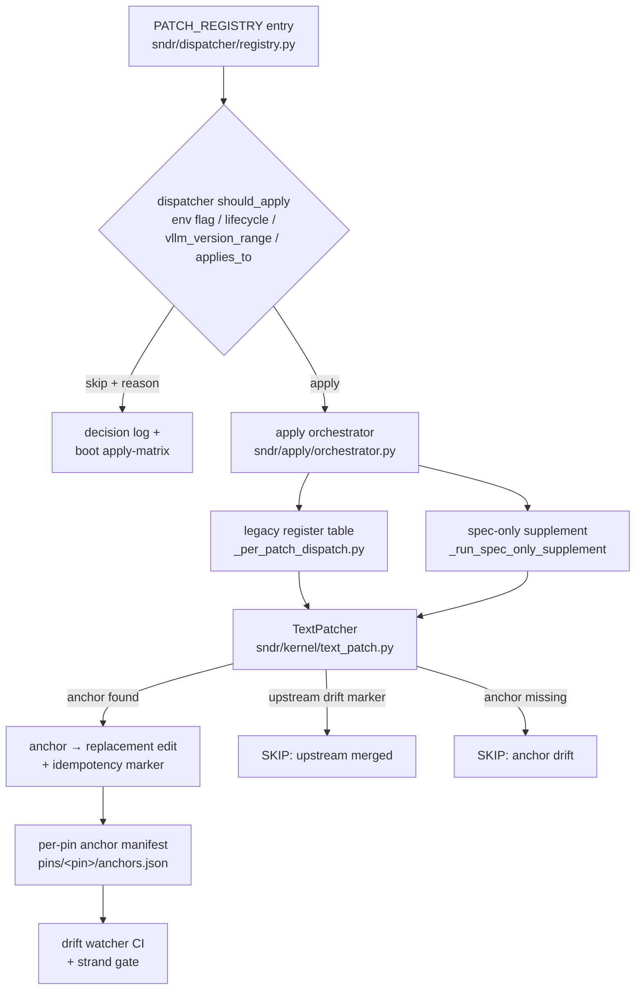

# Architecture — how the platform fits together

Last updated: 2026-07-04 (v12.0.0, pin `dev748`). This is the
structural map of the codebase: what each tree does, how a patch
travels from registry entry to a byte-level edit inside the serving
container, and how the pin / config / bench machinery keeps the whole
thing honest. Operator task guides live elsewhere (see the
[documentation index](README.md)); this document explains **why the
repo is shaped the way it is** and cites the source files that
implement each claim.

## 1. Big picture

SNDR Core (Genesis) is a **patch-orchestration layer over an inference
engine** — primarily vLLM, with llama.cpp and sglang lanes behind the
same abstraction ([`sndr/engines/base.py`](../sndr/engines/base.py),
[`sndr/engines/{vllm,llamacpp,sglang}/`](../sndr/engines)). It does not
fork vLLM. Instead it keeps a registry of 325 surgical patches
([`sndr/dispatcher/registry.py`](../sndr/dispatcher/registry.py) —
by lifecycle: 235 experimental, 41 retired, 28 legacy, 14 stable,
4 coordinator, 3 research, regenerated 2026-07-04) and applies the
enabled subset at boot, inside the container, against a **pinned**
nightly build. Result on the reference rig (2× RTX A5000, TP=2):
wall_TPS **242.55** on Qwen3.6-35B AWQ with TurboQuant k8v4 KV +
MTP K=5 (pin `dev748`, 2026-07-04 promotion gate —
[`BENCHMARKS.md`](BENCHMARKS.md)).

Three product surfaces share one core:

| Surface | Entry | What it is |
| --- | --- | --- |
| **CLI** | `sndr` ([`sndr/cli/`](../sndr/cli)) | The 28-verb operator CLI (`launch`, `preset`, `patches`, `doctor`, `kv-calc`, `up`, `run`, ...). A wider legacy surface remains at `python3 -m sndr.cli` ([`sndr/compat/cli.py`](../sndr/compat/cli.py)). |
| **TUI** | `sndr tui` ([`sndr/cli/tui/`](../sndr/cli/tui)) | Terminal cockpit — live dashboard + serve/stop/chat ([`TUI.md`](TUI.md)). |
| **GUI daemon** | `sndr up` / `sndr gui-api` ([`gui/web/`](../gui/web), [`sndr/product_api/`](../sndr/product_api)) | Browser Control Center at `http://127.0.0.1:8765` ([`GUI.md`](GUI.md)). |

All three drive the same **Product API** ([`PRODUCT_API.md`](PRODUCT_API.md));
the GUI is a client of a stable API, never a wrapper that parses CLI
stdout. Underneath the API sits the same core: the dispatcher + apply
pipeline (§3), the V2 layered model-config system (§5), and the
detection/guard layer
([`sndr/engines/vllm/detection/`](../sndr/engines/vllm/detection)).

## 2. Repository walk

The only tree the Apache wheel ships is `sndr/`. Everything else is
maintainer tooling, docs, evidence, or front-end assets.

| Path | Role |
| --- | --- |
| [`sndr/dispatcher/`](../sndr/dispatcher) | `PATCH_REGISTRY` (data-only, [`registry.py`](../sndr/dispatcher/registry.py)) + `should_apply()` decision gates ([`decision.py`](../sndr/dispatcher/decision.py)) + typed `PatchSpec` view ([`spec.py`](../sndr/dispatcher/spec.py)). |
| [`sndr/apply/`](../sndr/apply) | Boot orchestrator ([`orchestrator.py`](../sndr/apply/orchestrator.py)): iterates registered apply functions, resolves dependencies/conflicts, emits the applied/skipped/failed summary. |
| [`sndr/kernel/`](../sndr/kernel) | The text-patch primitive ([`text_patch.py`](../sndr/kernel/text_patch.py), [`multi_file.py`](../sndr/kernel/multi_file.py), [`manifest.py`](../sndr/kernel/manifest.py)). |
| [`sndr/engines/vllm/patches/`](../sndr/engines/vllm/patches) | Per-family patch wirings — 23 family dirs (`attention`, `spec_decode`, `kv_cache`, `moe`, `quantization`, `tool_parsing`, `scheduler`, `kernels`, ...) plus `_retired/`. |
| [`sndr/engines/vllm/pins/`](../sndr/engines/vllm/pins) | Per-pin anchor manifests — one `<release>_<sha>/anchors.json` per validated pin (8 pin dirs as of dev748). |
| [`sndr/engines/vllm/detection/`](../sndr/engines/vllm/detection) | GPU / model / driver / config detection + [`guards.py`](../sndr/engines/vllm/detection/guards.py) (`KNOWN_GOOD_VLLM_PINS` and runtime guard rails). |
| [`sndr/model_configs/`](../sndr/model_configs) | The V2 layered config system: [`schema_v2.py`](../sndr/model_configs/schema_v2.py), [`registry_v2.py`](../sndr/model_configs/registry_v2.py), [`compose.py`](../sndr/model_configs/compose.py), the [`builtin/`](../sndr/model_configs/builtin) catalog (`model/` × `hardware/` × `profile/` → `presets/`), and [`emitters/`](../sndr/model_configs/emitters). |
| [`sndr/product_api/`](../sndr/product_api) | Legacy monolith ([`legacy/http_app.py`](../sndr/product_api/legacy/http_app.py)) + modular seam ([`routes/`](../sndr/product_api/routes), [`domain/`](../sndr/product_api/domain), [`server.py`](../sndr/product_api/server.py), [`unified.py`](../sndr/product_api/unified.py)) — see §7. |
| [`sndr/cli/`](../sndr/cli) + [`sndr/compat/`](../sndr/compat) | Modern 28-verb CLI vs the legacy bridge (doctor, presets, migration, self-test, plugins). |
| [`sndr/memory/`](../sndr/memory) | Persistent neural-graph memory engine (Postgres/pgvector + in-memory backends, gateway middleware). |
| [`sndr/cache/`](../sndr/cache) | PN95 tier-aware KV/response cache runtime (pinned pool, disk tier, eviction policies). |
| [`sndr/runtime/`](../sndr/runtime) | Runtime helpers: memory estimator/metrics, prealloc budgets, buffer modes, GPU profiles. |
| [`sndr/bundles/`](../sndr/bundles) | Named patch bundles (runtime overlays) — e.g. `attention_tq_multi_query`, `spec_decode_async_cleanup`, `reasoning_qwen3`. |
| [`sndr/proof/`](../sndr/proof) | Patch-proof machinery: static-check coverage, bench attach, release gate ([`release_check.py`](../sndr/proof/release_check.py)). |
| [`tests/`](../tests) | The pytest suite (13k+ collected) — unit tests per subsystem, contract/bundle/proof tests, CI gates. |
| [`scripts/`](../scripts) | Maintainer gates — 111 files, most named `audit_*` (pin consistency, anchor fragility, english-only, links, wheel contents, V2 config audits, ...) plus [`bump_pin.py`](../scripts/bump_pin.py) and the [`anchor_sot/`](../scripts/anchor_sot) pipeline. |
| [`tools/`](../tools) | Bench + ops harnesses: bench suite shim, [`bench_agentic.py`](../tools/bench_agentic.py), [`genesis_full_bench.py`](../tools/genesis_full_bench.py), drift checker ([`check_upstream_drift.py`](../tools/check_upstream_drift.py)), kv calculator. |
| [`gui/web/`](../gui/web) | React + TypeScript Control Center SPA (Vite); built assets are served by the product-API daemon. |
| [`compose/`](../compose) | Reference docker-compose files for the canonical prod presets (35B / 27B, single- and multi-concurrency). |
| [`evidence/`](../evidence) | Per-patch proof artefacts (`evidence/patch_proof/`, 331 files) + bench evidence cited by the registry. |

The three-zone namespace policy (core / engine / private) that governs
what may import what is documented in
[`CORE_ENGINE_BOUNDARY.md`](CORE_ENGINE_BOUNDARY.md) and enforced by
`scripts/audit_engine_boundary.py`.

## 3. Patch lifecycle — from registry entry to byte edit

Every patch is one entry in `PATCH_REGISTRY` declaring its `env_flag`,
`default_on`, `lifecycle`, `applies_to` model-compatibility dict,
`vllm_version_range`, `requires_patches` / `conflicts_with`, provenance
(`credit`, `upstream_pr`) and its `apply_module` (the wiring file under
`sndr/engines/vllm/patches/<family>/`).



Stage by stage:

1. **Dispatcher decision**
   ([`sndr/dispatcher/decision.py`](../sndr/dispatcher/decision.py)) —
   `should_apply(patch_id)` is the first gate in every wiring's
   `apply()`. Layer 1: env flag (`SNDR_ENABLE_*` / `GENESIS_ENABLE_*`)
   vs `default_on`. Layer 2: lifecycle safety (retired/deprecated skip
   unless overridden). Layer 3: model-aware `applies_to` matching
   against the live model profile (`model_class`, `quant_format`,
   `is_hybrid`, `is_moe`, ...) plus `vllm_version_range` /
   `torch_version_min` gates. Every decision is logged with a reason.
2. **Apply orchestrator**
   ([`sndr/apply/orchestrator.py`](../sndr/apply/orchestrator.py)) —
   invoked by the `apply_all` CLI and auto-loaded in-process via the
   `vllm.general_plugins` entry point (`sndr.plugin:register`), so
   `vllm serve` re-applies runtime monkey-patches inside the serving
   container. It imports the legacy register table
   (`_per_patch_dispatch.py`, hand-written `apply_patch_X` functions),
   runs the dependency/conflict resolver, then runs
   `_run_spec_only_supplement()` for enabled registry entries that have
   no legacy hook — the typed-`PatchSpec` path that will eventually
   retire the hand-written table. Output: the boot apply summary
   (e.g. **applied=87 / failed=0** on the 35B PROD boot, dev748,
   2026-07-04).
3. **TextPatcher**
   ([`sndr/kernel/text_patch.py`](../sndr/kernel/text_patch.py)) — the
   per-file primitive for code sites that cannot be monkey-patched
   (raises inside method bodies, Triton compile-time literals,
   local-variable control flow). Each edit is an anchor → replacement
   pair with: a unique **idempotency marker** (re-runs are no-ops),
   optional **multi-anchor variants** (the same patch carries anchors
   for more than one pin, so one tree applies to both `current` and
   `rollback`), and **upstream drift markers** — strings whose presence
   means upstream merged the fix, so the patch skips itself as
   obsolete. Multi-file patches compose per-file patchers via
   [`multi_file.py`](../sndr/kernel/multi_file.py).
4. **Per-pin anchor manifest**
   ([`sndr/engines/vllm/pins/`](../sndr/engines/vllm/pins)) — for each
   validated pin, `anchors.json` records, per patched upstream file,
   the pristine md5 plus every anchor's md5/byte-offset/replacement
   md5. This is the machine-checkable source of truth for "does this
   patch still land on this pin" (see
   [`ANCHOR_SOT.md`](ANCHOR_SOT.md)); `drift.rej.json` records the
   classified rejects.
5. **Drift watcher + strand gate** — the daily
   [`upstream_drift_watcher.yml`](../.github/workflows/upstream_drift_watcher.yml)
   CI job checks anchors against vLLM main HEAD and flags newly-merged
   upstream PRs; the strand gate
   ([`scripts/audit_patch_targets_exist.py`](../scripts/audit_patch_targets_exist.py))
   fails when a patch module's import/text targets no longer exist in
   the installed tree ("fully stranded" — 0 unexcused on dev748).

The operator-facing catalogue of all of this is
[`PATCHES.md`](PATCHES.md) (narrative + compat matrix) and
[`PATCHES_AUTO.md`](PATCHES_AUTO.md) (generated from the registry).

## 4. Pin lifecycle

Genesis targets **pinned** vLLM nightly builds, never floating tags.
The policy: at most two rolling nightly pins (`current` + `rollback`)
plus one `stable_release` slot. The single source of truth is
[`sndr/pins.yaml`](../sndr/pins.yaml):

```yaml
current: "0.23.1rc1.dev748+g2dfaae752"      # deployed nightly pin
rollback: "0.23.1rc1.dev714+g09663abde"     # retained previous pin
stable_release: "v0.24.0"                   # LTS bucket
canonical_substring: "dev748"               # drift-watcher version gate token
current_image: "vllm/vllm-openai:nightly-2dfaae752"
current_anchor_dir: "0.23.1_2dfaae752"      # under sndr/engines/vllm/pins/
```

The moving parts of a bump (full procedure:
[`PIN_BUMP_PLAYBOOK.md`](PIN_BUMP_PLAYBOOK.md)):

- **`make bump-pin NEW=<pin>`**
  ([`scripts/bump_pin.py`](../scripts/bump_pin.py)) — one command
  propagates the new pin string into every downstream artifact:
  `pins.yaml` rotation (old current → rollback), the
  `CANONICAL_PIN_SUBSTRING`, ~11 model YAMLs (`vllm_pin_required`),
  and the three **promotion receipts** —
  `guards.KNOWN_GOOD_VLLM_PINS`, audit-v2 `ALLOWED_MODELDEF_PINS`,
  and `test_pin_gate.EXPECTED_PINS`. Pass `--sha-full` (from the image
  label) so `current_sha_full` stays usable for CI git-fetch-at-sha.
- **`make rebuild-pin`**
  ([`scripts/anchor_sot/rebuild_pin.sh`](../scripts/anchor_sot/rebuild_pin.sh)) —
  regenerates the per-pin anchor manifest **on the rig**: step 1
  discovers the live anchor set inside the *running* pinned container;
  step 2 dumps pristine source from a *bare* same-pin image; step 3
  classifies every anchor against pristine source and writes
  `pins/<pin>/anchors.json` + `drift.rej.json`.
- **`make audit-pin-consistency`**
  ([`scripts/audit_pin_consistency.py`](../scripts/audit_pin_consistency.py)) —
  the cross-artifact gate: asserts the current pin is present in all
  three receipts, every model YAML, and the anchor dir; asserts the
  rollback pin stays known-good; runs as a `make gates` member so a
  half-finished bump fails loudly.
- **Tag rotation** — `:nightly` re-tagged to the new pin plus an
  explicit `nightly-<sha>` tag; the oldest image is deleted per the
  ≤2-pin policy.

**Worked example — dev714 → dev748 (2026-07-04)**: preflight over a
34-rev bump found 27/34 anchors intact; the 2 genuinely drifted patches
(P100, PN351) were re-anchored dual-variant so one tree applies on both
pins. Boot: health 200 in 330 s, applied=87/failed=0. Bench vs the
same-day dev714 reference: wall_TPS 242.55 vs 234.16 (**+3.5%**,
CV 6.9%), decode_TPOT 3.90 ms, tool-call 7/7, MTP K=5 accept 0.653,
ctx-scaling 1K→32K LINEAR_OK. Then: receipts ×3, anchor-manifest
rebuild from the live container + bare image, `:nightly` re-tag, dev672
dropped. Full narrative: [`PIN_BUMP_PLAYBOOK.md` §9](PIN_BUMP_PLAYBOOK.md).

## 5. Model-config V2 — layered compose

Launch configuration is not a pile of per-rig YAMLs; it is a 3-layer
compose ([`sndr/model_configs/compose.py`](../sndr/model_configs/compose.py)):

```text
ModelDef (what the model needs)
  × HardwareDef (what the rig provides, incl. runtime block)
  × ProfileDef delta (enable → disable → override patch/env tweaks)
  = preset (the launchable unit; sndr launch <preset>)
```

- Definitions live under
  [`sndr/model_configs/builtin/`](../sndr/model_configs/builtin):
  12 `model/`, 3 `hardware/`, 17 `profile/` YAMLs composing into
  16 `presets/` (e.g. `prod-qwen3.6-35b-balanced`,
  `prod-qwen3.6-27b-tq-k8v4`, `prod-gemma4-26b-default`). Schema:
  [`schema_v2.py`](../sndr/model_configs/schema_v2.py); registry +
  resolution: [`registry_v2.py`](../sndr/model_configs/registry_v2.py).
- Conflict semantics are **ownership-based**: each field has a single
  owning layer; a cross-layer conflict on an owned field is a
  `SchemaError` at load time, not a silent override.
- **Emitters** ([`sndr/model_configs/emitters/`](../sndr/model_configs/emitters))
  render a composed config into runnable form: the vLLM / llama.cpp
  server command lines (`vllm_cmd.py`, `llamacpp_cmd.py`), the
  `docker run` line (`docker_cmd.py`), and the full launch script
  (`launch_script.py`) that `sndr launch` executes (or prints with
  `--dry-run`). Compose / Quadlet / Kubernetes renderers wrap the same
  composed config on the legacy CLI surface (`python3 -m sndr.cli
  compose|quadlet|k8s render`); reference compose files live in
  [`compose/`](../compose).
- **Host resolution** ([`sndr/model_configs/host.py`](../sndr/model_configs/host.py)) —
  configs reference paths symbolically (`${models_dir}`, `${hf_cache}`,
  `${triton_cache}`, `${compile_cache}`, `${sndr_src}`,
  `${plugin_src}`) so presets are portable across rigs; concrete paths
  live in the per-host `host.yaml` (auto-detected at install,
  operator-editable). `plugin_src` is what gets bind-mounted and
  pip-installed into the container so the plugin entry point re-applies
  patches in-process.

Operator guides: [`MODEL_CONFIG_LAUNCHER.md`](MODEL_CONFIG_LAUNCHER.md),
[`PRESETS.md`](PRESETS.md), [`MODELS.md`](MODELS.md).

## 6. Bench & quality machinery

Numbers are only trusted when they come from the canonical harness and
carry a (pin, date) label — the rules are in
[`BENCHMARKS.md`](BENCHMARKS.md).

- **Canonical suite**
  ([`sndr/extras/tools/genesis_bench_suite.py`](../sndr/extras/tools/genesis_bench_suite.py),
  back-compat shim at
  [`tools/genesis_bench_suite.py`](../tools/genesis_bench_suite.py)) —
  staged run: `[1/8]` tool-call quality (8 cases), `[2/8]` decode bench
  (25 runs × 5 prompts by default), `[3/8]` multi-turn TTFT, `[4/8]`
  stability stress, `[5/8]` context-input probe, `[5b/8]`
  output-length probe, `[5d/8]` **context-scaling decode sweep**
  (1K→32K; dev748 verdict LINEAR_OK, endpoint ratio 0.84), then output
  + summary. Spec-decode acceptance is scraped and checked against the
  **accept-rate floor** (0.55 for MTP K=5; dev748 measured 0.653).
  `--compare A.json B.json` runs Welch's t-test for A/B arms.
- **Agentic bench**
  ([`tools/bench_agentic.py`](../tools/bench_agentic.py)) — multi-turn
  tool-call conversation with growing context; surfaces the
  TTFT-vs-depth curve and silent-empty turns that a single-shot decode
  bench cannot see (club-3090 methodology port).
- **Fleet sweep** — during a promotion window every launchable model
  boots on the new pin and gets smoke + mini-bench: 7 models on dev748
  (2026-07-04), all **failed=0** (table in
  [`BENCHMARKS.md`](BENCHMARKS.md)).
- **Evidence & proof-status** — per-patch proof artefacts live in
  [`evidence/patch_proof/`](../evidence/patch_proof) (331 files);
  [`sndr/proof/`](../sndr/proof) implements static-check coverage,
  bench attach, and the release gate (`require-static` today — see
  [`RELEASE_POLICY.md`](RELEASE_POLICY.md)); the legacy CLI exposes
  `patches prove / bench-attach / proof-status / release-check`.
  Boundary/stress + soak gates: [`QUALITY_GATE.md`](QUALITY_GATE.md).
- **CI gates** — `make gates` fast-fails through 21 members (pin gate,
  iron-rule, family, doc-sync, GUI contract, i18n/english-only, links,
  wheel contents, override policy, ...). GitHub workflows
  ([`.github/workflows/`](../.github/workflows)): `test.yml` (pytest),
  `lint.yml`, `doc_sync.yml`, `drift_check.yml`,
  `upstream_drift_watcher.yml` (daily anchor drift vs vLLM main),
  `upstream_audit_status.yml`, `gui_web.yml`, `pip_audit.yml`,
  `codeql.yml`, `pages.yml`, `release.yml`.

## 7. Product API & GUI

The HTTP surface is mid-migration from a monolith to modular routers —
both exist on purpose:

- **Legacy monolith**
  ([`sndr/product_api/legacy/http_app.py`](../sndr/product_api/legacy/http_app.py)) —
  the production Control Center daemon (`sndr gui-api`, default
  `http://127.0.0.1:8765` via `sndr up`), ~197 routes: catalog,
  preset recommendation, launch planning, container/engine ops, fleet,
  k8s/proxmox, GPU telemetry, jobs, copilot, MCP server. Auth is a
  full session stack
  ([`legacy/auth/`](../sndr/product_api/legacy/auth)): passwords,
  sessions, TOTP 2FA, OAuth, API tokens, rate limiting — threat model
  in [`GUI_SECURITY.md`](GUI_SECURITY.md). Mutating flows are
  plan-before-apply: dry-run jobs unless apply-mode is explicitly
  enabled.
- **Modular seam**
  ([`server.py`](../sndr/product_api/server.py),
  [`routes/`](../sndr/product_api/routes) +
  [`domain/`](../sndr/product_api/domain) services) — the
  engine-aware target architecture (`/api/v1/engines`, `/health`,
  `/pins`, `/patches`, `/memory`, `/gateway`, ...). Its auth is a
  deliberately simpler bearer key
  ([`security.py`](../sndr/product_api/security.py)):
  `GENESIS_MEMORY_API_KEY` unset → open for localhost dev; set → every
  guarded route requires `Authorization: Bearer` / `X-Api-Key`
  (constant-time compare), with owner scoping via `X-Owner-Id`.
- **Unified factory**
  ([`unified.py`](../sndr/product_api/unified.py)) — composes both:
  builds the unchanged legacy app and mounts the memory + gateway
  routers onto it (re-attaching the SPA catch-all last so API routes
  win), giving a single superset daemon until Phase 11 migrates the
  legacy routes into the modular server.

The GUI ([`gui/web/`](../gui/web), React + TypeScript, Vite) is a
read-only client of this API; its built assets are served by the
daemon, and a generated TypeScript API client keeps the route contract
in sync (`npm run check:api` — see [`GUI.md`](GUI.md)).

## 8. Where to go deeper

| Topic | Doc |
| --- | --- |
| Patch catalogue + dispatcher decision diagram | [`PATCHES.md`](PATCHES.md) |
| Pin bump, end to end | [`PIN_BUMP_PLAYBOOK.md`](PIN_BUMP_PLAYBOOK.md) + [`ANCHOR_SOT.md`](ANCHOR_SOT.md) |
| V2 config schema + launcher | [`MODEL_CONFIG_LAUNCHER.md`](MODEL_CONFIG_LAUNCHER.md) |
| Canonical numbers + methodology | [`BENCHMARKS.md`](BENCHMARKS.md) |
| CLI surface | [`CLI_REFERENCE.md`](CLI_REFERENCE.md) |
| Namespace / boundary policy | [`CORE_ENGINE_BOUNDARY.md`](CORE_ENGINE_BOUNDARY.md) |
| GUI + API security | [`GUI.md`](GUI.md) + [`GUI_SECURITY.md`](GUI_SECURITY.md) + [`PRODUCT_API.md`](PRODUCT_API.md) |
