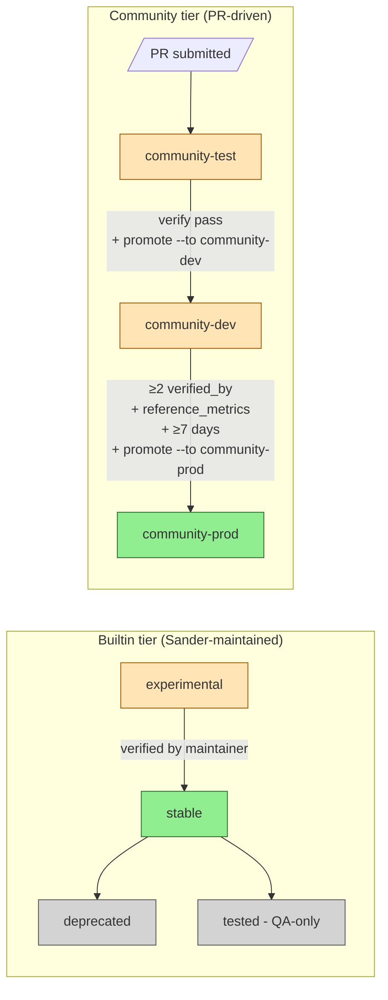

# Genesis Universal Launcher + ModelConfig — Reference

Single entry point for ALL configs. Replaces the old `scripts/launch/start_*.sh` + `bare_metal_*.sh` duplicates. The **current format is V2 composition**: each launchable *preset* references a model + hardware + profile YAML triplet. The V1 monolithic one-file-per-combo format was **retired 2026-06-01 (Phase 10)** — its sections below are kept as labeled history.

---

## TL;DR (current V2 surface)

```bash
sndr preset list                                    # browse launchable presets
sndr preset explain prod-qwen3.6-35b-balanced       # card + composed runtime + fit + measured bench
sndr launch prod-qwen3.6-35b-balanced --dry-run     # render bash, don't exec
sndr launch prod-qwen3.6-35b-balanced --preflight-only  # env check (mounts/GPU/pin)
sndr launch prod-qwen3.6-35b-balanced               # boot
sndr config explain prod-qwen3.6-35b-balanced       # plain-English preset walkthrough
sndr config diff <key-a> <key-b>                    # field-by-field preset diff
```

Where `sndr` = `python3 -m sndr.cli`.

> The legacy `sndr model-config {list,validate,verify,diagnose,…}` bridge
> resolves only V1 monolithic keys — with V1 retired it currently returns
> an empty set (verified 2026-07-04). Use the `sndr preset` / `sndr config`
> / `sndr launch <preset>` surface above.

---

## Where configs live (3 tiers, priority order user > community > builtin)

| Tier | Path | Who edits |
|---|---|---|
| `user` | `~/.sndr/model_configs/*.yaml` (legacy alias: `~/.genesis/`; or `$GENESIS_MODEL_CONFIG_DIR`) | personal — your rig |
| `community` | `sndr/model_configs/community/*.yaml` | PR'd, reviewed |
| `builtin` | `sndr/model_configs/builtin/{model,hardware,profile,presets}/*.yaml` | Sander/maintainer |

Filename SHOULD match the YAML `key`. Registry indexes by `cfg.key`, so technically they can diverge — but `git grep` will hate you.

---

## Naming convention

Schema enforces kebab-case: `^[a-z0-9](?:[a-z0-9-]*[a-z0-9])?$`.

**V2 preset convention (current)**: `<audience>-<model-family>-<flavor>`,
e.g. `prod-qwen3.6-35b-balanced`, `prod-qwen3.6-27b-tq-k8v4`,
`qa-qwen3.6-27b-tested`, `llamacpp-qwen3.6-27b-q4km-1x`. Browse with
`sndr preset list`.

**V1 convention (HISTORICAL — retired 2026-06-01, Phase 10)** was
`<hardware>-<n_gpus>x-<model>-<flavor>`. Migration table for the retired
keys:

| Retired V1 key | Current pointer |
|---|---|
| ~~`a5000-2x-35b-prod`~~ | V2 `prod-qwen3.6-35b-balanced` |
| ~~`a5000-2x-27b-int4-tested`~~ | V2 `qa-qwen3.6-27b-tested` |
| ~~`a5000-1x-27b-int4-tested`~~ | V2 `qa-qwen3.6-27b-tq-1x` |
| ~~`a5000-2x-27b-int4-long-ctx`~~ | V2 `prod-qwen3.6-27b-tq-k8v4` (the interim `long-ctx-qwen3.6-27b` preset was itself archived) |

---

## YAML anatomy — V2 composition + field reference

**V2 (current)**: a launchable preset composes three YAMLs. Canonical
example `prod-qwen3.6-35b-balanced`
(`sndr/model_configs/builtin/presets/prod-qwen3.6-35b-balanced.yaml`):

```text
model    = model/qwen3.6-35b-a3b-fp8.yaml                  # checkpoint, KV format, spec method, genesis_env patches
hardware = hardware/a5000-2x-24gbvram-16cpu-128gbram.yaml  # rig: GPUs, VRAM, docker image + mounts
profile  = profile/qwen3.6-35b-balanced.yaml               # tuning deltas (max_num_seqs, env overrides)
```

Inspect the composition with `sndr preset explain prod-qwen3.6-35b-balanced`
or `sndr config explain prod-qwen3.6-35b-balanced`.

The annotated example below keeps the V1 monolithic *shape* (retired
2026-06-01) because the **field semantics are identical** — in V2 the same
fields are simply split across the three files (vllm-serve flags,
`spec_decode` and `genesis_env` in the model YAML; `docker:`/mounts in
hardware; deltas in profile). Values updated to the current stack:

```yaml
key: example-my-rig                 # kebab-case, unique across all tiers
title: 2× RTX A5000 — 35B-A3B FP8 PROD
description: One sentence. Maybe two.
schema_version: 1                    # bump on breaking changes
maintainer: sandermage
last_validated: '2026-05-05'
genesis_pin: 991dc1a                 # short SHA of patcher commit
vllm_pin_required: 0.23.1rc1.dev714+g09663abde   # KNOWN_GOOD_VLLM_PINS gate (current pin — SSOT: sndr/pins.yaml)
lifecycle: stable                    # stable | experimental | deprecated | tested | community-test | community-dev | community-prod
# (community-* states require community_submitted: true and use the
#  promote workflow — see "Community config flow" section below)
workload_tag: balanced               # balanced | long-context | high-tps | ...

hardware:
  gpu_match_keys: [rtx a5000]        # name-substring match in nvidia-smi
  n_gpus: 2
  min_vram_per_gpu_mib: 22000
  cuda_capability_min: [8, 6]        # Ampere SM 8.6

# vLLM serve flags (1:1 with --flag-name)
model_path: /models/...
served_model_name: qwen3.6-35b-a3b
quantization: null                   # FP8 native = null; gptq/awq/auto_round otherwise
kv_cache_dtype: turboquant_k8v4      # fp8_e5m2 | turboquant_k8v4 | auto
max_model_len: 280000                # PROD 35B serves 280K on 2x A5000
gpu_memory_utilization: 0.90
max_num_seqs: 2
max_num_batched_tokens: 4096
enable_chunked_prefill: true
dtype: float16
enforce_eager: false
disable_custom_all_reduce: true
disable_log_stats: true              # true (default) = --disable-log-stats; set false to expose live vLLM /metrics (GUI Inference panel). Also a rig sizing / profile sizing_override knob.
language_model_only: true
trust_remote_code: true
enable_auto_tool_choice: true
tool_call_parser: qwen3_xml          # PROD switched from qwen3_coder 2026-06-14
reasoning_parser: qwen3

spec_decode:
  method: mtp                        # mtp | ngram | eagle
  num_speculative_tokens: 5          # PROD: K=5 on 35B (re-tuned 2026-06-19); K=4 on 27B TQ

# Genesis patcher env (P*, PN*, GENESIS_*)
genesis_env:
  GENESIS_ENABLE_P58_ASYNC_PLACEHOLDER_FIX: '1'
  GENESIS_ENABLE_P67_TQ_MULTI_QUERY_KERNEL: '1'
  # ... audit cross-checks these against PATCH_REGISTRY (catches typos)

# System env (PYTORCH_*, VLLM_*, NCCL_*, OMP_*, CUDA_*, TRITON_*)
system_env:
  PYTORCH_CUDA_ALLOC_CONF: 'expandable_segments:True,...'
  VLLM_LOGGING_LEVEL: WARNING
  # ...

vllm_extra_args:                     # raw CLI args appended to `vllm serve`
  - --no-scheduler-reserve-full-isl

api_key: genesis-local
host: 0.0.0.0

docker:
  image: vllm/vllm-openai:nightly
  container_name: vllm-server
  port: 8000
  shm_size: 8g
  memory_limit: 64g
  network: sndr_core_engine_default
  gpus: all                          # all | '"device=0"' | '"device=0,1"'
  mounts:                            # host:container[:mode]
    - ${HOME}/models:/models:ro
    - ${HOME}/.cache/huggingface:/root/.cache/huggingface:ro
    - /path/to/sndr_core_engine/vllm/sndr_core:/usr/local/lib/python3.12/dist-packages/vllm/sndr_core:ro
  extra_run_flags:
    - --security-opt label=disable

# Frozen reference from a real bench (validate gate uses this).
# The block below is a HISTORICAL example frozen at its 2026-05-05 bench
# (pin of that date) — R-014 requires reference_metrics.vllm_pin to equal
# vllm_pin_required, so re-bench when you bump the pin.
reference_metrics:
  measured_at: '2026-05-05T18:35:00Z'
  bench_method: bench_35b.sh × 5 sections
  long_gen_sustained_tps: 192.6
  long_gen_mean_lat_s: 5.19
  short_gen_tps: 225.6
  tool_call_score: 9/10
  stability_mean_s: 1.387
  stability_cv_pct: 1.80
  vram_used_mib_per_gpu: [22265, 21558]
  vram_total_mib: 43823
  genesis_pin: 991dc1a
  vllm_pin: 0.20.2rc1.dev9+g01d4d1ad3

# verify command fails if any tolerance is breached
verify_tolerances:
  tps_drop_pct_max: 5.0
  tool_call_min: 9/10
  stability_cv_pct_max: 6.0
  vram_increase_mib_max: 2000

verified_on:
  - 'sandermage/2xA5000-A2: 192.6 TPS, 9/10 tool, 991dc1a, 2026-05-05'

notes:
  - 'ℹ Pin gate enforces vllm_pin_required (current: 0.23.1rc1.dev714+g09663abde)'
  - '⚠ Do NOT enable --enable-prefix-caching with TQ k8v4 + spec_decode'
```

---

## 5-layer validation pipeline

| Layer | Command | What it catches | When to run |
|---|---|---|---|
| 1 schema | `validate` | required fields, type/format | CI, pre-commit |
| 2 audit_rules | `validate` (19 rules) | missing critical patches, typos in env names, pin drift, lifecycle gaps | CI, pre-commit |
| 3 preflight | `preflight` | mounts exist, container free, GPU visible, VRAM sufficient, git pin matches | pre-launch |
| 4 diagnose | `diagnose` | container up, env exported, boot summary parsed, /v1/models responsive | post-launch |
| 5 verify | `verify` | bench TPS/tool/CV/VRAM vs reference (CI gate) | post-bench |

---

## 19 audit rules (offline, fast — R-001 through R-019, `sndr/model_configs/audit_rules.py`)

| ID | What it checks | Severity if violated |
|---|---|---|
| R-001 | P98 required for TQ k8v4 + hybrid GDN (vllm#40941 lock) | error |
| R-002 | P67 multi-query kernel for spec_decode + TQ | warn |
| R-003 | P58 async-scheduler -1 placeholder fix for spec+cudagraph | warn |
| R-004 | P60 + P60B for GDN + ngram spec | warn |
| R-005 | PN59 streaming-GDN for long-ctx hybrid (Cliff 2b) | warn |
| R-006 | P87 + P91 for Marlin path quantized weights | warn |
| R-007 | P72 profile_run cap for chunked-prefill + MoE batched > 4096 | warn |
| R-008 | P61 / P64 / P68 / P69 for Qwen3 tool-call quality | warn |
| R-009 | Block `--enable-prefix-caching` on hybrid + TQ + spec | error |
| R-010 | Block 27B + TQ + cudagraph FULL (.tolist crash on GQA=6) | error |
| R-011 | Cross-check `genesis_env` keys vs PATCH_REGISTRY (typo catcher) | error |
| R-012 | VRAM math sanity: model + KV vs n_gpus × min_vram × util | warn |
| R-013 | `vllm_pin_required` must be in KNOWN_GOOD_VLLM_PINS | error |
| R-014 | `reference_metrics.vllm_pin == vllm_pin_required` | error |
| R-015 | `lifecycle: stable` requires `reference_metrics` | error |
| R-016 | `lifecycle: stable` should pin `genesis_pin` | warn |
| R-017 | `cudagraph_mode` divergence from `FULL_AND_PIECEWISE` (the bench-validated Genesis default) | warn |
| R-018 | Hybrid-mamba REQUEST_CONSTANT state capacity — high `max_num_seqs` × per-request mamba state (replicated across all TP ranks) can OOM at boot | warn |
| R-019 | Unresolved `${var}` in `docker.mounts` vs `host.yaml` `paths:` (see the symbolic-mounts section below) | error |

---

## CLI subcommands (under `sndr model-config <subcommand>` — 14, matches `sndr model-config --help`)

> Reminder: these resolve V1 monolithic keys only (retired Phase 10) — for
> the current preset surface use `sndr preset` / `sndr config` / `sndr
> launch <preset>`.

| Subcommand | What it does |
|---|---|
| `list` | Show all configs (3 tiers merged), TPS/tool/CV columns |
| `show <key>` | Print full YAML |
| `where <key>` | Print tier + filesystem path |
| `render <key>` | Emit equivalent bash launch script (no exec) |
| `audit <key>` | Run the 19 audit_rules (cross-patch checks) standalone |
| `validate <key>` | Schema check + 19 audit rules (offline-fast) |
| `preflight <key>` | Pre-launch env check (mounts/container/GPU/VRAM/git pin) |
| `launch <key>` | Boot (auto-runs preflight first) |
| `diagnose <key>` | Runtime check on running container |
| `verify <key>` | Run bench, diff vs reference_metrics, exit 1 on tolerance breach |
| `new <key> --template <existing>` | Clone existing config to user dir, clear `reference_metrics` (also `--from-running <container>`) |
| `save <key>` | Persist edits |
| `promote <key> --to <tier>` | Promote community config along community-test → -dev → -prod (see flow below) |
| `bench-and-update <key>` | Bench, then write fresh `reference_metrics` back into YAML |

---

## Multi-runtime support (W-runtime 2026-05-06)

Genesis configs can declare which container runtimes they're known to work
on. Operator picks one at launch time via `--runtime` flag. Symbolic mounts
(`${var}`) make configs portable across rigs by resolving paths via
`~/.sndr/host.yaml` (auto-detected at install; `~/.genesis/` is a legacy
alias).

### `deploy:` block

Add to any config to declare runtime compatibility:

```yaml
deploy:
  docker: true        # tested & shipped (default for all builtin configs)
  podman: true        # opt-in: docker-compatible with --device nvidia.com/gpu=all
  kubernetes: false   # opt-in: SHIPPED via `sndr service install --runtime kubernetes` (Deployment + Service + ConfigMap manifest under ~/.sndr/k8s/; audit C3 closure 2026-05-16) and `sndr k8s render <preset>`. Default false so operators opt in explicitly.
  lxc_proxmox: false  # opt-in: NOT YET implemented; Proxmox kernel 6.17.x
                      # has known asyncio footgun → use bare_metal instead
                      # (see noonghunna club-3090 CONTAINER_RUNTIMES.md)
  bare_metal: true    # opt-in: native venv launch (Proxmox-friendly)
  default: docker     # which runtime when --runtime not given
```

### Symbolic mounts

Replace hardcoded paths with `${var}` references:

```yaml
docker:
  mounts:
    - ${models_dir}:/models:ro
    - ${hf_cache}:/root/.cache/huggingface:ro
    - ${triton_cache}:/root/.triton/cache
    - ${compile_cache}:/root/.cache/vllm/torch_compile_cache
    - ${sndr_src}:/usr/local/lib/python3.12/dist-packages/vllm/sndr_core:ro
    - ${plugin_src}:/plugin:ro
```

Resolved at render time via `~/.sndr/host.yaml`. Each user has different
filesystem — symbolic mounts mean configs travel between rigs unchanged.

**Backward compat:** absolute paths pass through unchanged. Builtin
Sander-maintained configs continue using absolute paths until migration is
incremental.

### `~/.sndr/host.yaml`

Auto-detected at `install.sh` time by scanning common locations:

```yaml
paths:
  models_dir: ~/models                 # or /data/models, /opt/models
  hf_cache: /home/user/.cache/huggingface
  triton_cache: /var/cache/triton      # auto-created if missing
  compile_cache: /var/cache/vllm-compile
  sndr_src: /opt/sndr_core_engine/vllm/sndr_core
  plugin_src: /opt/sndr_core_engine/tools/genesis_vllm_plugin
```

Re-run detection: `FORCE_REDETECT=1 install.sh` or manually:
```bash
python3 -c "from sndr.model_configs.host import detect_and_save; detect_and_save()"
```

(The old `vllm.sndr_core.model_configs.host` import path no longer resolves
after the `sndr/` rename — verified 2026-07-04.)

### CLI usage

```bash
# Use deploy.default runtime (typically docker)
sndr model-config render <key>

# Override — Proxmox LXC users with kernel 6.17.x footgun
sndr model-config render <key> --runtime bare_metal

# Podman (rootless / RHEL family)
sndr model-config render <key> --runtime podman

# Kubernetes (shipped 2026-05-16; also: sndr k8s render <preset>)
sndr model-config render <key> --runtime kubernetes
```

### Audit rule R-019 — unresolved `${var}` catch

Validates that every `${var}` in `docker.mounts` has a corresponding entry
in `host.yaml`. Fires at validate time so operator catches typos / missing
config BEFORE booting (which would fail with cryptic mount errors):

```bash
$ sndr model-config validate community-rig-3090-qwen3.6
ERROR (R-019): symbolic mounts reference ['unknwn_dir'] but host.yaml only
defines ['models_dir', 'hf_cache', 'triton_cache', 'compile_cache',
'sndr_src', 'plugin_src']. Add these vars to ~/.sndr/host.yaml
`paths:` section.
```

### Runtime-specific notes

#### Docker (default, baseline)
Tested + supported. Every Genesis benchmark uses Docker. NVIDIA Container
Toolkit required for GPU passthrough.

#### Podman
Renders identical to docker with substitutions:
- `docker run` → `podman run`
- `--gpus all` → `--device nvidia.com/gpu=all`

Compose semantics may differ — use `COMPOSE_BIN=podman compose` if running
through compose path. See [noonghunna CONTAINER_RUNTIMES.md](https://github.com/noonghunna/club-3090/blob/main/docs/CONTAINER_RUNTIMES.md)
for podman-specific gotchas.

#### Kubernetes (microk8s / k3s / k8s)
**Shipped 2026-05-16** (audit C3 closure): `sndr service install
--runtime kubernetes` emits Deployment + Service + ConfigMap manifests
under `~/.sndr/k8s/`, and `sndr k8s render <preset>` renders the manifest
for a V2 preset key (verified 2026-07-04). GPU via the NVIDIA k8s device
plugin; Genesis patch mounts via ConfigMap/initContainer per the original
design (noonghunna disc#48, @apnar).

#### Proxmox LXC
**Known footgun:** Docker image vllm/vllm-openai:nightly + Proxmox VE
kernel 6.17.x = `RuntimeError: this event loop is already running` at
`uvloop.run()`. Bare-metal venv works on the same host (per @lexhoefsloot
bisect). For Proxmox users:
- Try `--runtime bare_metal` (renders venv launch script)
- OR try Docker with `--privileged` (sometimes unblocks namespace policy)

#### Bare-metal venv
Renders bash script that sources a venv + runs `vllm serve` natively. No
container. Operator must have venv at `vllm_venv` path with vllm
pip-installed at the matching pin. Genesis patches loaded via PYTHONPATH
+ plugin pip-install.

## Common workflows

### Add your own config (clone an existing one)

```bash
# Current V2 path: scaffold from the detected host
sndr config new my-rig --from-detect
# Legacy V1 path (needs an existing V1 key — retired; kept for history):
#   sndr model-config new my-rig --template <existing-key>
# edits go to ~/.sndr/model_configs/my-rig.yaml
$EDITOR ~/.sndr/model_configs/my-rig.yaml
sndr model-config validate my-rig          # catch typos before boot
sndr model-config preflight my-rig         # catch mount/GPU issues before boot
sndr launch my-rig                    # boot

# After bench:
sndr model-config bench-and-update my-rig  # freezes reference_metrics
# Want to share? Move to community/ and PR.
```

### Promote experimental → stable

`lifecycle: experimental` is allowed without `reference_metrics`. To go stable:

1. `sndr launch <key>` — boot
2. Wait for healthy `/v1/models`
3. `sndr model-config bench-and-update <key>` — fills reference_metrics
4. Edit YAML: `lifecycle: experimental` → `stable`, set `genesis_pin` if missing
5. `sndr model-config validate <key>` — must pass with 0 errors

### Community config flow (W-A 2026-05-06)

Community-submitted configs follow a 3-tier safety ladder before being
recommended as production-ready. Each transition has a hard schema gate
enforced by `cfg.validate()`.



**Reading guide:**
- 🟢 green = production-ready (recommended for operators)
- 🟡 amber = under verification (NOT recommended for production)
- ⚪ grey = QA / migration / archive (do NOT compare against working)

#### Required fields for community configs

```yaml
community_submitted: true            # MUST be true for any community-* lifecycle
verified_by:                         # list of "<rig-tag>@<github-handle>-<ISO-date>"
  - 'rtx-a5000@sandermage-2026-05-06'
  - 'rtx-3090@noonghunna-2026-05-08'
test_started_at: '2026-04-30'        # ISO date when promoted to community-test
```

#### Promotion: community-test → community-dev

After your config boots cleanly + passes `sndr model-config verify`:

```bash
sndr model-config promote my-rig-config \
    --to community-dev \
    --rig-tag rtx-a5000 \
    --handle yourhandle
```

This appends `<rig>@<handle>-<today>` to `verified_by` and flips lifecycle.
Schema validation runs after edit; on failure the change is rolled back.

#### Promotion: community-dev → community-prod

Hard gates (all must pass):
- ≥2 distinct entries in `verified_by` (cross-rig validation)
- `reference_metrics` populated (run `bench-and-update` first)
- ≥7 days since `test_started_at` (cooling-off; use `--force` to bypass)

```bash
sndr model-config promote my-rig-config --to community-prod
# OR with cooling-off bypass (e.g. critical fix)
sndr model-config promote my-rig-config --to community-prod --force
```

#### Why this exists

Builtin configs (`stable` lifecycle) are maintained by Sander on validated
hardware. Community configs widen coverage to more GPUs / regions / models —
but without a safety ladder, a single broken config could mislead operators.
The 3-tier flow ensures every recommended community config is independently
verified on multiple rigs over time.

### Investigate a crash on a config

```bash
sndr model-config validate <key>           # schema + 16 audit rules (does the config even make sense?)
sndr model-config render <key> > /tmp/launch.sh   # see exact bash that would run
sndr model-config preflight <key>          # mounts? GPU? pin drift?
docker logs <container_name> 2>&1 | tail -200 # boot log — look for "register() complete: N applied / M skipped"
sndr model-config diagnose <key>           # runtime cross-check of env exports
```

---

## Failure modes & gotchas

- **Schema error on unknown env name** — `R-011` catches `GENESIS_ENABLE_PXX_TYPO`. Fix the typo or add the patch to `PATCH_REGISTRY` first.
- **`R-013` rejects vllm pin** — your pin isn't in `KNOWN_GOOD_VLLM_PINS` (in `sndr/engines/vllm/detection/guards.py`). Bump the allowlist if pin is genuinely validated.
- **preflight fails on `genesis_pin`** — your local `git HEAD` short SHA doesn't match `genesis_pin`. Either git checkout the pinned commit, or update the YAML if your new commit is validated.
- **diagnose says "register() complete: N applied / M skipped"** — patches in `genesis_env` that didn't fire show in M. Look at boot log for skip reason (model class mismatch / sm capability / opt-in).
- **verify exits 1 on TPS drop** — tolerance breach. Either: regression to debug, or genuine ratchet → re-run `bench-and-update`.
- **Two configs share `key`** — registry rejects with `RegistryError: duplicate key`. Pick a new key for the user/community config.

---

## Why this exists

Old world: 18 `start_*.sh` + 18 `bare_metal_*.sh` scripts. Same tuning lived in 2 places. Any change required editing 2 files. Adding a new rig meant copy-paste-modify of 600-line bash. No way to query "what configs exist?" or "did config X regress?".

New world: 1 YAML per (model, hardware, tuning). 1 launcher. 5 layers of validation catch drift before it costs a 30-min boot. `reference_metrics` + `verify_tolerances` make TPS/tool/CV regression a CI failure, not a 6-month-later forum complaint.

---

## File map (matches disk, 2026-07-04)

```
sndr/model_configs/
├── __init__.py                 # exports ModelConfig + sub-components
├── schema.py / schema_v2.py    # dataclasses + validation (V1 legacy / V2 layered)
├── registry.py                 # legacy 3-tier loader (user > community > builtin)
├── registry_v2.py              # V2 loader — list_presets() / triplet composition
├── compose.py                  # model + hardware + profile composition
├── preset_schema.py            # preset card schema (drives `sndr preset`)
├── audit_rules.py              # 19 rules (R-001 through R-019)
├── preflight.py / preflight_fit.py  # pre-launch env checks + fit projection
├── diagnose.py                 # runtime checks
├── verify.py                   # bench-vs-reference gate
├── host.py                     # host.yaml detection (detect_and_save)
├── kv_projector.py             # byte-level KV fit projection (sndr kv-calc)
└── builtin/                    # V2 layered ONLY — no V1 monolith YAMLs remain on disk
    ├── model/      # <id>.yaml  — checkpoint, KV format, spec method, patches
    ├── hardware/   # <id>.yaml  — rig (GPU, VRAM, CPU, RAM, mounts)
    ├── profile/    # <id>.yaml  — env/runtime tuning deltas
    └── presets/    # <alias>.yaml — composes model + hardware + profile
        └── _archive/  # archived presets (dflash family, gemma K-variants, long-ctx-27b, …) — do not route users here
```

Retired V1 monolith → current pointer (all retired 2026-06-01, Phase 10):

- `a5000-2x-35b-prod` → V2 preset `prod-qwen3.6-35b-balanced`
- `a5000-2x-27b-int4-tq-k8v4` → V2 preset `prod-qwen3.6-27b-tq-k8v4`
- `a5000-2x-27b-int4-tested` → V2 preset `qa-qwen3.6-27b-tested`
- `a5000-2x-27b-int4-long-ctx` → V2 preset `prod-qwen3.6-27b-tq-k8v4`
  (the interim `long-ctx-qwen3.6-27b` pointer was itself archived)
- `a5000-2x-27b-int4-tq-k8v4-dflash` / `a5000-2x-27b-dflash-true` /
  `a5000-2x-35b-fp8-dflash` → the DFlash presets (and the
  `experimental-qwen3.6-27b-tq-dflash-ab` A/B preset) are archived in
  `presets/_archive/` pending re-validation — see
  [`SPEC_DECODE_GUIDE.md`](SPEC_DECODE_GUIDE.md)
- `a5000-1x-tier-aware-pn95` → PN95 tier_config
  `sndr/cache/pn95/tier_configs/a5000-1x-pn95-long-ctx.yaml`
- `a5000-2x-tier-aware-EXAMPLE` → PN95 tier_config
  `sndr/cache/pn95/tier_configs/a5000-2x-tier-aware.yaml`
- `single-3090-dense-cpu-offload-EXAMPLE` → V2 preset
  `example-3090-dense-cpu-offload`
- `single-3090-hybrid-gdn-tier-aware-EXAMPLE` → V2 preset
  `example-3090-tier-aware`

**V1 is fully retired** (Phase 10 sunset, 2026-06-01): the registry no
longer loads monolithic YAMLs, and the doc/preset gate
(`tests/unit/test_doc_preset_keys.py`) forbids V1 keys on the operator
surface. All configs are V2 triplets composed by `registry_v2`; browse
with `sndr preset list`, launch with `sndr launch <preset>`.
