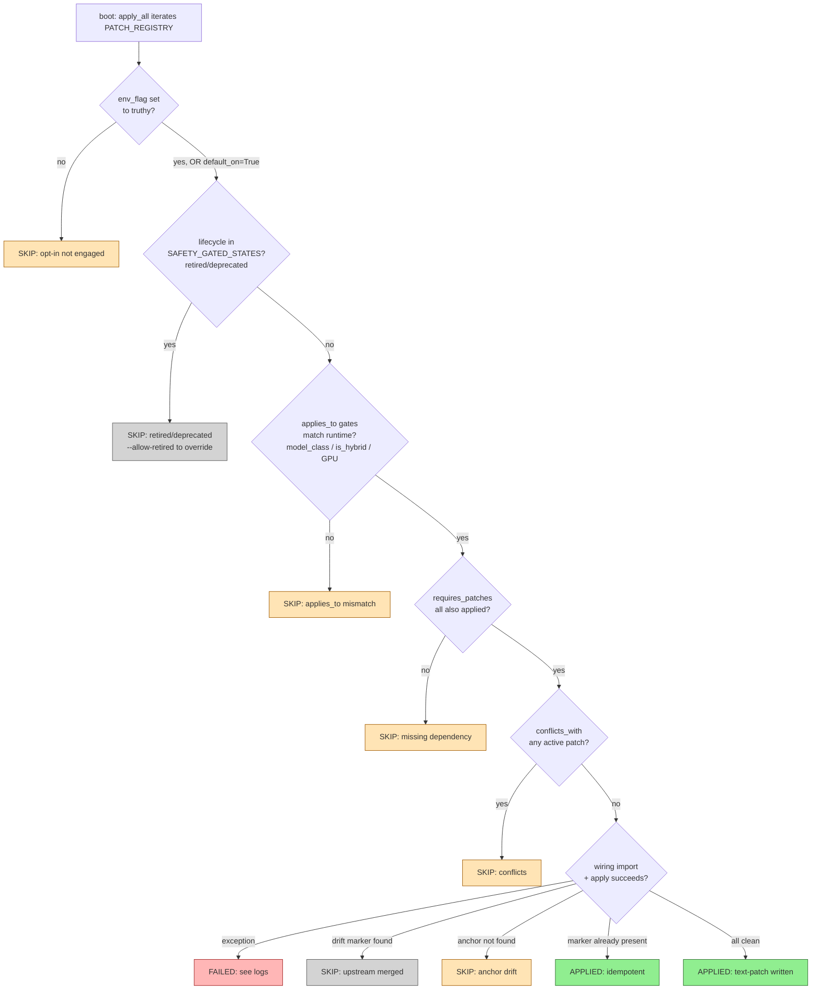

# Genesis vLLM Patches — Complete Reference

This file is the **curated narrative reference** for every Genesis runtime patch.
For each patch you get: ID, title, what it does, status (ON / opt-in / deprecated),
env flag to toggle, upstream PR (if backported), and credit.

> 📊 **Full machine-readable table** — auto-generated from `dispatcher/registry.py` —
> at [**`PATCHES_AUTO.md`**](PATCHES_AUTO.md). Regenerate via
> `python3 scripts/generate_patches_md.py`. CI gate: `--check` mode (audit 2026-05-11).
>
> 🛡️ **Release policy** — which patch-proof mode gates a public release —
> is documented in [**`RELEASE_POLICY.md`**](RELEASE_POLICY.md). The
> current public gate is `require-static`; two stricter ratchets
> (`require-bench`, `require-baseline`) are available for operators
> preparing a hardened deploy.

## Current state (v12.0.0, 2026-05-22)

**Total PATCH_REGISTRY entries:** 226 — range covers `P1`–`P109` legacy +
`PN8`–`PN275` modern + `G4_01`–`G4_78` Gemma 4 family + sub-patches
(P5b, P7b, P15B, P18b, P38B, P39a, P61c, P67b, P67c, P79d, PN26b,
PN40-classifier) + library/diagnostic (P51, P102, P103) + the standalone
`SNDR_WORKSPACE_001` entry. P56/P57 archived 2026-05-05; PN71 burned
by abandoned prealloc_v2 experiment; PN78 tombstoned; P39a flipped to
community per the strict-AND audit.

**Library modules** (not in PATCH_REGISTRY but available for patches to
use): `vllm.sndr_core.cache.eviction_policies` — LRU/2Q/ARC eviction
policy classes (37 unit tests, scan-pollution verified). Awaiting full
backport of vllm#40270 with proper BlockPool integration before being
added as a registry patch.

| Metric | Count |
|:-------|:------|
| Total PATCH_REGISTRY entries | **226** |
| Tier=community (Apache 2.0, sndr_core) | **226** (all entries) |
| Tier=engine (commercial, sndr_engine) | **0** (PN72 reclassified to community 2026-05-08; sndr_engine namespace reserved but empty) |
| Default-on at boot | 52 |
| Lifecycle=experimental | 157 |
| Lifecycle=legacy (pre-dispatcher) | 33 |
| Lifecycle=retired | 15 |
| Lifecycle=research | 4 |
| Lifecycle=stable | 15 (PN33, PN35, G4_01, G4_02, G4_03, G4_04, G4_05, G4_09, G4_11, G4_12, G4_13, G4_14, G4_16, G4_23, G4_25 — ratchet active with `stable_kind` declared; see [STABLE_PROMOTION_CHECKLIST.md](CONTRIBUTING.md#promoting-a-patch-to-lifecyclestable)) |
| Lifecycle=coordinator | 2 (env-flag-only, no real binding) |
| Implementation status=full | 173 |
| Implementation status=marker_only / placeholder / partial / retired | 30 (17 + 2 + 7 + 4) |
| Apply-loop coverage (apply_module set) | 209 / 226 = 92.5% |
| Spec-only (intentional, allow-listed) | 17 (P1, P17, P18b, P20, P23, P29, P32, P51, P102, PN60, PN63, PN64, PN256, PN261, G4_70, G4_70B, G4_70C) |

### Engine tier (the strict-AND boundary)

A patch is `tier="engine"` only when ALL four conditions hold (Sander's
strict AND rule, audit 2026-05-08):

1. NOT present on the public github repo.
2. NO external author credit in title/credit text.
3. NO PR link / PR number in title/credit text.
4. NO `upstream_pr` / `related_upstream_prs` field.

After the strict-AND + github-presence audit (2026-05-08):

- **PN72** was the only candidate but reclassified to community since
  its real algorithm lives in `vllm/sndr_core/kernels/ngram_frequency_filter.py`
  (subsystem boundary). `sndr_engine` namespace remains reserved but empty;
  `engine_available()` returns `False`.

Everything previously parked in engine (P67/P67b/P67c, PN21..PN24, PN26,
PN29, PN38, PN40, PN57, P82, PN16, PN65, plus 30+ legacy P*) was reclassified
to community and ships in `vllm/sndr_core/integrations/<family>/` under Apache 2.0.

### Tombstones (deprecated, no-op)

- **PN78** — post-warmup `empty_cache()` wrap. Deprecated 2026-05-07
  same day it was created: `apply()` returns `"skipped"` unconditionally.
  Investigation found vllm pin already calls `torch.accelerator.empty_cache()`
  twice in `gpu_model_runner.py:capture_model()` (lines 6213 + 6244), so the
  wrap would be redundant. Architectural lesson: monkey-patches in
  `apply_all` don't reach spawn'd workers — only source-level edits do.

### Recent additions (v11.0 sprint)

- **PN95** (2026-05-09, Path C v7.73.x foundation) — Genesis-original
  tier-aware KV cache + vision sub-tier + Mamba SSM exclusion. Solves
  club-3090 issue #58 long-context+vision OOM on hybrid-GDN models
  (which all upstream CPU offload paths — vLLM `--cpu-offload-gb`,
  `SimpleCPUOffloadConnector`, LMCache, SGLang HiCache — crash on
  because Mamba state lives outside the KV pool). Two anchors:
  `single_type_kv_cache_manager.py::cache_blocks` notify_admit, and
  `block_pool.py::get_cached_block` notify_touch. Runtime singleton
  TierManager (`vllm/sndr_core/cache/tier_manager.py`) owns per-tier
  EvictionPolicy + CPU-pool slab + vision-first demote ordering +
  Mamba-exclusion filter + spec-decode hot ring. Schema:
  `cache_config.tiers: [CacheTier(...), ...]` with `exclude_mamba_ssm:
  true` (mandatory on hybrid GDN). Default OFF; opt in via
  `GENESIS_ENABLE_PN95_TIER_AWARE_CACHE=1` + declared tiers in YAML.
  Days 5-7 (vision-token MM tagging + Mamba runtime classifier walk +
  live 27B Lorbus bench) deferred to live integration.
- **PN16_V6** (2026-05-09, Sprint 4) — Genesis-original streaming
  `<think>` token-budget enforcer. Per-request stateful truncator
  (`vllm/sndr_core/middleware/think_streaming_truncator.py`) wraps
  `OpenAIServingChat.chat_completion_stream_generator` via class-rebind.
  When request has tools attached AND
  `GENESIS_PN16_MAX_THINKING_STREAM_TOKENS > 0`, counts
  `delta.reasoning_content` chunks; once budget exceeded, drops
  subsequent reasoning chunks and emits one-shot `[Genesis] truncation
  note` as `delta.content`. tool_calls + plain content always pass.
  Cache-safe (no chat_template mutation) + compute-neutral (model still
  generates internally). Stacks on V8: V8 nudges, V6 enforces. Default
  OFF; opt in via `GENESIS_ENABLE_PN16_V6_STREAMING_TRUNCATOR=1`.
- **PN90** (2026-05-09, Wave 3.1) — vllm#40269 backport: probabilistic
  draft rejection. Captures `softmax(logits)` in `_greedy_sample` of
  MTP/Eagle/DFlash drafters, stacks per K-step into
  `[total_draft_tokens, vocab]` 2D layout, feeds to rejection_sampler
  via `gpu_model_runner.py` site (replaces literal `None,
  # draft_probs`). Rejection rule becomes `min(1, target/draft)`
  instead of argmax-or-bonus. Expected +0.5-2% acceptance on MTP K=3.
  Atomic via MultiFilePatchTransaction (proposer + runner). Default
  OFF; opt in via `SNDR_ENABLE_PN90_PROBABILISTIC_DRAFT=1`.
- **PN82** (2026-05-08, PR38 Day 1) — vllm#41873 backport zeroing padded
  `is_prefilling` rows so Mamba/hybrid backends don't read stale True from
  `condense()` rotation. Hybrid-only via `applies_to`, default OFF.
- **PN55v2** (2026-05-08, PR38 Day 2) — same patch_id as PN55, body upgraded
  from list-only to recursive iterator covering `Tensor` / `list` / `tuple`
  / `Mapping` / `None` / non-tensor sentinels. Unified backport of
  vllm#41602 + vllm#41896.
- **PN80** (2026-05-07) — vllm#41845 backport of LoRA tensorizer device
  kwarg (single-line fix not yet in nightly image).
- **PN79** (2026-05-07) — In-place SSM state for GDN chunk prefill
  (vllm#41824 backport). Most complex patch in the registry: 17 anchors
  atomic across 3 files via MultiFilePatchTransaction. A/B null-impact
  on single-shot; multi-turn validation pending. `lifecycle="experimental"`.

### Archived dead-ends

- **P56 / P57** archived 2026-05-05 — TQ spec-decode dead-ends superseded
  by P65 (CG downgrade). Files live in
  `Genesis_internal_docs/_archive/dead_patches/p56_p57_tq_specdec_deadends/`.
- **PN71** — abandoned prealloc_v2 experiment, never landed.

### Native upstream features (no Genesis backport needed)

The following capabilities are native to dev93 and require no Genesis
patch — Genesis would only add a stub. Documented here so users know
where to enable them.

- **CPU KV cache offloading** (vllm#37160, merged upstream) — exposed as
  `SimpleCPUOffloadConnector` at
  `vllm/distributed/kv_transfer/kv_connector/v1/simple_cpu_offload_connector.py`.
  Enable with:

  ```bash
  --kv-transfer-config '{"kv_connector": "SimpleCPUOffloadConnector",
    "kv_role": "kv_both",
    "kv_connector_extra_config": {"cpu_bytes_to_use": 34359738368}}'
  ```

  Caveats for Genesis stack:
  - **Hybrid GDN models (Qwen3.6-A3B family) are NOT compatible** —
    Mamba SSM state lives outside the KV cache and can't be offloaded
    via this path. Use only on dense attention models (e.g. Qwen3-7B).
  - Frees +96K context worth of GPU VRAM at the cost of CPU↔GPU PCIe
    traffic on miss; suits long-context dense workloads only.
- **Other connectors in dev93:** `LMCacheConnector`,
  `MooncakeConnector`, `NixlConnector`, `OffloadingConnector`,
  `MultiConnector`. See vllm docs for matrix.

---

- **Source of truth:** `vllm.sndr_core.dispatcher.PATCH_REGISTRY` (rich
  metadata; lifecycle-tracked; schema-validated) +
  `vllm.sndr_core.dispatcher.spec.iter_patch_specs()` (canonical apply_module
  resolver; the new spec-driven loop).
- **Legacy parking lot:** `vllm.sndr_core.apply._per_patch_dispatch` —
  the 4542-line `@register_patch` registry kept as fallback during the
  PR38 Day 6-8 migration to registry-driven apply (opt-in via
  `SNDR_APPLY_VIA_SPECS=1`).
- **All patches default OFF** unless explicitly noted. Production launch
  script enables a curated set via env flags.
- **Credits:** every backport names its upstream author + PR. Genesis-original
  patches are explicitly labelled. See [`CREDITS.md`](CREDITS.md).
- **Status legend:**
  - `default ON` — patch self-activates when its config gate passes
  - `opt-in` — requires `GENESIS_ENABLE_<patch>=1` env var
  - `deprecated` / `retired` — superseded by another patch; kept for archeology
  - `library` — utility module loaded by other patches, no direct env flag


---

## How to enable / disable a patch

```bash
# Enable an opt-in patch:
docker run -e GENESIS_ENABLE_P82=1 -e GENESIS_P82_THRESHOLD_SINGLE=0.3 ... vllm/vllm-openai:nightly

# Disable a default-ON patch (rare — usually for A/B testing):
docker run -e GENESIS_ENABLE_P67_TQ_MULTI_QUERY_KERNEL=0 ... vllm/vllm-openai:nightly

# See full list of env vars + defaults:
# → CONFIGURATION.md
```

## Where the code lives

- **Integrations** (text-patcher hooks + runtime hooks): `vllm/sndr_core/integrations/<family>/<patch_id>_*.py` — organized by subsystem family (Phase 6 reorg, ~15 subdirs: attention/, spec_decode/, scheduler/, kv_cache/, memory/, kernels/, compile_safety/, loader/, lora/, middleware/, moe/, multimodal/, observability/, quantization/, reasoning/, serving/, tool_parsing/, worker/). Resolution is layout-agnostic via `compat/categories.module_for(patch_id)`.
- **Kernels** (Triton / CUDA): `vllm/sndr_core/kernels/`
- **Dispatcher metadata** (P56+): `vllm/sndr_core/dispatcher/registry.py:PATCH_REGISTRY`
- **Registration**: `vllm/sndr_core/apply/_per_patch_dispatch.py:@register_patch`
- **Per-patch CHANGELOG entries**: `CHANGELOG.md` (root, search by patch ID — audit 2026-05-11)

---

## How a patch is decided to apply or skip

Every patch goes through the same dispatcher decision tree at boot. The
tree below visualises the order of checks — if any check fails, the patch
is SKIPPED with a logged reason; if all pass, it APPLIES.



**Reading guide:**
- 🟢 green = patch active (production effect)
- 🟡 amber = predictable skip (operator decision or runtime mismatch)
- ⚪ grey = retired/upstream-merged (no longer needed)
- 🔴 red = unexpected failure (read logs!)

Boot summary (printed by `apply_all`) shows the verdict for each patch with
the reason. Use `genesis lifecycle-audit` to see which patches are at risk
of upstream-merge drift.

---

## Patches by category

### TurboQuant integration

| ID | Title | Status | Env Flag | Upstream | Credit |
|---|---|---|---|---|---|
| **P4** | TurboQuant hybrid model support | opt-in | — | — | Genesis (see source / CHANGELOG) |
| **P98** | TQ WorkspaceManager revert (vllm#40941 perf hotfix) | opt-in | `GENESIS_ENABLE_P98` | [#40941](https://github.com/vllm-project/vllm/pull/40941) | Reverts upstream PR #40941 WorkspaceManager indirection in turboquant_attn — required for TQ k8v4 on hybrid GDN models (else AssertionError on workspace lock) |
| **P101** | TQ continuation 64-token slicing (vllm#41123 SELECTIVE) | opt-in | `GENESIS_ENABLE_P101` | [#41123](https://github.com/vllm-project/vllm/pull/41123) | Selective backport of vllm#41123 TQ on hybrid models — takes the `_CONTINUATION_DECODE_SLICE` improvement only |
| **PN14** | TQ decode IOOB safe_page_idx clamp | opt-in | `GENESIS_ENABLE_PN14_TQ_DECODE_OOB_CLAMP` | [#40074](https://github.com/vllm-project/vllm/pull/40074) | devarakondasrikanth @adobe (vllm#40074, OPEN) — fixes upstream issue: TQ decode page-index out-of-bounds clamp |

### Memory / buffers

| ID | Title | Status | Env Flag | Upstream | Credit |
|---|---|---|---|---|---|
| **P6** | TurboQuant-aware attention page size | opt-in | — | — | Genesis (see source / CHANGELOG) |
| **P5** | KV cache page size unification | opt-in | — | — | Genesis (see source / CHANGELOG) |
| **P22** | TurboQuant shared dequant prealloc | opt-in | — | — | Genesis (see source / CHANGELOG) |
| **P26** | TurboQuant prefill output prealloc | opt-in | — | — | Genesis (see source / CHANGELOG) |
| **P44** | TQ mixed-batch attn_out pool | opt-in | — | — | Genesis (see source / CHANGELOG) |
| **P46** | GDN gating buffer pool | opt-in | — | — | Genesis (see source / CHANGELOG) |
| **P39a** | FLA chunk_scaled_dot_kkt persistent A pool | opt-in | — | — | Genesis (see source / CHANGELOG) |
| **P38** | TQ _continuation_prefill persistent workspace | opt-in | — | — | Genesis (see source / CHANGELOG) |
| **P36** | TurboQuant shared decode buffers | opt-in | — | — | Genesis (see source / CHANGELOG) |
| **P32/P33** | TurboQuant cu_2 + synth_seq_lens preallocs | opt-in | — | — | Genesis (see source / CHANGELOG) |
| **P28** | GDN core_attn_out prealloc | opt-in | — | — | Genesis (see source / CHANGELOG) |
| **P14** | block_table tail zero-fill | opt-in | — | — | Genesis (see source / CHANGELOG) |
| **P20** | TurboQuant continuation-prefill FP16 rotate | opt-in | — | — | Genesis (see source / CHANGELOG) |
| **PN12** | FFN intermediate scratch pool — Cliff 1 fix on TQ3 path | opt-in | `GENESIS_ENABLE_PN12_FFN_INTERMEDIATE_POOL` | [#34207](https://github.com/vllm-project/vllm/pull/34207) | Genesis-original 2026-04-29 — Cliff 1 fix on TQ3 path. Closes 138 MiB OOM at 192K context |
| **PN17** | FA2 softmax_lse runtime clamp (Cliff 1 mechanism A, Issue #11) | opt-in | `GENESIS_ENABLE_PN17_FA2_LSE_CLAMP` | — | Genesis-original 2026-04-30 in response to noonghunna's [Genesis Issue #11](https://github.com/Sandermage/genesis-vllm-patches/issues/11) cross-rig diagnosis (RTX 3090). Clamps `max_seqlen_k` from `attn_metadata.max_seq_len` (= max_model_len during cudagraph capture) to actual chunk max from `seqused_k.max()` at runtime. Closes Cliff 1 FA2 softmax_lse mechanism; widens long-text-no-vision safe envelope from ~150K to ~205K. Cudagraph-safe (capture-path falls back to original). Reference: Dao-AILab/flash-attention#1011. |
| **PN19** | Scoped max_split_size_mb during model load (vllm#41268) | opt-in | `GENESIS_ENABLE_PN19_SCOPED_MAX_SPLIT` | [#41268](https://github.com/vllm-project/vllm/pull/41268) | Backport of vllm#41268 (MatthewBonanni, OPEN). PyTorch 2.10+ introduced load-time allocator fragmentation; mitigates by temporarily setting `max_split_size_mb=20` (PyTorch minimum) during `Worker.load_model`, restores prior on exit. Cudagraph-safe (load-time only). Self-detects torch < 2.11 lacking `_accelerator_setAllocatorSettings` and falls through unchanged. Estimated 200-500 MiB headroom on H100; unverified on Ampere — operator should measure via nvidia-smi peak before relying on it. |
| **PN25** | SiluAndMul forward_native opaque-op pool — Cliff 1 mech B fix | opt-in | `GENESIS_ENABLE_PN25_SILU_INDUCTOR_SAFE` | — | Genesis-original 2026-05-01 — closes Cliff 1 mech B (PN12 inductor inline bypass) on TQ3 + spec-decode + TP=1 configs. Registers `genesis::silu_and_mul_pooled` torch op as Inductor-opaque, ensuring FFN intermediate buffer pool fires even when Inductor inlines `forward_native`. Worker-spawn safe (issue #16 fix 2026-05-02). |
| **PN31** | FA varlen persistent out buffer (issue #15, sister to P38) | opt-in | `GENESIS_ENABLE_PN31_FA_VARLEN_PERSISTENT_OUT` | — | Genesis-original 2026-05-02 — closes #15 OOM at flash_attn_varlen_func on budget-constrained single-GPU. Per-shape persistent `out` buffer eliminates per-call malloc pressure inside FA C extension. Memory cost: ~16-64 MiB per shape × layer. NULL impact on 2×A5000 PROD (we have headroom); designed for 1×3090/1×4090 community users. |

### Kernel performance

| ID | Title | Status | Env Flag | Upstream | Credit |
|---|---|---|---|---|---|
| **P3** | TurboQuant BF16->FP8 cast (Ampere fix) | opt-in | — | — | Genesis (see source / CHANGELOG) |
| **P23** | Marlin FP32_REDUCE env override | opt-in | — | — | Genesis (see source / CHANGELOG) |
| **P31** | MoE router fp32 softmax | opt-in | — | — | Genesis (see source / CHANGELOG) |
| **P81** | fp8 block-scaled MM low-M decode tuning (vllm#40925) | opt-in | `GENESIS_ENABLE_P81_FP8_BLOCK_SCALED_M_LE_8` | [#40925](https://github.com/vllm-project/vllm/pull/40925) | Backport of vllm#40925 (tonyliu312, OPEN). Specializes w8a8_triton_block_scaled_mm default config for M<=8 (single-reque |
| **P87** | Marlin W4A16/W8A16 sub-tile output dim pad-on-load (vllm#40361) | opt-in | `GENESIS_ENABLE_P87` | [#40361](https://github.com/vllm-project/vllm/pull/40361) | Backport of vllm#40361 (OPEN). MarlinLinearKernel requires per-rank out_features divisible by GPTQ_MARLIN_MIN_THREAD_N=64. Sub-tile shards (Qwen3.5 GatedDeltaNet at TP>=2, Intel/Qwen3.6-35B-A3B-int4-AutoRound n=32 shard) fail can_implement and force a slow non-Marlin fallback. P87 zero-pads weights/scales/qzeros at load. Class-rebind on MarlinLinearKernel.{can_implement, process_weights_after_loading, apply_weights}. **NOTE 2026-04-28:** v764 boots with P87+P93 enabled trigger torch.dynamo "marked as skipped" error during cudagraph capture; deep dive deferred. Use at your own risk. |
| **P91** | AutoRound row-parallel group cdiv + start-idx fix (vllm#39460) | opt-in | `GENESIS_ENABLE_P91` | [#39460](https://github.com/vllm-project/vllm/pull/39460) | Backport of vllm#39460 non-MoE portion (CLOSED but valid). Fixes silent dequant corruption when AutoRound INT4/INT8 checkpoints have row-parallel layers whose input_size_per_partition is not divisible by group_size at TP>=2. Text-patch on gptq_marlin.py + parameter.py. Hypothesized cause of Lorbus INT4 < INT8 perf gap. |
| **P93** | AllSpark bypass for INT8 W8A16 group_size=-1 (force Marlin path) | **archived** | — | — | Genesis-original 2026-04-28. **Archived 2026-05-06:** P93 was removed from PATCH_REGISTRY after v764c boot crash blocked measurement. Conceptual approach (prepend "AllSparkLinearKernel" to VLLM_DISABLED_KERNELS to force Marlin fallback for INT8 W8A16 group_size=-1) is documented here for historical reference. If revived, must be rewritten as a text-patch and re-registered. |
| **P72** | profile_run M cap (unblocks `--max-num-batched-tokens > 4096` on MoE) | opt-in | `GENESIS_ENABLE_P72_PROFILE_RUN_CAP` | — | Genesis-original (Dynamo fake-tensor mismatch workaround for moe_align_block_size symbolic shape) |
| **P37** | MoE intermediate cache pool (opt-in) | opt-in | — | — | Genesis (see source / CHANGELOG) |
| **P17/P18** | Marlin MoE per-SM tuning | opt-in | — | — | Genesis (see source / CHANGELOG) |
| **P1/P2** | FP8 kernel dispatcher | opt-in | — | — | Genesis (see source / CHANGELOG) |

### Spec-decode

| ID | Title | Status | Env Flag | Upstream | Credit |
|---|---|---|---|---|---|
| **P62** | structured-output spec-decode timing fix | opt-in | `GENESIS_ENABLE_P62_STRUCT_OUT_SPEC_TIMING` | [#36138](https://github.com/vllm-project/vllm/pull/36138) | sfbemerk (vllm#36138), cicirori (vllm#34650) |
| **P60b** | GDN+ngram Triton kernel offset | opt-in | `GENESIS_ENABLE_P60B_TRITON_KERNEL` | [#40738](https://github.com/vllm-project/vllm/pull/40738) | tdoublep (vllm#40738) |
| **P60** | GDN+ngram state recovery | opt-in | `GENESIS_ENABLE_P60_GDN_NGRAM_FIX` | [#40738](https://github.com/vllm-project/vllm/pull/40738) | tdoublep (vllm#40738), bhaktatejas922 (#39273) |
| **P63** | MTP/Eagle drafter GDN state recovery | deprecated | `GENESIS_ENABLE_P63_MTP_GDN_STATE_RECOVERY` | — | Genesis-original (hypothesis disproven 2026-04-25) |
| **P64** | qwen3coder MTP streaming early-return fix | opt-in | `GENESIS_ENABLE_P64_QWEN3CODER_MTP_STREAMING` | [#39598](https://github.com/vllm-project/vllm/pull/39598) | kotori-yan (vllm#39598) |
| **P65** | TurboQuant spec-decode cudagraph downgrade | opt-in | `GENESIS_ENABLE_P65_TURBOQUANT_SPEC_CG_DOWNGRADE` | — | Genesis-original (root cause for noonghunna #40880) |
| **P66** | cudagraph_capture_sizes spec-decode divisibility filter | opt-in | `GENESIS_ENABLE_P66_CUDAGRAPH_SIZE_FILTER` | [#23679](https://github.com/vllm-project/vllm/pull/23679) | Genesis-original (mirrors fhl2000 vllm#23679 closed) |
| **P70** | Auto-strict-ngram (force prompt_lookup_min>=8) | opt-in | `GENESIS_ENABLE_P70_AUTO_STRICT_NGRAM` | — | Genesis-original (vllm#40875 enforcement) |
| **P67** | TurboQuant multi-query kernel for spec-decode K+1 | opt-in | `GENESIS_ENABLE_P67_TQ_MULTI_QUERY_KERNEL` | — | Genesis-original (proper fix for noonghunna #40880; replaces P65 workaround) |
| **P71** | Block-verify rejection sampler (vllm#40819 + gemini bug | opt-in | `GENESIS_ENABLE_P71_BLOCK_VERIFY` | [#40819](https://github.com/vllm-project/vllm/pull/40819) | Backport of vllm#40819 (Z. Golpayegani draft) + Sun et al. arXiv 2403.10444 + 2 critical fixes from gemini-code-assist r |
| **P77** | Adaptive ngram K controller (EMA + hysteresis + auto-di | opt-in | `GENESIS_ENABLE_P77_ADAPTIVE_NGRAM_K` | — | Genesis-original (port of SGLang adaptive_spec_params.py EMA+hysteresis Apache-2.0 + Nightjar arXiv 2512.22420 auto-disa |
| **P79b** | Async × spec-decode proposer-sync backport (vllm#40610) | opt-in | `GENESIS_ENABLE_P79B_ASYNC_PROPOSER_SYNC` | [#40610](https://github.com/vllm-project/vllm/pull/40610) | Backport of vllm#40610 (OPEN draft, tracked from #40608). Re-records prepare_inputs_event AFTER spec-decode proposer GPU |
| **P82** | SGLang threshold_single OR-clause acceptance (BIASED —  | opt-in | `GENESIS_ENABLE_P82` | — | SGLang team (sgl-project/sglang) speculative_sampling.cuh — port of the threshold_single OR-clause that breaks the struc |
| **P83** | MTP keep-last-cached-block (vllm#38182 downstream symptom) | opt-in (research) | `GENESIS_ENABLE_P83` | — | Genesis (root-cause analysis on vllm#38182 by uOnePiece + @Angazenn). Empirically DISPROVEN as actual cause for our workload; kept as research artifact. |
| **P84** | hash_block_size override (vllm#38182 actual root cause for hybrid) | opt-in (research) | `GENESIS_ENABLE_P84` + `GENESIS_P84_HASH_BLOCK_SIZE=16` | — | Genesis-original 2026-04-27. scheduler.py:234 + engine/core.py:209 dual-site override; lets prefix-cache hash at finer granularity than the LCM-padded hybrid block_size. |
| **P85** | Hybrid fine-shadow prefix cache (MambaManager fix) | opt-in (research) | `GENESIS_ENABLE_P85` | — | Genesis-original 2026-04-27. MambaManager scale-factor shadow-hash entries + eviction-safety verify. Requires P84 to give fine hashes. NOTE: bisect 2026-04-27 confirmed v756 sustained-load crash NOT caused by P85 (reproduced without it). |
| **P86** | ngram batch_propose O(N\*K) → O(N+K) direct-fill (vllm#40876) | opt-in | `GENESIS_ENABLE_P86` | [#40876](https://github.com/vllm-project/vllm/pull/40876) | Backport of vllm#40876 (aaronagent). Replaces O(N\*K) `i in valid_ngram_requests` membership scan with O(N+K) direct-fill loop. Algorithmic improvement, no behavioral change. |
| **P94** | Spec-decode prepare_next_token_ids_padded zero-alloc (vllm#41043) | opt-in | `GENESIS_ENABLE_P94` | [#41043](https://github.com/vllm-project/vllm/pull/41043) | Backport of vllm#41043 (wangluochao902, OPEN). Removes GPU→CPU `.tolist()` sync + list-comprehension + `np.array(...)` allocation in spec-decode hot path. PR author measured P99 TPOT -9.3% on Llama-3.1-8B + Eagle3 TP=4. Applies to all spec methods (Eagle, MTP, ngram, draft model). For our MTP K=3 single-stream: expected +2-4% wall TPS + tighter CV. |
| **P57** | TQ spec-decode capture-safe buffers | deprecated | `GENESIS_ENABLE_P57_SPEC_DECODE_CAPTURE_SAFE` | — | noonghunna (#40831), gdn_attn.py reference |
| **P56** | TQ spec-decode safe-path guard | deprecated | `GENESIS_ENABLE_P56_SPEC_DECODE_GUARD` | — | noonghunna (#40807, #40831) |
| **PN9** | Independent drafter attention backend (vllm#39930) | self-retired | — | [#39930](https://github.com/vllm-project/vllm/pull/39930) | MatthewBonanni (vllm#39930, MERGED). Self-retires when upstream merged — use `--speculative-config.attention_backend` instead. Removed from start scripts 2026-05-02. |
| **PN30** | DS conv state layout + spec-decode AL>1 fix (issue #17) | opt-in | `GENESIS_ENABLE_PN30_DS_LAYOUT_SPEC_DECODE` | — | Genesis-original 2026-05-02 (closes #17 noonghunna LCB v6 50/50 crash). Two-file text-patch: replaces `NotImplementedError` raise in `mamba_utils.py:get_conv_copy_spec` with `.contiguous()` copy + module-level temp-tensor list; adds stream sync + cleanup in `do_mamba_copy_block`. Cost ~10-50us per batch when path active. |

### Structured-output / Qwen3 parser

| ID | Title | Status | Env Flag | Upstream | Credit |
|---|---|---|---|---|---|
| **P15** | Qwen3 None/null tool arg parser | opt-in | — | — | Genesis (see source / CHANGELOG) |
| **P12** | Qwen3 <tool_call> implicit reasoning end | opt-in | — | — | Genesis (see source / CHANGELOG) |
| **P29** | tool parser IndexError guard | opt-in | — | — | Genesis (see source / CHANGELOG) |
| **P61c** | Qwen3Coder deferred-commit until `<function=` header | opt-in | `GENESIS_ENABLE_P61C_QWEN3CODER_DEFERRED_COMMIT` | — | Closes [club-3090#72](https://github.com/noonghunna/club-3090/issues/72) (troymroberts 2026-05-06). Defers `is_tool_call_started=True` until `<function=` confirms within 64-char slack — fixes 30-120s SSE silence on prose containing literal `<tool_call>`. |
| **P61b** | Qwen3 streaming partial-tag overlap guard | opt-in | `GENESIS_ENABLE_P61B_STREAMING_OVERLAP` | [#40783](https://github.com/vllm-project/vllm/pull/40783) | ExtReMLapin (vllm#40783) |
| **P61** | Qwen3 multi-tool first-occurrence | opt-in | `GENESIS_ENABLE_P61_QWEN3_MULTI_TOOL` | [#40783](https://github.com/vllm-project/vllm/pull/40783) | ExtReMLapin (vllm#40783) |
| **P68/P69** | long-context tool-call adherence | opt-in | `GENESIS_ENABLE_P68_AUTO_FORCE_TOOL` | — | Genesis-original (long-ctx tool adherence mitigation) |
| **PN70** | Tool schema subset filter (companion to P68 v7.72.1) | opt-in | `GENESIS_ENABLE_PN70_TOOL_SCHEMA_FILTER` | — | Genesis-original (closes [club-3090#57](https://github.com/noonghunna/club-3090/issues/57) option-3) |
| **PN72** | Frequency-based ngram draft post-filter (llama.cpp `draft_min_sample_size`-style; rejects spurious 2-token-suffix matches) | opt-in | `GENESIS_ENABLE_PN72_FREQUENCY_NGRAM_DRAFTER` | — | Genesis-original 2026-05-06 (composes with P70; tunables `GENESIS_PN72_MIN_OBSERVATIONS=4`, `GENESIS_PN72_FREQUENCY_WINDOW=1024`) |
| **PN77** | FP8 lm_head compression (BF16→FP8 e4m3 + per-channel scale; ~606 MiB/rank на 27B Qwen3.6, ~243 MiB/rank на 35B). Phase E.5 redesign: subclass `Genesis_FP8_LMHead_EmbeddingMethod` swap via single text-patch on `process_weights_after_loading` walker; uses `replace_parameter` (preserves `weight_loader`); hardware-tier dispatch — **Marlin** на Ampere, **`torch._scaled_mm`** на Ada/Hopper/Blackwell, cast-back fallback otherwise. | opt-in | `GENESIS_ENABLE_PN77_FP8_LM_HEAD` | — | Genesis-original 2026-05-07 (Phase E.5 architectural redesign after E.2-3 weight_loader-orphan blocker; cosine_sim ≥0.999 quality gate validated; auto-retire on vllm#41000 lm_head_quantized merge) |
| **PN78** | [DEPRECATED 2026-05-07] post-warmup empty_cache wrap — upstream `gpu_model_runner.py:6213/6244` already calls it; PN78 would be redundant 3rd call. Also monkey-patch wouldn't reach spawn'd workers. Retained for documentation only. | deprecated | `GENESIS_ENABLE_PN78_POST_WARMUP_CACHE_RELEASE` (ignored) | — | Genesis-original 2026-05-07 (deprecated same day after source-code investigation) |
| **PN80** | [ADDED 2026-05-07] LoRA tensorizer device kwarg (vllm#41845 backport). Single-line fix: passes `device=device` to TensorDeserializer in lora/lora_model.py. Without it, deserializer first goes to host RAM then transfers to GPU, causing OOM on memory-constrained rigs. With kwarg, streams directly to GPU. Genesis 35B/27B PROD не использует LoRA — patch ready for community deployments. Default OFF. Not in nightly image as of dev93+g51f22dcfd. | experimental | `GENESIS_ENABLE_PN80_LORA_TENSORIZER_DEVICE` | [#41845](https://github.com/vllm-project/vllm/pull/41845) | Backport of Or Ozeri @ IBM (vllm#41845, MERGED 2026-05-07) |
| **PN79** | [FULL IMPL 2026-05-07 + LIVE A/B VALIDATED] In-place SSM state for GDN chunk prefill (vllm#41824 backport). Eliminates per-decode-step gather/scatter copies of `initial_state`/`final_state` by passing `ssm_state_indices` directly to Triton kernel. Author claims 4.5–36 GiB cumulative fp32 traffic eliminated per multi-turn session. ORTHOGONAL TO PN59 (which fixes prefill peak; empirical 2026-05-06 — PN59 streaming path almost never fires under chunked-prefill, so PN79 is the actual decode-side win). 17 anchors atomic across 3 files via MultiFilePatchTransaction (Sub-1 chunk.py: 7, Sub-2 chunk_delta_h.py: 7, Sub-3 gdn_linear_attn.py: 3). 27B Lorbus INT4+TQ k8v4 A/B 2026-05-07: TPS 105.3 (PN79=1) vs 104.2 (baseline) — within noise; VRAM identical; tool 10/10 match. Single-shot win unproven, multi-turn evidence pending (Cliff 2 reproducer + memory traffic profiler on roadmap). 58 PN79 tests + 2260 full Genesis suite pass. conflicts_with [PN59, PN54]. Default OFF. | experimental | `GENESIS_ENABLE_PN79_INPLACE_SSM_STATE` | [#41824](https://github.com/vllm-project/vllm/pull/41824) | Backport of Kermit-C (vllm#41824, OPEN) |
| **P59** | Qwen3 reasoning embedded tool_call recovery | opt-in | `GENESIS_ENABLE_P59_QWEN3_TOOL_RECOVERY` | [#39055](https://github.com/vllm-project/vllm/pull/39055) | ZenoAFfectionate (vllm#39055) |
| **P40** | TurboQuant GQA-grouped decode stage1 (opt-in) | opt-in | — | — | Genesis (see source / CHANGELOG) |
| **P24** | fused_moe num_warps/num_stages overlay | opt-in | — | — | Genesis (see source / CHANGELOG) |
| **P18b** | TurboQuant decode stage1 tune | opt-in | — | — | Genesis (see source / CHANGELOG) |

### Hybrid / GDN / Mamba

| ID | Title | Status | Env Flag | Upstream | Credit |
|---|---|---|---|---|---|
| **P34** | Mamba zero-collapse deadlock guard | opt-in | — | — | Genesis (see source / CHANGELOG) |
| **P7b** | GDN dual-stream via torch.library.custom_op (opt-in) | opt-in | — | — | Genesis (see source / CHANGELOG) |
| **P7** | GDN dual-stream in_proj parallelism | opt-in | — | — | Genesis (see source / CHANGELOG) |
| **PN11** | GDN a/b contiguity in fix_query_key_value_ordering (vllm#41142) | opt-in | `GENESIS_ENABLE_PN11_GDN_AB_CONTIGUOUS` | [#41142](https://github.com/vllm-project/vllm/pull/41142) | Yeuvoir (vllm#41142, OPEN). Fixes upstream issue #41112: in `GatedDeltaNet.fix_query_key_value_ordering` the `a` and `b` slices need explicit `.contiguous()` calls |

### Cudagraph

| ID | Title | Status | Env Flag | Upstream | Credit |
|---|---|---|---|---|---|
| **P78** | TurboQuant .tolist() capture-guard (adapted from noongh | opt-in | `GENESIS_ENABLE_P78_TOLIST_CAPTURE_GUARD` | — | Adapted from noonghunna's patch_tolist_cudagraph.py (Apache-2.0, github.com/noonghunna/qwen36-27b-single-3090). Surgical |
| **P67b** | TurboQuant spec-verify forward() routing (FULL CG enabl | opt-in | — | — | Genesis (see source / CHANGELOG) |
| **P95** | Marlin TP cudagraph cap on Ampere (vllm#40385) | opt-in | `GENESIS_ENABLE_P95` | [#40385](https://github.com/vllm-project/vllm/pull/40385) | Backport of vllm#40385 (OPEN as of 2026-04-28). Defensive cap of `max_cudagraph_capture_sizes` to avoid OOM on TP>=2 with Marlin kernels |
| **P100** | FlashInfer FULL CUDA graph for spec-decode (vllm#41127) | opt-in | `GENESIS_ENABLE_P100` | [#41127](https://github.com/vllm-project/vllm/pull/41127) | Backport of vllm#41127 (open 2026-04-28) — enables FlashInfer FULL cudagraph mode for spec-decode |
| **PN13** | CUDAGraphWrapper gc.collect/empty_cache lambda arity (vllm#41235) | opt-in | `GENESIS_ENABLE_PN13_CUDA_GRAPH_LAMBDA_ARITY` | [#41235](https://github.com/vllm-project/vllm/pull/41235) | roikoren755 (vllm#41235, OPEN). Fixes worker-death TypeError in CUDAGraphWrapper |

### Scheduler / chunked-prefill

| ID | Title | Status | Env Flag | Upstream | Credit |
|---|---|---|---|---|---|
| **P74** | Auto chunk-clamp via long_prefill_token_threshold (P72  | opt-in | `GENESIS_ENABLE_P74_CHUNK_CLAMP` | — | Genesis-original (zero-VRAM-cost prealloc-overflow safety net for P72-unblocked batched_tokens>4096) |
| **P58** | async-scheduler -1 placeholder fix | opt-in | `GENESIS_ENABLE_P58_ASYNC_PLACEHOLDER_FIX` | [#40768](https://github.com/vllm-project/vllm/pull/40768) | z1ying (vllm#40768) |

### Other

| ID | Title | Status | Env Flag | Upstream | Credit |
|---|---|---|---|---|---|
| **P8** | KV hybrid reporting (per-token capacity) | opt-in | — | — | Genesis (see source / CHANGELOG) |
| **P27** | Qwen3 BEFORE-THINK fallback | opt-in | — | — | Genesis (see source / CHANGELOG) |
| **P5b** | KV page-size pad-smaller-to-max (env-opt-in) | opt-in | — | — | Genesis (see source / CHANGELOG) |
| **P79c** | Stale spec_token_ids cleanup for unscheduled requests ( | opt-in | `GENESIS_ENABLE_P79C_STALE_SPEC_TOKEN_CLEANUP` | [#37629](https://github.com/vllm-project/vllm/pull/37629) | Backport of vllm#37629 (OPEN, fixes #36906). Cleanup pass after main scheduling loop clears spec_token_ids for unschedul |
| **P79d** | Preempt async-discard backport (vllm#38624) | opt-in | `GENESIS_ENABLE_P79D_PREEMPT_ASYNC_DISCARD` | [#38624](https://github.com/vllm-project/vllm/pull/38624) | Backport of vllm#38624 (CodersAcademy006, OPEN). Adds discard_latest_async_tokens=True + num_output_placeholders=0 to _preempt_request() — fixes silent token duplication after preemption-resume on async + EAGLE/MTP/ngram_gpu paths. Idempotent. |
| **P75** | Auto-enable Suffix Decoding (vllm#25784 Arctic Inferenc | opt-in | `GENESIS_ENABLE_P75_SUFFIX_DECODING` | [#25784](https://github.com/vllm-project/vllm/pull/25784) | Backport-enabler of vllm#25784 (Arctic Inference Suffix Decoding) — operator convenience: auto-swap method=ngram→suffix  |
| **P51** | TQ-active runtime layer-level guard | library | — | — | Pre-dispatcher library patch in kernels/dequant_buffer.py — runtime layer-level TQ-active detection (skips TQ preallocs on layers where TQ is not active). No env toggle, defensive runtime check. Companion to model_detect's config-level TQ check. |
| **P102** | Unified spec-decode metadata + disagreement tracker (TRT-LLM style) | opt-in | `GENESIS_ENABLE_P102` | — | Genesis-original (Sander 2026-04-29). First-class spec_meta module in spec_meta.py — diagnostic-only opt-in observability layer for spec-decode predicate disagreement (e.g. should_dispatch_p67 divergence between proposer and verify paths). |
| **PN60** | Quant arg vs config.json validator (preflight DX) | default-on | `GENESIS_ENABLE_PN60` | — | Genesis-original 2026-05-05 (apnar club-3090#51 finding). Doctor extension cross-checks operator's `--quantization` CLI arg against the model's `config.json:quantization_config.quant_method` BEFORE vLLM loads. Emits one-line remediation hint instead of a 30-line pydantic ValidationError. |
| **PN61** | qwen3_vl loader KeyError → text-only auto-fallback | opt-in | `GENESIS_ENABLE_PN61` | — | Genesis-original 2026-05-05 (apnar club-3090#51 NVFP4 finding). Catches `KeyError: 'blocks.0.attn.proj.weight'` in `qwen3_vl.load_weights` when an NVFP4 quant strips the ViT tower; emits WARN + auto-sets `language_model_only=True` instead of crashing. Same defensive pattern as P29 IndexError guard. |
| **PN62** | Text-only ViT scratch skip (memory savings, 3-5 GiB on 27B-NVFP4) | opt-in | `GENESIS_ENABLE_PN62` | — | Genesis-original 2026-05-05 (apnar club-3090#51 highest-impact gap); Wave 6 real hook 2026-05-09. When `mm_limits_all_zero AND --language-model-only`, PN62 wraps `GPUModelRunner.profile_run` and flips `MultiModalConfig.skip_mm_profiling=True` BEFORE the original runs, so vllm dev93's native short-circuit at the encoder-profiling branch (`gpu_model_runner.py:5879`) fires. Saves ~3-5 GiB ViT scratch on qwen3_vl + NVFP4 single-card boot. Sister to PN35 (text-only inputs_embeds skip). |
| **PN63** | fp8_e5m2 advisory for consumer Blackwell (gpu_profile recommendation) | default-on | `GENESIS_ENABLE_PN63` | — | Genesis-original 2026-05-05 (apnar club-3090#51 empirical). Adds advisory entry to `gpu_profile.PATCH_RECOMMENDATIONS` recommending `--kv-cache-dtype fp8_e5m2` over `fp8_e4m3` on consumer Blackwell (sm 12.0) until vLLM e4m3 codepath matures. Suggest-only; operator passes via CLI. |
| **PN64** | Marlin MoE per-SM tuning placeholder for SM 12.0 | opt-in | `GENESIS_ENABLE_PN64` | — | Genesis-original 2026-05-05 (apnar club-3090#51 — boot log shows `[Genesis] skipped: P17/P18 Marlin MoE per-SM tuning — no tuning entry for SM (12, 0)`). PN64 adds a placeholder copying SM (9, 0) Hopper config until empirical sweep data lands from sm_120. Author-blocked: needs real 5090 sweep — solicit from apnar/jhsmith409. |
| **PN65** | Genesis structured API access log middleware (operator UX) | opt-in | `GENESIS_ENABLE_PN65` | — | Genesis-original 2026-05-05 (Sander request 'по апи лог невзрачный надо тоже проработать'). Replaces uvicorn's bare `INFO: 127.0.0.1:45116 - "GET /v1/models" 401` with `[Genesis-API] 200  POST /v1/chat/completions  34ms  prompt=46t  completion=400t  tools=1  client=127.0.0.1`. Suppresses /health polling by default (GENESIS_PN65_LOG_HEALTH=1 to include). Status-aware level (2xx INFO / 4xx WARN / 5xx ERROR + exception type). |
| **PN66** | Multiturn `</think>` leak fix in DelegatingParser (vllm#41696 backport) | opt-in | `GENESIS_ENABLE_PN66` | [#41696](https://github.com/vllm-project/vllm/pull/41696) | Backport of vllm#41696 (panpan0000, OPEN as of 2026-05-05). Removes the buggy `prompt_reasoning_checked` short-circuit in `vllm.parser.abstract_parser.DelegatingParser.parse_delta` that walked the FULL prompt for `</think>` and prematurely set `reasoning_ended=True` from a previous turn's `</think>`. Defensive backport for multi-turn DSML/Hermes/Qwen3 chat clients sending full history. |
| **PN67** | thinking_token_budget inverted-bool fix (vllm#41674 backport, 1-line) | opt-in | `GENESIS_ENABLE_PN67` | [#41674](https://github.com/vllm-project/vllm/pull/41674) | Backport of vllm#41674 (JasonKeyiL, OPEN as of 2026-05-04). Single-token fix in `vllm/v1/worker/gpu_input_batch.py:894` — removes `not` from `or not thinking_budget_tracks_reqs`. Bug: thinking_token_budget silently ignored for any request without penalty parameters. NULL on Genesis PROD; defensive for users who experiment. Trivial backport, zero risk. |
| **SPRINT26_CG_DISPATCH_TRACE** | Sprint 2.6 v2 — CUDA graph dispatch trace wire-in | opt-in | `GENESIS_ENABLE_SPRINT26_CG_DISPATCH_TRACE` | — | Genesis-original (Sandermage). Wires the Sprint 2.6 v1 cudagraph dispatch instrumentation into the live decision path so dispatch divergences surface in boot logs instead of post-mortem diffs. Diagnostic-only; off by default. Family: observability. |
| **PN96** | Persistent Marlin MoE workspace (Wave 9 dev209 perf-restore) | default-on | `GENESIS_ENABLE_PN96` | — | Genesis-original 2026-05-12 (Wave 9 dev209 35B regression RCA). Upstream `experts/marlin_moe.py::MarlinExperts.apply` calls `fused_marlin_moe(...)` without passing `workspace=`, so `_fused_marlin_moe` allocates fresh via `marlin_make_workspace_new(device, 4)` per call. PN96 wraps MarlinExperts.apply to cache a persistent workspace per-instance + monkey-patches fused_marlin_moe to honor a thread-local default when workspace=None. Target: recover part of -2.82% TPS / +2.86% TPOT 35B A3B-FP8 regression. NO-OP on non-Marlin paths (27B hybrid GDN+Mamba INT4). Auto-skips on dev93-era layout. Family: moe. |

---

## Category descriptions

### TurboQuant integration

Genesis uses Beidi Chen's [TurboQuant](https://github.com/Infini-AI-Lab/turboquant) k8v4 KV cache (FP8 K + 4-bit V) on Ampere. These patches add Ampere-specific casts, page-size unification, hybrid model support, and decode/prefill workspace management for the TurboQuant attention path.

### Memory / buffers

Pre-allocated singleton buffers shared across all 36 attention layers via `GenesisPreallocBuffer.get_or_create()`. Eliminates per-call `torch.empty` allocations on the hot path. Toggleable via `GENESIS_BUFFER_MODE=shared|per_layer`.

### Kernel performance

Triton / CUDA kernel optimizations: Marlin FP8 reduce, MoE warps/stages tuning, fp8 block-scaled MM low-M decode (P81), and the flagship **P67 multi-query kernel** for spec-decode K+1 verify (Genesis-original, +32% TPS).

### Spec-decode

Speculative decoding fixes and acceptance heuristics: GDN+ngram state recovery (P60/P60b backport), block-verify rejection sampler (P71, Sun 2024), MTP cudagraph fixes, async-scheduler placeholder, and **P82 SGLang threshold_single OR-clause** (production: +12% TPS at threshold=0.3).

### Structured-output / Qwen3 parser

Qwen3 thinking + tool-call output handling: reasoning-end timing (P62), multi-tool first-occurrence (P61), streaming overlap (P61b), embedded tool_call recovery (P59), MTP streaming early-return (P64), long-context tool-format reminder (P68/P69).

### Hybrid / GDN / Mamba

Patches for hybrid attention models (GDN, Mamba): dual-stream parallelism (P7/P7b/P28), gating buffers (P46), zero-collapse deadlock guard (P34), FLA chunk_scaled_dot_kkt persistent A pool (P39a).

### Cudagraph

Cudagraph capture safety: spec-decode divisibility filter (P66), TurboQuant CG downgrade (P65), .tolist() capture-guard (P78).

### Scheduler / chunked-prefill

Scheduler-level fixes for long-context decode + MoE: `profile_run` M cap (P72, unblocks `--max-num-batched-tokens > 4096`), auto chunk-clamp via `long_prefill_token_threshold` (P74).

### Other

Misc fixes: KV cache page size unification (P5/P5b), block_table tail zero-fill (P14), Marlin FP32_REDUCE env override (P23).

### Community-issue fixes (v7.65, 2026-05-02)

Patches addressing reported community bugs. Mix of default-OFF (cross-rig
validation pending) and default-ON (root-cause correctness fixes).

| ID | Title | Issue | Default | Env flag |
|---|---|---|---|---|
| P15B | FA varlen `max_seqlen_k` clamp on TQ path | #15 | OFF | `GENESIS_ENABLE_P15B_FA_VARLEN_CLAMP` |
| P38B | P38 compile-safe in-source hook (aot_compile-safe) | #14 | OFF | `GENESIS_ENABLE_P38B_COMPILE_SAFE` |
| PN30 | DS conv state layout + spec-decode AL>1 | #17 | OFF | `GENESIS_ENABLE_PN30_DS_LAYOUT_SPEC_DECODE` |
| PN31 | FA varlen persistent `out` buffer (sister to P38) | #15 | OFF | `GENESIS_ENABLE_PN31_FA_VARLEN_PERSISTENT_OUT` |
| PN32 | GDN chunked-prefill (Cliff 2 single-24GB-GPU OOM) | noonghunna | OFF | `GENESIS_ENABLE_PN32_GDN_CHUNKED_PREFILL` |
| PN33 | Spec-decode warmup K-aware (vllm#37521 extended to MTP/ngram) | ampersandru/noonghunna | **ON** | `GENESIS_ENABLE_PN33_SPEC_DECODE_WARMUP_K` (disable: `GENESIS_DISABLE_PN33_SPEC_DECODE_WARMUP_K=1`) |
| PN34 | WorkspaceManager runtime lock relaxation (PN33 companion for runtime decode) | noonghunna | OFF | `GENESIS_ENABLE_PN34_WORKSPACE_LOCK_RELAX` |
| PN35 | Skip inputs_embeds buffer for text-only models (vllm#35975 backport, ~64 MiB GPU + 64 MiB CPU per buffer × 2 sites) | AjAnubolu/noonghunna/club-3090#32 | **ON** | `GENESIS_ENABLE_PN35_INPUTS_EMBEDS_OPTIONAL` (disable: `GENESIS_DISABLE_PN35_INPUTS_EMBEDS_OPTIONAL=1`) |
| PN38 | DFlash quantized drafter sub-kernels (vllm#40425 backport, 4 sub-patches) | infatoshi/Sander | OFF | `GENESIS_ENABLE_PN38_DFLASH_QUANT_DRAFTER` |
| PN40 | Spec-decode omnibus (sub-A DFlash K-norm + sub-B persistent buffer pool + sub-C adaptive K controller + sub-D workload classifier + sentinel) | Sander | OFF | `GENESIS_ENABLE_PN40_DFLASH_OMNIBUS` (per-sub: `GENESIS_PN40_ENABLE_SUB_{A,B,C,D}=0` to disable) |
| PN40-classifier | PN40 sub-D workload classifier middleware (chat_completion serving hook — companion of PN40 sub-D) | Sander | OFF | `GENESIS_ENABLE_PN40_DFLASH_OMNIBUS` (toggled jointly with PN40 master) |
| PN50 | GDN proj fusion (SGLang#21019 — Qwen3.5/3.6 contiguous-projection Triton kernel; +7.4% TPS claimed) | Yuan Luo (SGLang)/Sander | OFF | `GENESIS_ENABLE_PN50_GDN_FUSED_PROJ` |
| PN51 | Qwen3 streaming `enable_thinking=false` content routing (vllm#40816 backport — fixes Open WebUI / LibreChat / LobeChat / Cline / OpenCode) | keehawkes/Sander | OFF | `GENESIS_ENABLE_PN51_QWEN3_STREAMING_THINKING_DISABLED` |
| PN52 | prompt_logprobs eviction fix during chunked prefill (vllm#41411 backport — multi-file) | Joachim Studnia (Mistral)/Sander | OFF | `GENESIS_ENABLE_PN52_PROMPT_LOGPROBS_EVICTION` |
| PN54 | GDN contiguous-call deduplication (P0.7 Cliff 2b OOM mitigation) | Sander/MLX-LM#1077 inspiration | OFF | `GENESIS_ENABLE_PN54_GDN_CONTIGUOUS_DEDUP` |
| PN55 | wake_up crash fix on hybrid (Mamba/DeltaNet) — vllm#41602 backport | kevglynn/Sander | OFF | `GENESIS_ENABLE_PN55_WAKE_UP_HYBRID_KV` |
| PN56 | Qwen3Coder XML parse fallback — vllm#41466 backport | ToastyTheBot/Sander | OFF | `GENESIS_ENABLE_PN56_QWEN3CODER_XML_FALLBACK` |
| PN57 | TurboQuant centroids disk-persistent cache — vllm#41418-inspired | TheTom inspiration / Sander | OFF | `GENESIS_ENABLE_PN57_TQ_CENTROIDS_DISK_CACHE` |
| P107 | MTP truncation detector at reasoning→tool_call boundary — vllm#41467 | ToastyTheBot/Sander | OFF | `GENESIS_ENABLE_P107_MTP_TRUNCATION_DETECTOR` |
| PN58 | Spec-decode reasoning boundary validation — narrower alt to P62 (vllm#40962, mutex with P62) | ToastyTheBot/Sander | OFF | `GENESIS_ENABLE_PN58_SPEC_REASONING_BOUNDARY` (+ `VLLM_SPEC_REASONING_BOUNDARY_VALIDATION=1`) |
| PN59 | Streaming-GDN orchestrator (Variant D Phase 2) — true Cliff 2b OOM fix (window-iterative, eliminates 805 MiB peak) | Sander/noonghunna validation | OFF | `GENESIS_ENABLE_PN59_STREAMING_GDN` (+ `GENESIS_VARIANT_D_WINDOW_NT=4`) |

### v7.68 cross-rig fixes from noonghunna (2026-05-02)

After v7.66 cross-rig validation by noonghunna and an independent CLI cross-check on
1× 3090 + 2× 3090, three real bugs in v7.66 were diagnosed and fixed
in v7.68:

| Bug | Root cause | Fix in v7.68 |
|---|---|---|
| PN30 layout corruption | `.contiguous()` produced compact buffer (10240×5) but destination strided full state_len (10240×6) → memcpy corrupted DS row strides on every offset>0 copy | New part3 patches `collect_mamba_copy_meta` to build dst-shaped temp via `state[dest].clone()` + tail copy. Old part1 path becomes fail-closed RuntimeError. |
| PN25 v7.66 TP=1 spawn fail | `Library("genesis", "FRAGMENT")` constructed inside Dynamo trace context on TP=1 spawn config → `instantiate_user_defined_class_object` crash | Text-patch `activation.py` to register at module-import time (BEFORE any trace context). `forward_native` body reads only the cached module global. P7b extended with same pattern preventively. |
| PN33 partial close | Boot-time warmup K-aware fix closes profile_run path but runtime decode `_decode_attention` workspace_lock still fires on rare paths | New PN34 — companion patch relaxing the strict runtime AssertionError to WARN+grow. Default OFF; engage when PN33 alone doesn't close. |

Diagnosis credit: **noonghunna + independent CLI cross-check**
([club-3090 commit 9af1a52](https://github.com/noonghunna/club-3090/commit/9af1a52),
[a62ad78](https://github.com/noonghunna/club-3090/commit/a62ad78),
[2b5ab4d](https://github.com/noonghunna/club-3090/commit/2b5ab4d), all
on 2026-05-02).

**PN33 is default-ON** because it's a root-cause correctness fix, not
experimental. The vanilla `_dummy_sampler_run` warms the rejection
sampler with K=1 dummy draft tokens regardless of real
`num_speculative_tokens`. This causes (a) under-counted KV-cache
profile → mid-stream OOM via `propose_draft_token_ids` (ampersandru on
club-3090#16), and (b) TurboQuant `WorkspaceManager` lock fails when
real K-token spec-decode tries to grow workspace beyond warmup-reserved
size (noonghunna on club-3090 disc #19). Both share one root cause;
PN33 fixes the root, both symptoms disappear. Genesis extends the
upstream PR (vllm-project/vllm#37521 by `itailang`) beyond its
`use_eagle()` gate to cover all spec-decode methods (EAGLE + MTP +
ngram + draft-model) since the rejection sampler memory footprint
scales with K regardless of method. Disable only if K-sized warmup
itself OOMs on a tight rig.

### Reasoning + middleware

- **PN16** — Lazy-reasoner request hook (per-request `enable_thinking`). Middleware variant; configured via `GENESIS_ENABLE_PN16_LAZY_REASONER`.

### DFlash spec-decode (PN21–PN24)

DFlash combine_hidden_states + SWA + aux-layer indexing fixes for spec-decode + DFlash hybrid:

- **PN21** — DFlash SWA support partial backport (vllm#40898). Env: `GENESIS_ENABLE_PN21_DFLASH_SWA`.
- **PN22** — Local argmax for TP draft (vllm#39419). Env: `GENESIS_ENABLE_PN22_LOCAL_ARGMAX_TP`.
- **PN23** — DFlash combine_hidden_states dtype cast (vllm#40334). Env: `GENESIS_ENABLE_PN23_DFLASH_DTYPE_FIX`.
- **PN24** — DFlash aux layer +1 indexing fix (vllm#40727). Env: `GENESIS_ENABLE_PN24_DFLASH_AUX_LAYER_FIX`.

### TurboQuant unified pack (PN26 / PN26b)

- **PN26** — TQ unified perf pack (centroids prebake + sparse-V scaffold). Genesis-original.
- **PN26b** — Sparse-V tile-skip kernel (BLASST λ=a/L for SM86; first NVIDIA Ampere implementation). Genesis-original Triton kernel.

### MoE / merge_attn_states / chunk_o numerics

- **PN27** — Revert MoERunnerInterface PluggableLayer (vllm#41440 backport).
- **PN28** — `merge_attn_states` NaN guard (vllm#39148 backport).
- **PN29** — GDN `chunk_o` scale-fold (vllm#41446 pattern (c) backport). Default OFF; empirical −0.4% on 27B (Welch p=0.008) — kept opt-in for future Blackwell.

---

## Compatibility matrix

Every opt-in patch listed here is `default_on=False`. The PROD launch
scripts already set the right combination for each model — this
section is what to consult when customising. The default-on subset
ships in the V1 / V2 presets and is summarised in
[`MODELS.md`](MODELS.md) + [`CONFIGS_AUTO.md`](CONFIGS_AUTO.md).

Conventions:

- 🟢 **SAFE** — empirically verified neutral or positive on the
  listed model. No tool-call regression, no stability issue.
- 🟡 **OPT-IN-ONLY** — patch is applied but its effect depends on
  workload (prefix-caching, GQA shape, online quant, ...).
- 🔴 **DO-NOT-ENABLE** — empirically broken on the listed model
  (regression confirmed in this repo's commit history).
- ⚠ **DEPRECATED** — superseded by another patch; kept for git
  history but should NOT be enabled.

### How patches interact

The dispatcher's `validate_registry()` call (runs at every boot)
checks for `requires_patches` and `conflicts_with` declarations and
refuses to boot on a violation. As of HEAD there are **0 declared
conflicts** between patches — they compose additively. The
"conflicts" below are EMPIRICAL (observed at runtime), not
schema-declared. Within a category, patches are typically
**alternatives** (enable one, not all). Across categories, patches
are typically **additive**.

### spec_decode — currently in PROD on 35B-A3B-FP8

| Patch | Status | Effect | Notes |
| --- | --- | --- | --- |
| **P58** Async-scheduler -1 placeholder fix | 🟢 SAFE | spec-decode + cudagraph workloads no longer loop or IMA | Backport vllm#40768 |
| **P60** GDN+ngram state recovery (Phase 1) | 🟢 SAFE | tool-call recovery on hybrid models | Backport vllm#40738 |
| **P60b** GDN+ngram Triton kernel offset (Phase 2) | 🟢 SAFE | composes with P60 | Backport vllm#40738 |
| **P66** cudagraph_capture_sizes divisibility filter | 🟢 SAFE | boot 2–4× faster, less peak GPU memory | Genesis-original |
| **P67** TurboQuant multi-query kernel (spec K+1) | 🟢 SAFE on 35B (GQA=8 = pow-2); 🔴 27B (GQA=6 non-pow-2) — guard auto-skips | self-protected by power-of-2 guard | Genesis-original |
| **P67b** TQ spec-verify forward() routing | 🟢 SAFE on 35B; auto-skips on 27B | routes K+1 batches through P67 before `_prefill_attention` | Genesis-original |
| **P82** SGLang threshold_single OR-clause acceptance | 🟢 SAFE on 35B; `GENESIS_P82_THRESHOLD_SINGLE=0.3` recommended | +5–10% acceptance on conservative draft scenarios | Backport SGLang |

### spec_decode — opt-in only on certain workloads

| Patch | When to enable | Why off by default |
| --- | --- | --- |
| **P59** Qwen3 reasoning embedded tool_call recovery | Streaming clients (LibreChat / OpenWebUI) | Overlaps with P62; dual-apply on same code is redundant. |
| **P65** TQ spec-decode CG downgrade | Never on Ampere (superseded by P67b) | Forces PIECEWISE which costs ~5% TPS. |
| **P70** Auto-strict-ngram (`prompt_lookup_min>=8`) | ngram workloads only | We use MTP, not ngram → no-op. |
| **P71** Block-verify rejection sampler | Hopper / Blackwell experiments | Sampling change; needs retraining. |
| **P75** Auto-enable Suffix Decoding | Arctic Inference workloads | Different acceptance heuristic. |
| **P77** Adaptive ngram K controller | ngram only | We're on MTP. |
| **P83 + P85** MTP keep-last-cached-block + hybrid fine-shadow prefix cache | If `--enable-prefix-caching` ON | PROD doesn't use prefix-caching (P83+P84+P85 stack regressed −29% in our 4-arm A/B). |
| **PN8** MTP/draft online-quant propagation | FP8 + MTP only | No-op on offline-quant INT4 (Lorbus). −1066 MiB VRAM on 35B FP8. |

### spec_decode — deprecated

| Patch | Why |
| --- | --- |
| **P56** TQ spec-decode safe-path guard | Superseded by P65 (which itself is superseded by P67b). |
| **P57** TQ spec-decode capture-safe buffers | Research artefact; never reproduced positive effect. |
| **P61** Qwen3 multi-tool first-occurrence | Superseded by P12 v2. |

### structured_output

| Patch | Status | When | Effect |
| --- | --- | --- | --- |
| **P61b** Streaming partial-tag overlap guard | 🟢 SAFE on PROD | streaming tool-call | stops `<tool_call` partial fragment closing prematurely |
| **P62** Spec-decode reasoning-end timing fix | 🟢 SAFE on PROD | spec-decode + grammar | reasoning-aware grammar acceptance + spec-token validation |
| **P64** Qwen3coder MTP streaming early-return fix | 🟢 SAFE on PROD | streaming + MTP | removes early `return` that drops parameters when MTP bundles last param + `</function>` |
| **P68** Auto force `tool_choice=required` for long-context | 🟢 SAFE on PROD | long-context (≥50K chars) | threshold via `GENESIS_P68_P69_LONG_CTX_THRESHOLD_CHARS` |
| **P69** Long-context tool-format reminder injection | 🟢 SAFE on PROD | long-context | companion to P68 |

### perf_hotfix

| Patch | Status | Effect | Empirical |
| --- | --- | --- | --- |
| **P98** TQ WorkspaceManager revert | 🟡 OPT-IN-ONLY | expected +15–25% TPS recovery on Ampere small-batch single-stream | tested 35B PROD 2026-04-30: +1.0% — within ±1% noise |
| **P99** WorkspaceManager.get_simultaneous memoization | 🟢 SAFE on 35B PROD | helper for P98 | already in PROD; baked into baseline |
| **P100** FlashInfer FULL CUDA graph for spec-decode | 🟢 SAFE on 35B PROD | UNIFORM_BATCH cudagraph for K+1 spec-verify | NO-OP on TQ backend; only fires on FlashInfer |
| **P101** TQ continuation 64-token slicing | 🟢 SAFE on 35B PROD | +3–12% TPS on long-context | already in PROD baseline |

### kv_cache

| Patch | Status | When | Notes |
| --- | --- | --- | --- |
| **P84** hash_block_size override (vllm#38182) | 🔴 DO NOT ENABLE on 27B PROD | prefix-caching ON + `GENESIS_P84_HASH_BLOCK_SIZE` set | −29% TPS regression in 4-arm A/B |
| **P85** Hybrid fine-shadow prefix cache | 🔴 DO NOT ENABLE on 27B PROD | companion to P84 | same regression |

### kernel / quantization

| Patch | Status | When | Notes |
| --- | --- | --- | --- |
| **P81** fp8 block-scaled MM low-M decode tuning | 🟢 SAFE on 35B PROD | FP8 block-scaled checkpoints | Backport vllm#40925 |
| **P87** Marlin W4A16/W8A16 sub-tile output dim pad-on-load | 🟢 SAFE on 27B PROD | INT4 AutoRound checkpoints | Backport vllm#40361 |
| **P91** AutoRound row-parallel group cdiv + start-idx fix | 🟢 SAFE on 27B PROD | row-parallel AutoRound INT4 | Backport vllm#39460 |
| **PN14** TQ decode IOOB safe_page_idx clamp | 🟡 OPT-IN-ONLY | defensive on TQ k8v4 | tested 35B PROD: +0.1% (noise) |

### compile_safety

| Patch | Status | Effect | Empirical |
| --- | --- | --- | --- |
| **P72** profile_run M cap | 🟢 SAFE on PROD | unblocks `--max-num-batched-tokens > 4096` on MoE | already PROD |
| **P74** Auto chunk-clamp via long_prefill_token_threshold | 🟢 SAFE on PROD | prevents prealloc buffer overflow when batched=8192 | already PROD |
| **P78** TurboQuant `.tolist()` capture-guard | 🟡 OPT-IN-ONLY (Site B only) | falls back to `flash_attn_varlen_func` during cudagraph capture | Site A NOT applied — substituting captured-time constant produces garbage output |

### cudagraph_safety / model_correctness / memory_savings

| Patch | Status | When | Empirical |
| --- | --- | --- | --- |
| **PN11** GDN a/b contiguity (vllm#41142) | 🟢 SAFE on 35B PROD | hybrid GDN — Quentin Machu fix | defensive; community-validated |
| **PN12** FFN intermediate scratch pool (Cliff 1 fix) | 🟡 OPT-IN-ONLY | INT4 AutoRound 27B at long-ctx | tested 35B PROD: +0.16% (noise) |
| **PN13** CUDAGraphWrapper lambda-arity fix (vllm#41235) | 🟡 OPT-IN-ONLY | Blackwell GB200 nightly | tested 35B PROD: +0.7% (noise) on Ampere |
| **PN17** FA2 softmax_lse runtime clamp | 🟡 OPT-IN-ONLY | FA2 + spec-decode | recent; not yet PROD-tested |

### Empirical compatibility (2× RTX A5000, 2026-04-30 baseline)

| Patch | 35B-A3B-FP8 | 27B-Lorbus + fp8_e5m2 | 27B-Lorbus + TQ k8v4 | Notes |
| --- | --- | --- | --- | --- |
| P58 | 🟢 PROD | 🟢 PROD | 🟢 PROD | always safe |
| P60 + P60b | 🟢 PROD | 🟢 PROD | 🟢 PROD | hybrid GDN — always |
| P66 | 🟢 PROD | 🟢 PROD | 🟢 PROD | always safe |
| P67 + P67b | 🟢 fires (GQA=8) | 🟡 auto-skip (GQA=6) | 🟡 auto-skip (GQA=6) | pow-2 guard |
| P67/P67b under FULL cudagraph | 🟢 PROD | n/a | 🔴 `_prefill_attention` `.tolist()` crash + repetition spam | use PIECEWISE on 27B+TQ |
| P82 (threshold=0.3) | 🟢 PROD | 🟡 OFF | 🟡 OFF | workload-dependent acceptance |
| P98 | 🟡 +1% noise | not yet tested | required for boot on hybrid+TQ | |
| P99 + P101 | 🟢 PROD | 🟡 OFF | n/a | already optimised in baseline |
| P83 + P84 + P85 | n/a | n/a | n/a | −29% regression with prefix-cache ON |
| PN8 | 🟢 PROD (−1066 MiB) | 🟡 no-op (offline INT4) | 🟡 no-op (offline INT4) | online-quant only |
| PN11 | 🟢 PROD | 🟡 OFF | 🟡 OFF | hybrid defensive |
| PN12 | 🟡 +0.16% noise | not yet tested | not yet tested | Cliff 1 fix |
| PN13 | 🟡 +0.7% noise | not yet tested | not yet tested | Blackwell-targeted |
| PN14 | 🟡 +0.1% noise | not yet tested | not yet tested | TQ defensive |

Numbers in "noise" parentheses are from
`tools/genesis_bench_suite.py --mode standard --runs 25 --max-tokens 1024`
on 2× RTX A5000. CV is 5–6%, so anything under ±2% is sampling
noise.

## Patch plan resolver — `--policy compat|safe|minimal`

Genesis ships **226 patches**; a typical preset enables ~50–80 of
them. Two operator questions follow naturally:

1. Which patches actually need to be on for this deployment?
2. Which ones could I safely drop without losing the speedups I
   care about?

`patch_plan` is the answer. It's a read-only resolver that reads
each preset's `genesis_env` and the structured
`patches_attribution` metadata, applies a policy filter, and
produces:

- the **included** env-flag set (what the runtime should export),
- the **excluded** set (what the policy dropped and why),
- the **passthrough** set (`GENESIS_*` parameter keys that are NOT
  patch toggles and therefore always survive),
- a **warnings** list (conflicts between included patches,
  `candidate_when` predicate mismatches against your rig).

The resolver does NOT change runtime apply decisions — the
dispatcher's `should_apply()` remains the canonical runtime gate.
`patch_plan` operates upstream of the runtime: it decides what
gets exported in the first place.

### Policy modes

| Policy | What it drops | When to use |
| --- | --- | --- |
| `compat` *(default)* | Nothing. Every truthy toggle survives. The excluded set only contains operator-disabled (`value=0`) toggles. | Legacy / pre-attribution operators. Byte-identical to old behaviour. |
| `safe` | Toggles whose attribution declares `role: no_op`. Conservative — only kills patches explicitly documented as inactive on this preset. | Recommended starting point once attribution coverage is meaningful. |
| `minimal` | Above + `role: suspected_regression` + `role: unknown` (no attribution at all). Aggressive — drops everything that isn't explicitly documented as needed. | Advanced operators who curate attribution and want a lean stack. |

**Parameter keys always pass through.**
`GENESIS_PN95_CONFIG_KEY`, `GENESIS_BUFFER_MODE`,
`GENESIS_PROFILE_RUN_CAP_M`, and similar configuration values are
not patch toggles — they're how the patches behave once they fire.
Filtering them would silently break the patches that depend on
them. The resolver detects toggles by the `GENESIS_ENABLE_` /
`GENESIS_DISABLE_` prefix; every other `GENESIS_*` key passes
through every policy unchanged.

### CLI surface

```bash
sndr patches plan --preset prod-35b
sndr patches plan --preset prod-35b --policy compat --explain
sndr patches plan --preset prod-35b --policy minimal --json

# A/B before flipping
sndr compose plan-diff prod-35b --from compat --to minimal

# Render a compose file with the filtered env
sndr compose render prod-35b --policy minimal -o /etc/sndr/compose.yml

# Launch with the filter applied
sndr launch prod-35b --policy minimal --dry-run

# Diagnose against the same policy used at launch
sndr model-config diagnose prod-35b --policy minimal

# Capture the plan in a report bundle
sndr report bundle --preset prod-35b --scope quality
```

### Authoring attribution

`patches_attribution` lives inside the model YAML, keyed by registry
patch ID (e.g. `PN204`, not the env-flag name):

```yaml
patches_attribution:
  PN204:
    role: optional_perf
    bench_evidence: "dev371 35B conc=8: 689 TPS / TTFT 237 ms"
    note: |
      Enabled in 35b-multiconc profile via patches_delta.enable.
      Hopper SM 9.0+ gives +5-10% TPOT per upstream PR.
    candidate_when:
      max_num_seqs_gte: 4
```

#### Role taxonomy

| Role | Semantics | Required fields |
| --- | --- | --- |
| `load_bearing` | Removal causes measurable regression / boot break. | `note` |
| `defensive` | Cheap safety guard; default-include. | — |
| `optional_perf` | Conditional perf knob; needs evidence to justify. | `bench_evidence` |
| `suspected_regression` | Bench showed regression; documented but kept off. | `note` |
| `no_op` | Included for cross-config consistency but inactive on this preset. | — |
| `unknown` | Not yet classified (defaults when no attribution exists). | — |

#### `candidate_when` predicates

`candidate_when` is an optional dict of operator-authored predicates.
When the predicate doesn't match the current `cfg`, the resolver
emits an advisory warning (it does not exclude the patch).

Supported predicate keys:

```yaml
candidate_when:
  max_num_seqs_gte: 4               # cfg.max_num_seqs >= 4
  max_num_seqs_lte: 8
  max_model_len_gte: 100000
  n_gpus_eq: 2
  tool_call_parser: ["qwen3_coder", "qwen3_xml"]    # list membership
  reasoning_parser: ["qwen3"]
  kv_cache_dtype: ["fp8_e5m2", "turboquant_3bit_nc"]
  quantization: ["auto_round"]
```

Unknown predicate keys produce a warning and don't fail closed —
forward-compat for predicates the resolver hasn't been updated to
recognise.

### Profile-level overrides

A `ProfileDef.patches_delta.attribution` map can override or extend
the model's attribution per patch ID:

```yaml
# profile/long-ctx-27b.yaml
patches_delta:
  enable:
    GENESIS_ENABLE_PN204_DUAL_STREAM_INPROJ: '1'
  attribution:
    PN204:
      role: load_bearing
      note: |
        Long-ctx profile keeps PN204 mandatory because OOM risk
        compounds with context length on the multi-conc path.
```

Per-key full replacement (not field merge): the profile entry is
the entry that lands in the composed
`ModelConfig.patches_attribution`.

### Audit gates

```bash
make audit-patch-attribution     # AT-1 key matches registry; AT-2 role-presence consistency
make audit-patch-plan-resolves   # every V2 preset resolves cleanly under all 3 policies
```

Coverage ratchet (optional CI gate):

```bash
python3 scripts/audit_patch_attribution.py --min-coverage 30
```

### Migration

The policy filter is opt-in everywhere. If no `--policy` flag is
passed:

- `sndr patches plan` runs the dispatcher simulator (legacy);
- `sndr compose render` produces byte-identical output to
  pre-2026-05-16;
- `sndr launch` exports the full `genesis_env` matrix;
- `sndr diagnose` compares against the raw matrix.

The resolver still runs in the background under `sndr patches plan`
without `--policy` to surface advisory warnings (conflicts +
`candidate_when` mismatches). Those warnings are always visible —
they don't change behaviour, just visibility.

### Reference

- Resolver code:
  `vllm/sndr_core/model_configs/patch_plan.py`
- Schema: `PatchAttribution` in
  `vllm/sndr_core/model_configs/schema.py`,
  `PatchesDelta.attribution` in `schema_v2.py`.
- Audit gates: `scripts/audit_patch_attribution.py`,
  `scripts/audit_patch_plan_resolves.py`.

## Adding a new patch

1. **Pick a free ID.** Run `grep -E '^@register_patch' vllm/sndr_core/apply/_per_patch_dispatch.py | head` and `grep -E '"P[0-9]+' vllm/sndr_core/dispatcher/registry.py` to confirm the next available number. Don't reuse retired IDs (P56/P57/P63 are deprecated but kept).
2. **Write integration module**: `vllm/sndr_core/integrations/<family>/<patch_id>_<name>.py`. Use [`p71_block_verify.py`](../vllm/sndr_core/integrations/spec_decode/p71_block_verify.py) or [`p82_sglang_acceptance_threshold.py`](../vllm/sndr_core/integrations/spec_decode/p82_sglang_acceptance_threshold.py) as templates. The family should match a `compat/categories.py` bucket — `_build_module_index` will rglob the new file in automatically.
3. **Register in dispatcher** (P56+): add an entry to `PATCH_REGISTRY` in [`vllm/sndr_core/dispatcher/registry.py`](../vllm/sndr_core/dispatcher/registry.py).
4. **Hook in apply dispatch**: add `@register_patch(...)` + `apply_patch_<id>_*` function in [`vllm/sndr_core/apply/_per_patch_dispatch.py`](../vllm/sndr_core/apply/_per_patch_dispatch.py).
5. **Document in CHANGELOG**: add a `vX.YZ` entry to [`CHANGELOG.md`](../CHANGELOG.md) explaining the WHY, empirical data, and ship/reject decision.
6. **Validate**:
   - Static: `python3 -c 'import ast; ast.parse(open("vllm/sndr_core/integrations/<family>/<patch_id>_*.py").read())'`
   - Container: `docker compose down && docker compose up -d` (NOT `stop/start` — see [`CONFIGURATION.md`](../docs/CONFIGURATION.md) Container R/W layer note)
   - Empirical: blue/green sweep with `genesis_quality_harness.py` + `genesis_bench_v3.py`. SHIP gate: ≥30/31 quality + ≥+5% TPS (or whatever the patch targets).
7. **Credit upstream** in the patch docstring + `CREDITS.md` if backporting from someone else's PR / project.
