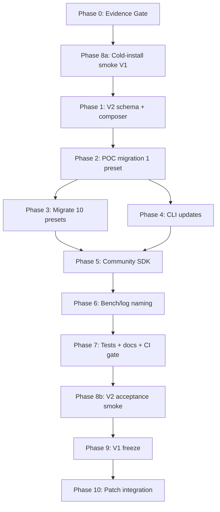

# Project Roadmap V2 — production-ready Genesis vLLM Patches

Дата: 2026-05-12 (v1.1 — supplement integration)
Статус: **active master plan** (объединяет MASTER_REMEDIATION_PLAN closure,
POST_REMEDIATION_DEFERRED, LAYERED_CONFIG_DESIGN + Q1-Q7 decisions + web
research lessons + audit unfinished items + supplement v1).
Предшественники: см. § 14 (Cross-reference).
Supplement: см. `PROJECT_ROADMAP_V2_SUPPLEMENT_2026-05-12_RU.md` (источник для §0 + §6 ниже).

Цель: довести проект до состояния, в котором новый оператор может:

1. `git clone` + `pip install -e .`
2. `sndr install` → wizard собирает host config + проверяет deps.
3. `sndr launch <preset>` → vLLM поднят, патчи применены, бенч в норме.
4. Community может вкладывать patches/configs через прозрачный SDK.

Без bug'ов. Без открытых вопросов. С working installer + launcher.

---

## 0. Текущее baseline (что уже сделано)

Актуальные test counts для local + server хранятся только в
`docs/_internal/ROADMAP_EVIDENCE_LEDGER_2026-05-12_RU.md`. Roadmap не
дублирует pytest/self-test cifры — это исключает рассинхронизацию
между документом и реальностью.

| Окружение | Pytest | Self-test | Audit |
|---|---|---|---|
| Local  | see evidence ledger | 8/8 PASS | clean |
| Server | see evidence ledger | 8/8 PASS | clean |

**Закрыто в текущем sprint (2026-05-12, MASTER_REMEDIATION_PLAN + post-round):**

- 8 этапов MASTER_REMEDIATION_PLAN (security, dual-state, deploy correctness,
  doctor-logs, PN26 polish, automation wiring, docs cleanup, PN96 plan
  executable, migration map).
- 5 P0 blockers из `PROJECT_STATE_AUDIT_2026-05-12_RU.md` — все verified.
- CLI gaps quick wins: `--preflight-only`, `--pull`, `--check-deps`,
  WSL2 probes, K8s GPU operator detection.
- Translation Cyrillic → English всех 30 touched code файлов.
- Layered config design v0.1 draft + Q1-Q7 decisions.

---

## 1. Operator decisions (Q1-Q7) — финальные ответы

Накапливаются в schema design + руководят implementation.

| # | Question | Decision | Rationale |
|---|---|---|---|
| Q1 | Aliases vs explicit triplet | **Hybrid:** explicit triplet default + optional aliases (operator opt-in) | CI/docs always explicit; operator gets short forms locally |
| Q2 | Profile promote | **CLI auto** with dry-run default + atomic write + archive (not delete) | Solo-operator workflow; full audit trail via git commits |
| Q3 | Community plugin SDK location | **Hybrid A+B:** in-repo `plugins/community/<user>/`, maintainer-approval workflow (PR-style как vLLM) | One repo, one CI, one review pipeline; community owns subdirs |
| Q4 | Logs/baselines | **Hybrid C:** `tests/integration/baselines/` curated in-repo + `~/.sndr/bench-results/` runtime | Reference baselines reviewable; raw outputs operator-private |
| Q5 | V1 deprecation timeline | **Freeze → deprecate:** V1 frozen после Phase 7, removed когда все 11 presets migrated | Gentle migration; no forced deadline |
| Q6 | Patch versioning | **Inline semver** + `patches.lock` operator-side reproducibility | Pin-compatible; standard Python conventions |
| Q7 | Conflict UX | **Fail loud default** + opt-in `--auto-resolve-conflicts` | CI safety; profile YAML stays explicit source of truth |

**Дополнительное решение по runtime type (User's "профиль + runtime"):**

Runtime тип (docker / podman / k8s / quadlet / bare-metal) живёт **в hardware
layer**, не в profile. Обоснование:

- Runtime — deployment target (HOW), не testing scope (profile WHAT).
- Hardware rig обычно имеет primary runtime: homelab→docker, cluster→k8s.
- Profile — patches delta, lifecycle "test → promote". Если положить
  runtime туда — profiles размножатся cross-product `(model_test × runtime)`.
- Web research lesson #10: production projects model multiple runtimes
  как **separate overlays sharing a base**, не conditional fields.

```yaml
# hardware/a5000-2x-24gbvram-16cpu-128gbram.yaml
runtime:
  default: docker
  supported: [docker, podman, bare-metal]
  docker:
    image: vllm/vllm-openai:nightly
    image_digest: 'sha256:9b534fe...'
    container_name_template: "vllm-{model_id}"
    host_port: 8000
    container_port: 8000
    shm_size: 8g
    network: genesis-vllm-patches_default
  podman:
    image: vllm/vllm-openai:nightly
    # inherits most from docker; specific overrides only
  bare-metal:
    venv_path: ${HOME}/vllm-genesis/.venv
    systemd_unit_template: docs/INSTALL.md#bare-metal-unit
```

CLI override: `sndr launch --runtime k8s` → uses k8s block если supported.
Если не supported — `SchemaError` (fail loud per Q7).

K8s/Proxmox runtimes — отдельная subdirectory `deployments/` (см. § 4.4),
потому что они требуют cluster-wide config, не rig-local.

---

## 2. Web research insights → applicable to Genesis

Из агента-исследователя 10 actionable lessons. Genesis-specific
интерпретация:

1. **Helm-style merge rules verbatim.** Maps deep-merge, arrays replace,
   scalars overwrite, later layer wins. **Adopt.** Документируем в
   `docs/CONFIG_SYSTEM_V2.md` чётко.
2. **Explicit `merge_key` annotations для lists.** В нашем случае —
   `patches:` dict (не list), `vllm_extra_args:` list (replace, не merge).
   **Adopt as schema constraint.**
3. **Single entry-point group для plugins.** Уже есть `vllm_genesis_patches`
   в `pyproject.toml`. **Reuse**, не изобретаем новый.
4. **`_applied_patches` registry на target class для double-patch detection.**
   Genesis уже имеет `_GENESIS_PN26_SPARSE_V_MARKER_ATTR` pattern (см.
   PN26). **Generalize:** require каждый patch имеет marker attr.
5. **`@min_vllm_version` decorator.** Genesis имеет `vllm_pin_required` в
   model config + `KNOWN_GOOD_VLLM_PINS` allowlist. **Extend** до per-patch
   `min_vllm_pin` / `max_vllm_pin` field в manifest.
6. **Patches ordering via env var.** `GENESIS_PATCHES_ORDER` для explicit
   ordering — добавляем в schema.
7. **Structural anchors (qualified names + context), не line numbers.**
   Genesis уже использует anchor manifest (`tests/legacy/pristine_fixtures/`).
   **Tighten:** каждый patch manifest declarally describes `target_module`,
   `target_callable`, `context_md5`.
8. **CI matrix против multiple upstream versions.** Genesis имеет
   `KNOWN_GOOD_VLLM_PINS`. **Add:** `make test-pin-matrix` runs apply pipeline
   per pinned version. Effort: 1 day.
9. **Re-entrant + idempotent apply.** Existing convention. **Document
   explicitly** в community SDK guide.
10. **Overlays per deployment target, не conditional in base.** Already
    captured в decision выше: K8s/Proxmox в `deployments/`.

---

## 3. Real unfinished items (cross-referenced with current state)

После cross-reference с MASTER_REMEDIATION_PLAN closure + POST_REMEDIATION
items, **actually open** items:

### 3.1 P0 (closed) — для трекинга

Все 5 P0 blockers из `PROJECT_STATE_AUDIT` верифицированы как закрытые
(см. § 0). **Никаких open P0.**

### 3.2 P1 — Architecture & Schema (требуется V2 work)

| Item | Effort | Deps | Phase |
|---|---|---|---|
| **V2 layered schema** (model/hardware/profile/patches) | 4-5d | None | Ph.1 |
| **Composer + V1 ModelConfig bridge** | 2d | V2 schema | Ph.1 |
| **Migrate 1 preset (POC, byte-identical)** | 1d | Composer | Ph.2 |
| **Migrate remaining 10 presets** | 2-3d | POC | Ph.3 |
| **Profile promote CLI + workflow** | 1-2d | V2 schema | Ph.4 |
| **Community patch SDK manifest + validator** | 3-4d | V2 schema + research lessons 4-8 | Ph.5 |
| **CLI: `sndr model/hardware/profile/community` subcommands** | 2d | V2 schema | Ph.4 |
| **Bench/log canonical naming integration** | 1d | V2 composer | Ph.6 |

### 3.3 P1 — Schema completeness (UNIFIED_CONFIG Y1-Y14)

Все Y-block dataclasses присутствуют в `model_configs/schema.py`. Что
осталось — **populate** их в builtin presets:

| Block | Schema | Used by builtins | Action |
|---|---|---|---|
| Y1 — Docker image digest pin | ✅ exists | partial (35B has, 27B doesn't) | Populate all 11 |
| Y2 — package_sources | ✅ exists | none | Populate where applicable |
| Y3 — artifacts | ✅ exists | none | Populate model + cache |
| Y7 — bootstrap | ✅ exists | none | Add for production presets |
| Y8 — gpu_tuning | ✅ exists | none | Add power-cap profiles |
| Y10 — service | ✅ exists | none | Add systemd unit defaults |
| Y14 — observability | ✅ exists | none | Wire memory_trace defaults |

После V2 migration большая часть этих blocks переедет в `hardware/` или
`profile/` слой natural way → меньше дублирования.

### 3.4 P1 — CLI gaps (remaining)

| Item | Effort | Notes |
|---|---|---|
| `sndr deps plan/apply` | 2-3d | UNIFIED_CONFIG C2 partial — apply phase missing |
| `sndr model pull` artifact resolver | 1-2d | Replace `scripts/fetch_models.sh` |
| `sndr bootstrap` scope completion | 2d | model-artifacts + service scopes |
| `sndr launch --runtime <name>` | 2d | Route to compose/quadlet/k8s emitter (already implemented as separate commands; needs integration) |
| `sndr launch --prepare/--fix` | 1-2w | Interactive operator confirmation flows — deferred |
| `sndr community submit/verify` | 1-2w | Part of community SDK Phase 5 |
| `sndr memory explain` MVP | 1d | Phase 4.7 — weights/KV/cudagraph/activations/quant/fragmentation estimate with median + p95 + worst-case uncertainty bands. Research extensions stay in §3.10 P3. |

### 3.5 P1 — Architecture debt (large refactors)

| Item | Effort | Risk | Decision |
|---|---|---|---|
| P2.1 — Collapse `_per_patch_dispatch.py` (4805 lines) | 1-2w | High | **Defer** — needs test harness regression discrimination first |
| P2.2 — Unified `PatchApplyResult` dataclass | 1w | Medium | **Defer** — bundle with P2.1 |

Эти refactors **не блокируют** V2 layered config или community SDK.
Можно делать после Phase 7.

### 3.6 P2 — Deploy gaps

| Item | Effort | Status |
|---|---|---|
| K8s GPU operator detection | ✅ done в `sndr k8s doctor` |
| K8s safe_dump_all + DNS-1123 validation | ✅ done (Этап 2.4) |
| K8s `--delete-pvc` opt-in | ✅ done (Этап 2.6) |
| Proxmox `apply` | Defer — нужен PVE testbed |
| Proxmox doctor (IOMMU/cgroup2/nvidia devices) | 1-2d — incremental polish |

### 3.7 P2 — Testing / CI / Observability

| Item | Effort | Notes |
|---|---|---|
| Static `ruff F821/F822` CI gate | 1d | Easy win, catches future undefined names |
| Pytest plugin fixtures (`genesis_registry`, `pristine_vllm_source`) | 2-3d | Reduces test boilerplate |
| Soak test auto-integration `stability_24h_*` | 1w | Requires real soak runs |
| Live GPU validation в CI (self-hosted runner) | 1d setup + infra | Operator infrastructure decision |
| Tool-call correctness matrix tests | 1-2d | Test contract for content-not-null, tool-calls-present, P68 downgrade |

### 3.8 P2 — Docs

| Item | Effort | Notes |
|---|---|---|
| `docs/CONFIG_SYSTEM_V2.md` operator guide | 1d | After Phase 1-3 complete |
| `docs/COMMUNITY_PATCHES.md` operator guide | 1d | After Phase 5 |
| Patch counts auto-sync (README/PATCHES.md) | 0.5d | Generate from registry |
| Archive structure (`docs/archive/`) + CI gate | 1d | After Phase 7 |

### 3.9 P3 — Patch integration (genuinely useful new patches)

Из upstream watchlist + research docs, **patches with real value**:

| Patch | Source | Effort | Value |
|---|---|---|---|
| **PN90** — Probabilistic draft (vllm#40269 backport) | research/upstream_42102 | 1-2w | +0.5-2% TPS на spec-decode |
| **PN94 + PN95b** — DFlash + quantized KV (vllm#42102) | research/upstream_42102_plan | 2-3d after merge | Unblocks DFlash + TQ k8v4 combo |
| **Sliding Window Attention activation** | KV_COMPRESSION_COMPREHENSIVE | 0.5d | 50-100× compression long-ctx if Qwen3.6 supports |
| **DuoAttention integration** | KV_COMPRESSION_COMPREHENSIVE | 1-2w | 5-10× KV reduction |
| **TQ k4v4 extension** | KV_COMPRESSION_COMPREHENSIVE | 1-2w | 2× memory savings vs k8v4 |
| **PN72 revert contract fix** | genesis_deep_audit_2026-05-06 | 1d | Idempotency restoration |
| **PN80 embedding FP8** | pn80_embedding_fp8_design | 1-2w | ~800 MiB savings on 35B |

### 3.10 P3 — Memory / PN95 long-term

| Item | Effort | Notes |
|---|---|---|
| PN95 Phase 2 (real GPU↔CPU bytes movement) | dni | 4-й anchor не спроектирован |
| PN95 Phase 3 (boot KV expansion) | 11-13h | Anchor #6 + #7 design done |
| PN95 Phase 5 (virtualization) | 20-25h | Design draft |
| PN95 metrics + safety policy | 1-2h | Quick win after Phase 2 |
| OOM preflight (host RAM + swap + GPU + Docker) | 4-6h | Quick win |
| MambaRadixCache backport (PN97/PN98) | 2-4w | Hybrid GDN+Mamba optimization |
| Path C tier-aware schema completion | 9d + 70 tests | Research-grade |
| `sndr memory explain` advanced calibration | 2-4w | GPU-measured calibration data, allocator telemetry hooks, tier-aware KV prediction, profile_run capture, per-layer attention sizing — beyond the static-estimate MVP from Phase 4.7 |

---

## 4. Layered config V2 — finalized architecture

### 4.1 Four-layer composition

```
model/<id>.yaml     ← identity + capabilities + canonical patches
hardware/<id>.yaml  ← rig + sizing + runtime block (docker/podman/bare-metal)
profile/<id>.yaml   ← patches delta (testing → promote workflow)
patch/<id>/         ← community plugin manifest (anchors, conflicts, apply)
deployments/<id>.yaml  ← (Optional) k8s/proxmox cluster-wide config
```

Composition: `final = model + hardware + profile_delta + (deployments_overlay)`

### 4.2 Merge precedence (final)

**Ownership-based, ne override-based** (per user decision Q1):

| Concern | Owner | Конфликт другого слоя → |
|---|---|---|
| `model_path`, `dtype`, `quantization` | model | `SchemaError` |
| `tool_call_parser`, `spec_decode.method`, `kv_cache_dtype` | model | `SchemaError` |
| `hardware`, `n_gpus`, `vram_per_gpu_mib` | hardware | `SchemaError` |
| `max_model_len`, `gpu_memory_utilization`, `max_num_seqs` | hardware | `SchemaError` |
| `genesis_env` (patches matrix) | model (canonical) + profile (delta) | merged per § 4.3 |
| `vllm_pin_required`, `genesis_pin` | model (default), profile (override OK) | profile wins |
| `runtime` block | hardware | CLI `--runtime` overrides default but must match `supported` |

### 4.3 Profile delta semantics

```yaml
# profile/<id>.yaml
patches_delta:
  enable:                         # add to canonical
    GENESIS_ENABLE_PN90: '1'
  disable:                        # remove from canonical (list of keys)
    - GENESIS_ENABLE_P67_TQ_MULTI_QUERY_KERNEL
  override:                       # change value for existing patch
    GENESIS_P67_NUM_KV_SPLITS: '32'
```

Composer applies operations в порядке: `enable → disable → override`.
Conflicts within profile (enable + disable один key) → `SchemaError`.

### 4.4 Directory layout (final)

```
vllm/sndr_core/model_configs/
├── builtin/
│   ├── model/                            # maintainer-curated canonical
│   │   ├── qwen3.6-35b-a3b-fp8.yaml
│   │   ├── qwen3.6-27b-int4-autoround.yaml
│   │   └── ...
│   ├── hardware/                         # rigs
│   │   ├── a5000-2x-24gbvram-16cpu-128gbram.yaml
│   │   ├── a5000-1x-24gbvram-8cpu-64gbram.yaml
│   │   └── ...
│   ├── profile/                          # delta profiles (canonical experiments)
│   │   ├── wave9-balanced.yaml
│   │   ├── wave9-dflash-experimental.yaml
│   │   └── ...
│   ├── deployments/                      # cluster-wide overlays (k8s/proxmox)
│   │   ├── k8s-microk8s.yaml
│   │   ├── proxmox-lxc.yaml
│   │   └── ...
│   └── presets/                          # optional aliases (operator convenience)
│       └── prod-35b.yaml                 # 3-pointer file
└── community/
    ├── hardware/                         # community rigs (no review needed)
    │   └── <user>__rtx3090-2x-...yaml
    └── profile/                          # community profiles (community-test lifecycle)
        └── <user>__<theme>-2026-05-12.yaml

vllm/sndr_core/integrations/              # canonical patches (unchanged)
└── ...

plugins/                                  # in-repo community patches (Q3 decision)
└── community/
    └── <user>/
        └── <patch_id>/
            ├── manifest.yaml             # per-patch metadata
            ├── patch.py                  # apply/verify/revert/marker
            ├── pristine_fixture.py       # captured upstream source
            └── tests/
                └── test_<patch_id>.py

tests/integration/baselines/              # curated reference baselines
└── <model>__<hardware>__<profile>__<wave>.json

~/.sndr/bench-results/                    # runtime outputs (gitignored)
└── <model>__<hardware>__<profile>__<ISO>.json
```

### 4.5 Community patch manifest (final)

Объединяя research lessons 4, 5, 7, 8:

```yaml
schema_version: 2
kind: patch
id: PN999
namespace: community/<user>

# Identity
title: PN999 — custom thing X
maintainer: noonghunna
version: 1.0.0                          # semver (Q6)
license: apache-2.0
created: '2026-05-15'

lifecycle: community-test               # community-test → community-validated → promoted
implementation_status: experimental     # experimental | beta | stable | deprecated | disabled
publish_state: draft                    # draft → review → published → rejected (see §6.6)

# Patch type + family
type: runtime_hook                      # runtime_hook | text_patch | composite
family: spec_decode
env_flag: GENESIS_ENABLE_PN999
default_on: false

# Compatibility (research lesson 5 — version gates)
compatibility:
  min_vllm_pin: 0.20.2rc1.dev93
  max_vllm_pin: null                    # null = no upper bound yet
  min_sndr_core_version: 11.2.0
  max_sndr_core_version: null
  model_arch_required: [hybrid_gdn_moe]
  cuda_capability_min: [8, 6]

# Anchors (research lesson 7 — structural, not line numbers)
target_files:
  - path: vllm/v1/spec_decode/eagle/proposer.py
    target_module: vllm.v1.spec_decode.eagle.proposer
    target_callable: EagleProposer.propose
    context_md5: deadbeef...
    pristine_fixture: pristine_fixture.py
    anchors:
      - id: anchor_1
        context_before: |
          def propose(self, batch_state):
              draft_logits = self._forward(batch_state)
        context_after: |
              return self._sample(draft_logits)
        operation: wrap_return
        what_we_do: "Apply probabilistic sampling to draft_logits"

# Conflicts (research lesson 4 — double-patch detection)
conflicts_with: [PN77]
requires_patches: [P58]
marker_attr: _genesis_pn999_applied      # added to target class

# Entry points
entry_points:
  apply: "patch:apply"                  # tuple[Literal["applied","skipped","failed"], str]
  verify: "patch:verify"                # dict[str, bool]
  revert: "patch:revert"                # restore original (Q research lesson 9)

# Tests required
tests_required:
  - test_apply_returns_tuple
  - test_apply_idempotent
  - test_env_off_is_noop
  - test_conflicts_resolved
  - test_revert_restores_original
  - test_pristine_anchor_md5

# Citations
references:
  - "https://github.com/.../issue/N"
```

### 4.6 CLI surface (final)

```bash
# Discovery
sndr model list                                  # builtin/model/*.yaml
sndr hardware list                               # builtin/hardware/*.yaml
sndr profile list [--model <id>]                 # profiles (filtered by target model)
sndr community list                              # community/* + plugins/community/*

# Inspection
sndr model show <id>                             # capabilities + canonical patches
sndr hardware show <id>                          # rig + sizing + runtime block
sndr profile show <id>                           # delta + validation status
sndr profile diff <id>                           # what would change if promoted

# Composition + launch
sndr launch --model <m> --hardware <h> [--profile <p>] [--runtime <r>] [--preflight-only|--pull|--check-deps]
sndr launch <alias>                              # alias resolves to triplet

# Profile workflow
sndr profile new <name> --parent-model <m>       # generate draft delta profile (publish_state=draft)
sndr profile validate <id>                       # run validation gates (bench, soak)
sndr profile promote <id> [--dry-run|--yes]      # merge delta into parent model

# Community
sndr community new-patch --id PN999 --family spec_decode --user <handle>
sndr community validate <id>                     # full schema + anchor md5 + conflicts + tests
sndr community lock > ~/.sndr/patches.lock       # operator-side reproducibility
sndr community install <id>[@version]            # pin specific version

# Config-key registry (§6.7 mitigates R2)
sndr config keys list                            # enumerate every recognized env key
sndr config keys describe VLLM_X                 # show origin patch + valid values
sndr config keys validate <yaml>                 # exit 1 if YAML uses unknown key

# Patch proof (§6.8 mitigates R1)
sndr patches prove <id>                            # apply.shadow strict + capability assertion
sndr patches prove --all                           # full registry sweep; reports coverage %
sndr patches prove --dead-detect                   # list patches with no apply evidence

# Bench (Phase 6 methodology contract)
sndr bench validate <result.json>                # round-trip bench artifact vs methodology
```

### 4.7 Composer V1-bridge (acceptance-critical)

Composer produces **byte-identical V1 `ModelConfig`** that existing
runtime expects:

```python
def compose(model_id, hardware_id, profile_id=None,
            runtime=None, deployment_id=None) -> ModelConfig:
    """Produce a V1 ModelConfig from layered V2 sources.

    Acceptance: cfg.to_dict() must be byte-identical to legacy combined
    YAML output. This is the migration safety net.
    """
    ...
```

CompatibilityMatrix (S2.5), launch, k8s/compose/quadlet renderers — all
continue working unchanged because they receive V1 `ModelConfig` shape.

---

## 5. Phased execution plan

### 5.-1 Task metadata convention (per REVIEW_NOTES §P2)

For every Phase deliverable below, large enough tasks (≥ 0.5d effort)
carry standard metadata. Inline format keeps the markdown readable
while making owner/status/evidence machine-greppable.

```markdown
**Deliverable D-N.M:**
  Owner:       <name>
  Status:      planned | in_progress | blocked | done | verified
  Evidence:    <link to ledger entry OR file path with proof>
  Blocked by:  <other deliverable ID, or "none">
  Acceptance:  <one-line definition-of-done>
```

`verified` means at least one ledger entry shows the deliverable passing
both local AND server. `done` means it works on at least one host.
Status transitions never go backward except via explicit re-verification
demand (ledger entry with `decision: re-verify`).

When the roadmap is updated, only the affected deliverable's `Status`
changes — Owner/Acceptance/Blocked-by are stable. This makes diffs
easy to read in PRs.

### 5.0 Phase dependency graph



**Reading the graph:**

- Phase 0 + Phase 8a together form the **pre-V2 gate**: evidence ledger
  baseline plus proof that installer/launcher work BEFORE any V2 change.
- Phase 2 is the **fork point**: POC migration acceptance unlocks both
  P3 (more presets) and P4 (CLI) in parallel.
- Phase 8b is the **V2 acceptance gate** before V1 deprecation (P9).
- Phase 10 is **post-acceptance, continuous** — each patch goes through
  community SDK pipeline (P5) so the dependency is implicit on P5 too.

### Phase 0 — Roadmap Truth / Evidence Gate (supplement integration, P0)

**Rationale (supplement §0.1):** перед V2 work любые "DONE" claims в этом
roadmap'е должны быть подтверждены reproducible artifact (команда + host +
commit + дата + stdout excerpt). Без этого progress trackable, но не
verifiable — future operator не сможет понять что реально работает vs
что было aspirational.

**Deliverables:**

1. `docs/_internal/ROADMAP_EVIDENCE_LEDGER_2026-05-12_RU.md` — append-only
   журнал. Каждая запись:
   - host (local / server)
   - path (absolute project root)
   - git rev-parse --short HEAD + branch + status hash
   - command run + timestamp + ISO date
   - result (pass/fail/skip + stdout/stderr excerpt)
   - decision (accept / re-verify / fix / drop from roadmap)
2. Initial baseline entry — current state captured in evidence ledger
   for both local and server (no hardcoded counts here; ledger is the
   single source of truth).
3. `make evidence` aggregate target — runs the full check matrix and
   appends one ledger entry per invocation.

**Why before Phase 1:** если V2 work shows regression, ledger immediately
shows "before V2 was green; after V2 something specific failed" — not
"we think it was green". And tracking progress is trackable only when
each green claim has a reproducible artifact attached.

**Acceptance:**

```bash
make evidence
# Appends entry to ledger; rc=0 only if all checks pass.
grep "^### " docs/_internal/ROADMAP_EVIDENCE_LEDGER_2026-05-12_RU.md | wc -l
# Returns count of recorded evidence entries.
```

### Phase 1 — V2 schema + composer + tests (Days 1-5, P0)

**Goal:** V2 dataclasses + composer + 30+ tests; POC migration of one
preset producing byte-identical output.

**Deliverables:**

1. `vllm/sndr_core/model_configs/schema_v2.py`:
   - `ModelDef`, `HardwareDef`, `ProfileDef`, `PatchManifest`,
     `RuntimeBlock`, `DeploymentDef` dataclasses + validators.
2. `vllm/sndr_core/model_configs/compose.py`:
   - `compose(model_id, hardware_id, profile_id=None, ...)` → V1 ModelConfig.
   - `_apply_profile_delta(patches, delta)` (enable/disable/override).
   - `_check_compat(model, hardware, profile)` ownership rules.
3. `vllm/sndr_core/model_configs/registry_v2.py`:
   - Loaders for each layer.
   - Alias resolver (`presets/<key>.yaml` → triplet).
4. **30+ unit tests** covering merge rules, conflicts, alias, edge cases.
5. **Acceptance regression:** для `a5000-2x-35b-prod` legacy combined →
   composed V2 → V1 ModelConfig — byte-identical `cfg.to_dict()`.

**Tests gate:** all existing tests still pass (baseline per evidence ledger)
plus 30+ new V2 unit tests added on top.

### Phase 2 — POC migration (Day 6, P0)

Migrate `a5000-2x-35b-prod` за один PR:

- Split to `builtin/model/qwen3.6-35b-a3b-fp8.yaml` + `builtin/hardware/...`
  + `builtin/profile/wave9-balanced.yaml` + `builtin/presets/prod-35b.yaml`.
- Verify: `sndr launch prod-35b --preflight-only` = legacy
  `sndr launch a5000-2x-35b-prod --preflight-only`.
- Tests: byte-identical `cfg.to_dict()`.

**Acceptance:** operator review → approved before Phase 3.

### Phase 3 — Migrate remaining 10 presets (Days 7-9, P1)

One commit per preset. Each migration is independent + reviewable.
Order by complexity:

1. Simplest first (a5000-2x-27b-int4-tested, a5000-1x-27b-int4-tested).
2. Medium (a5000-2x-27b-int4-long-ctx, etc.).
3. Complex last (a5000-2x-27b-int4-tq-k8v4-dflash, a5000-2x-tier-aware-example).

### Phase 4 — CLI updates (Days 10-11, P1)

Implement § 4.6 CLI surface. Tests for each subcommand.

### Phase 4.5 — RuntimeCommandSpec canonical IR (Days 11-12, P1)

```markdown
Owner:        sandermage
Status:       planned
Evidence:     pending — recorded in ROADMAP_EVIDENCE_LEDGER after acceptance
Blocked by:   Phase 4 (CLI baseline must exist before refactoring emitters)
Acceptance:   `sndr launch <alias> --dry-run --runtime <r>` produces deterministic
              output derived from single RuntimeCommandSpec for r ∈ {docker, compose,
              quadlet, kubernetes}; semantic diff between any two outputs = 0
```

**Rationale:** runtime lives in hardware layer, but every emitter
(Docker argv, compose YAML, quadlet, K8s manifest, dry-run, report
bundle, docs example) currently reads raw config. Without a single
canonical IR, emitters drift — what dry-run shows ≠ what launcher
runs ≠ what report bundle redacts.

**Deliverables:**

1. `vllm/sndr_core/model_configs/runtime_command_spec.py`:
   - `RuntimeCommandSpec` frozen dataclass + `MountSpec`/`PortSpec`/
     `DeviceSpec`/`SecuritySpec` sub-types.
   - `compose_runtime_command(model, hardware, profile, runtime)` —
     builder layered on top of `compose()`.
2. Existing Docker argv emitter refactored to consume IR.
3. Acceptance test: byte-identical `--dry-run` output for all 11 V2
   aliases vs pre-refactor golden output.

**Design:** `docs/_internal/RUNTIME_COMMAND_SPEC_DESIGN_2026-05-12_RU.md`.

**Acceptance:**

```bash
sndr launch prod-35b --dry-run --runtime docker
sndr launch prod-35b --dry-run --runtime compose
sndr launch prod-35b --dry-run --runtime quadlet
sndr launch prod-35b --dry-run --runtime kubernetes
sndr report bundle --dry-run --redact
# All emit text/YAML/JSON derived from the SAME RuntimeCommandSpec.
# Semantic diff between any two outputs = 0 (only format differs).
```

### Phase 4.6 — Security + license gate boundary (Day 13, P1)

```markdown
Owner:        sandermage
Status:       planned
Evidence:     pending — recorded in ROADMAP_EVIDENCE_LEDGER after audit-security passes
Blocked by:   Phase 4.5 (RuntimeCommandSpec — report bundle redaction consumes IR)
Acceptance:   `sndr license status --json` returns `core: public (unlicensed)`
              on a clean install; `make audit-security` passes all 6 sub-checks;
              SBOM + constraints + signed attestation present under release/
```

**Rationale:** establish public/private boundary, license CLI surface,
and release security scan BEFORE private engine work begins. Otherwise
any later license/private-engine work breaks public API. Public core
NEVER requires a license to function — license layer is optional
discovery only.

**Deliverables:**

1. `vllm/sndr_core/license/` boundary module:
   - `verify.py` — offline pub-key signature check
   - `__init__.py` — unlicensed-core default path
2. `vllm/sndr_core/cli/license.py` — `sndr license status/verify/import`.
3. `vllm/sndr_core/report/redact.py` — report bundle redaction rules.
4. `scripts/security_scan.py` — release-pipeline security audit.
5. `scripts/sbom_generate.py` — SBOM + constraints + attestation.
6. `make audit-security` aggregate target.

**Design:** `docs/_internal/SECURITY_LICENSE_GATE_2026-05-12_RU.md`.

**Critical invariants:**

- Public core NEVER makes network calls for licensing.
- Private key NEVER in repo.
- `sndr license status` reports cleanly on unlicensed core.
- No telemetry by default.

**Acceptance:**

```bash
sndr license status --json | jq -e '.core == "public (unlicensed)" and .engine == null'
sndr license verify --file tests/fixtures/valid_license.lic --offline
sndr report bundle --redact --dry-run | grep -v "/home/sander\|192\\.168\\."
make audit-security      # all 6 sub-checks pass
```

### Phase 4.7 — `sndr memory explain` MVP (Day 13, P1)

```markdown
Owner:        sandermage
Status:       planned
Evidence:     pending — recorded in ROADMAP_EVIDENCE_LEDGER after acceptance
Blocked by:   Phase 4.5 (RuntimeCommandSpec — explain consumes composed config)
Acceptance:   For all 11 V2 aliases, `sndr memory explain --profile <a> --json`
              produces verdict ∈ {SAFE, TIGHT, OOM_RISK} matching known bench
              reality (prod-35b SAFE, long-ctx-27b TIGHT at ctx=280k); every
              output mode emits median + p95 + worst-case bands
```

**Rationale:** the answer to "will prod-35b fit on my 2× A5000 at
ctx=64k seqs=4?" should be one CLI call, not a launch attempt. MVP
ships explicit-uncertainty estimator (median + p95 + worst-case)
covering weights / KV / cudagraph / activations / quant overhead /
drafter / fragmentation.

**Deliverables:**

1. `vllm/sndr_core/memory/explain.py` — estimator logic.
2. `tools/memory_explain_calibration/v1.yaml` — seeded with Wave 9
   bench data, version-pinned, per-arch + per-quantization tables.
3. `vllm/sndr_core/cli/memory.py` — CLI surface (modes: --profile,
   --model/--hardware composed, --ctx-sweep, --json).
4. 30+ unit tests vs known-good per-alias expected values (±tolerance).

**Design:** `docs/_internal/MEMORY_EXPLAIN_MVP_2026-05-12_RU.md`.

**Acceptance:**

```bash
sndr memory explain --profile prod-35b --json | \
  jq -e '.verdict == "SAFE" and .total_p95_mib_per_gpu <= 24576'
# All 11 V2 aliases produce a verdict matching existing bench reality:
# prod-35b SAFE, long-ctx-27b TIGHT at ctx=280k, qa-27b-tq-1x SAFE, ...
```

**Honesty rule:** MVP NEVER outputs a single-point estimate without an
uncertainty band. p95 + worst-case are mandatory in every output mode.

### Phase 5 — Community patch SDK (Days 12-15, P1)

**Deliverables:**

1. `vllm/sndr_core/community/`:
   - `manifest.py` — `PatchManifest` dataclass + loader + validator.
   - `discovery.py` — scan `plugins/community/*` + entry-points.
   - `validator.py` — schema + anchor md5 + conflicts + tests harness.
   - `scaffold.py` — `sndr community new-patch` generator.
2. `plugins/community/.gitkeep` + one template-only minimal example
   manifest. Template lives under `plugins/community/_template/` and is
   excluded from the release registry by `publish_state: draft` plus
   directory-name `_template` prefix (no-stub gate §6.6).
3. `docs/COMMUNITY_PATCHES.md` operator-facing guide.
4. Tests: validator catches every bad manifest shape.

### Phase 6 — Bench/log integration + methodology contract (Day 16, P2)

**6.A Naming/output layout:**

`tools/genesis_bench_suite.py` writes to `~/.sndr/bench-results/<composed>__<ISO>.json`
when invoked with V2 preset. Existing combined-key path preserved для
legacy operators.

**6.B Benchmark methodology contract (mitigates R7):**

Without a fixed methodology, "bench delta < X%" claims are noise.
Phase 6 codifies the rules every release bench must follow. Encoded
as `tools/bench_methodology.yaml` consumed by the suite + asserted in
the result JSON (so historical results carry their own methodology
fingerprint).

| Element | Contract |
|---|---|
| Prompt set | Fixed seed corpus committed at `tools/bench_corpus/v1/`; SHA pinned in result JSON |
| Sequence count | Configurable but recorded; default per-preset matches `max_num_seqs` |
| Warmup | 3 full requests discarded before measurement starts |
| Measurement | N=10 runs; report median + p95; flag if CV>5% |
| GPU clock | Lock to `nvidia-smi --lock-gpu-clocks=<base>,<base>` for the run; recorded in result JSON |
| Tolerance | Release accepts ≤2% regression on median TPS vs baseline; >5% blocks release |
| Tool-call corpus | 10 fixed scenarios from Wave 9 dev209; must score 10/10 |
| Soak | Optional; if run, ≥200 min with CV<3% on rolling 10-min window |
| Artifact | Result JSON includes: methodology SHA, vllm pin, model id, hw id, profile id, composed key, all knob values, GPU clock state, p50/p95 TPS, tool-call score |

**Acceptance:** `tools/genesis_bench_suite.py --quick prod-35b` produces
a result file that round-trips through `sndr bench validate <file>`
without warnings.

### Phase 7 — Tests + docs + CI gate (Days 17-18, P1)

- `docs/CONFIG_SYSTEM_V2.md` operator guide.
- `docs/COMMUNITY_PATCHES.md` operator-facing community SDK guide
  (Phase 5 ships a draft outline; Phase 7 finalizes the doc).
- `docs/INSTALL.md` cold-install operator guide (no `_genesis` refs).
- `docs/ROLLBACK_PLAYBOOK.md` — per-feature rollback procedures.
  Required by §9 production-ready item 9. Each feature shipped in
  Phase 1-6 lists its revert SHA + smoke command that proves V1 still
  works. Without this file, §9 acceptance cannot pass.
- New CI gate: `make audit-configs` — every `(model, hardware, profile)`
  referenced in presets composes successfully.
- New CI gate: `make audit-public-docs` — §6.10 public/private docs
  boundary check.
- New CI gate: `make audit-security` — §4.6 security scan + SBOM.
- Final pytest + audit + self-test green.

### Phase 8 — Installer + launcher acceptance (split: early V1-smoke + late V2-acceptance)

Proposals critique flagged Phase 8 as ambiguously placed (Day 19 but also
listed as Day 1-6 prerequisite in §10). Split into two distinct gates:

**Phase 8a — Cold-install smoke against V1 (Day 1-6, P0, pre-Phase 1):**

Establishes baseline that installer + launcher work BEFORE V2 changes
land. If 8a fails, Phase 1 is blocked (root cause must be fixed first).

```bash
make clean && python3 -m venv .venv && source .venv/bin/activate
pip install -e .
sndr --version                        # rc=0
sndr install --dry-run                # wizard validates rc=0
sndr config list                      # V1 preset discovery works (existing CLI)
sndr launch a5000-2x-35b-prod --preflight-only  # V1 composition + preflight green (V1 key, not V2 alias)
```

**Acceptance:** все commands return rc=0; bench seed run reproducible.
Note: V1 smoke uses the V1 preset key (`a5000-2x-35b-prod`), NOT the V2
alias (`prod-35b`). V2 alias resolution + `sndr hardware list` ship in
Phase 8b after V2 work lands.

**Phase 8b — V2 acceptance smoke (Day 19, P0, post-Phase 7):**

End-to-end smoke after V2 layered config + community SDK live. Adds
V2-only commands (alias resolution, `hardware list`, `model list`,
manifest validation).

```bash
sndr launch prod-35b --preflight-only         # V2-composed alias
sndr launch prod-27b-tq --preflight-only      # V2-composed alias
sndr hardware list                            # V2 discovery (new in Phase 4)
sndr model list                               # V2 discovery (new in Phase 4)
sndr config show prod-35b --runtime docker    # V2 runtime override
sndr patches validate path/to/community-manifest.yaml  # SDK works
```

**Acceptance:** все commands return rc=0; V2 byte-equivalence per
preset still holds (Phase 2-3 gate carried forward).

### Phase 9 — V1 freeze (Day 20, P2)

After Phase 8 acceptance + 1 sprint soak:

- Mark V1 loaders as deprecated (warning at load time).
- No new V1 presets accepted in repo (CI gate).
- V1 removed когда все combined presets either migrated or explicitly
  retired.

### Phase 10 — Patch integration (continuous, P2-P3)

После V2 stable, integrate **genuinely useful new patches**:

| Order | Patch | Effort | Expected impact |
|---|---|---|---|
| 1 | PN72 revert contract fix | 1d | Idempotency restoration |
| 2 | Sliding Window Attention activation check | 0.5d | 50-100× compression если Qwen3.6 supports |
| 3 | PN94 + PN95b (после vllm#42102 merge) | 2-3d | DFlash + TQ k8v4 coexistence |
| 4 | PN90 probabilistic draft | 1-2w | +0.5-2% TPS spec-decode |
| 5 | PN80 embedding FP8 | 1-2w | ~800 MiB savings 35B |
| 6 | DuoAttention | 1-2w | 5-10× KV reduction |
| 7 | TQ k4v4 extension | 1-2w | 2× memory savings |

Каждый идёт через community SDK pipeline (canonical patches тоже
проходят validation gates).

---

## 6. Quality gates (continuous, every phase)

### 6.1 Per-commit

- `python3 -m pytest tests/ -q --ignore=tests/integration` — green.
- `python3 -m vllm.sndr_core.compat.cli self-test` — 8/8 PASS.
- `python3 -m vllm.sndr_core.apply.shadow --strict` — CLEAN.

### 6.2 Per-PR

- `make audit` aggregate: legacy-imports, public-paths, upstream-offline,
  doc-sync — all clean.
- `make audit-configs` (new in Phase 7): every preset composes.
- `make docs-stale-scan` (new from supplement §3): zero matches against
  forbidden tokens list (`wiring/patch_`, `genesis doctor`, `genesis
  verify`, `genesis migrate`, `./scripts/launch.sh`, `vllm-server-mtp-test`).
- Pre-commit hooks pass.

### 6.3 Extended quality gates (from supplement §6, P1)

After Phase 7 the `make audit` aggregate must include:

1. **Docs stale scan** — `scripts/docs_stale_scan.py` returns clean against
   forbidden tokens + allowlist for archived/internal docs.
2. **No-stub release scan** — `rg "scaffold|placeholder|TODO|NotImplementedError" vllm/sndr_core README.md docs`
   has every match either resolved, removed, or moved to `docs/_internal`.
   See §6.6 for the scaffold/draft/placeholder boundary contract.
3. **Evidence ledger up-to-date** — last entry within last 7 days OR
   matches current commit.
4. **Env key canonical scan** — `sndr config keys validate` returns 0
   unknown keys across all YAML profiles (supplement §12). Canonical
   registry CLI surface defined in §6.7.
5. **Engine boundary check** — `rg "from vllm.sndr_engine|import vllm.sndr_engine"
   vllm/sndr_core` returns only optional-discovery helpers (supplement §5).
6. **Local/server convergence** — per three-tier policy in
   `LOCAL_SERVER_ALLOWED_DIRTY_STATE_2026-05-12_RU.md` (dev/audit/release),
   and `make evidence` recorded passes on both hosts.
7. **Patch proof gate** — `sndr patches prove --all` ≥ 80% of registry
   patches show evidence (apply-shadow strict + bench delta vs canonical)
   for **release** tier; **dev/audit** tiers allowed lower threshold.
   See §6.8.

### 6.4 Per-release

- Acceptance regression: V1 vs V2 byte-identical для каждого preset
  (no hardcoded test counts — see evidence ledger for current baseline).
- Integration smoke on at least 1 live GPU (operator runs).
- CHANGELOG entry per § 6.5 format.
- Rollback documentation present per extended production-ready
  definition (see §6.9).

### 6.5 CHANGELOG entry shape

```
## [vX.Y.Z] — Short summary (YYYY-MM-DD)

### Closed
- ... bullet list per category

### Tests
- Local: NNNN passed / 0 failed   (see evidence ledger for baseline)
- Server: NNNN passed / 0 failed  (see evidence ledger for baseline)

### Migration notes (если applicable)
- ...

### Rollback
- Revert SHA: <commit>
- Smoke command: <one-line repro that proves V1 still works>
```

### 6.6 Scaffold / draft / placeholder boundary (no-stub policy clarification)

From proposals critique: the original "no-stub release scan" was overly
broad (would flag legitimate WIP). This contract defines what each
marker means and where each is allowed:

| Marker | Meaning | Allowed in | Forbidden in |
|---|---|---|---|
| `scaffold` | Generator output or intentional template (e.g. `cli/scaffold.py` produces `__init__.py` boilerplate) | `vllm/sndr_core/cli/scaffold.py`, generated files | All other `vllm/sndr_core/*.py`, public docs |
| `draft` | Authored content in progress, not yet committed to the public API | `docs/_internal/`, YAML with `publish_state: draft` | Public docs, `vllm/sndr_core` runtime code |
| `placeholder` | Stub that would crash if reached (NotImplementedError, ellipsis body) | Never on `main` after Phase 7 | Anywhere except non-default git branches |
| `TODO` | Future work the author flagged; must have name + date | Comments + `docs/_internal/`; max 7 days un-tracked | Public docs |
| `NotImplementedError` | Runtime stub | Never on `main` after Phase 7 | All `vllm/sndr_core/*.py` |

**Release-tier scan (§6.3 gate #2) enforces:**

```bash
rg -n "scaffold|placeholder|NotImplementedError" vllm/sndr_core/ \
   --glob '!cli/scaffold.py' --glob '!*/templates/*'
# expect 0 hits

rg -n "TODO" vllm/sndr_core/ README.md docs/
# every hit must have format: TODO(<name>, YYYY-MM-DD): <reason>
```

### 6.7 Canonical env-key registry CLI (mitigates R2)

Today operators discover unknown env keys only after vLLM ignores them
at runtime. Phase 4 ships:

```bash
sndr config keys list              # enumerate every recognized env key
sndr config keys describe VLLM_X   # show origin patch + valid values
sndr config keys validate <yaml>   # exit 1 if YAML uses unknown key
```

**Source of truth:** every patch manifest declares the env keys it
introduces in `env_keys: []`. Registry is the union across all
published manifests. Unknown keys = either typo or undocumented patch.

### 6.8 Patch proof gate (mitigates R1, dead-patch accumulation)

From proposals §6: capabilities listed in registry can silently rot
(anchor md5 drifts on rebase, patch never applies, no operator notice).

```bash
sndr patches prove <id>            # apply.shadow strict + capability assertion
sndr patches prove --all           # full registry sweep, report coverage %
sndr patches prove --dead-detect   # list patches with no apply evidence
```

**Tier thresholds by `implementation_status` (§6.3 gate #7):**

| `implementation_status` | release tier requirement |
|---|---|
| `stable` | **100%** proof artifact OR explicit waiver (see below). No "≥N%" — every stable patch claims production-ready, so every stable patch needs evidence. |
| `beta` | Proof required IF `default_on: true`. Optional otherwise. |
| `experimental` | May skip proof. MUST be `default_on: false` to land in release registry. |
| `deprecated` | Retire note required (`retired_at`, `replacement`, `reason`). No proof needed; will not run. |
| `draft` | **Never** in release registry (no-stub gate §6.6). |

**audit tier** (per-PR): same shape, but `stable` may have ≤10% waiver
budget for in-flight refactors. `dead-detect` MUST list every drift
candidate regardless of tier.

**dev tier**: no minimum, `--dead-detect` runs informationally.

**Waiver schema** (`evidence/patch_proof/_waivers/<patch_id>.yaml`):

```yaml
patch_id: PN999
owner: sandermage
reason: "anchor drift across vllm 0.20.2→0.21.0 rebase; proof pending re-anchor"
expiry: '2026-06-01'             # MUST be ≤30 days from waiver creation
risk: medium                     # low | medium | high
rollback: "revert SHA abc1234; patch already default_off in profile X"
issue_ref: "github.com/.../issues/N"
```

Waivers expire automatically. An expired waiver = release blocked
until refreshed or patch downgraded to `beta`/`experimental`.

**Proof artifact format:** `evidence/patch_proof/<patch_id>__<vllm_pin>.json`
containing: apply.shadow strict result + bench-delta line (if patch is
bench-visible) + timestamp + commit SHA + provenance host.

### 6.9 Extended production-ready link

§9 "production-ready definition" is the gate. §6.6-6.8 are the
machine-checkable conditions that feed §9 items 9-11. The split
prevents §9 from becoming a wall of CLI commands and keeps §6 as
the place to look for "what does the audit actually check?".

### 6.10 Public/private docs boundary gate (mitigates R3)

Roadmap §6.3 gate #1 (docs-stale-scan) catches outdated wording, but
does NOT catch private-information leaks. This is a separate concern:
even up-to-date docs can leak `/home/sander`, private LAN IPs, internal
container names, or links into `docs/_internal/*` from public README.

**Gate (release tier):**

```bash
python3 scripts/release_public_docs_check.py
# Checks (all must return zero hits):
#   1. No `docs/_internal` link from public docs:
#      rg -n "docs/_internal" README.md docs/ --glob '!docs/_internal/*' --glob '!docs/upstream/*'
#   2. No private IPv4 in public docs (RFC 1918 ranges):
#      rg -nE '\b(10|172\.(1[6-9]|2[0-9]|3[01])|192\.168)\.\d+\.\d+\b' \
#         docs/ README.md --glob '!docs/_internal/*'
#   3. No operator home path:
#      rg -n "/home/sander|/Users/sander" docs/ README.md --glob '!docs/_internal/*'
#   4. No server-only container names:
#      rg -n "vllm-pn95-2xa5000-|vllm-server-mtp-test" docs/ README.md \
#         --glob '!docs/_internal/*' --glob '!_archive/*'
#   5. No retired commands:
#      rg -n "genesis doctor|genesis verify|genesis migrate|\\._genesis" \
#         docs/ README.md --glob '!docs/_internal/*' --glob '!docs/upstream/*'
#   6. No unresolved TODOs/placeholders in public docs (§6.6 boundary):
#      rg -nE "TODO\\(.*\\)|placeholder|NotImplementedError" docs/ README.md \
#         --glob '!docs/_internal/*'
#   7. Every public-doc link points at a path that exists in the release tree.
```

**Allowlist:** `docs/_internal/`, `docs/upstream/`, `docs/reference/`,
`_archive/` are explicitly excluded — those directories ARE internal
by design and not part of the public-release tree.

**Acceptance (Phase 7 release pipeline):** `make audit-public-docs`
exits 0. Any hit blocks release — operator must either redact or move
the reference into the allowlist.

### 6.11 Artifact storage + retention policy

Each artefact class in the roadmap has a single defined location,
tracked/untracked rule, release inclusion flag, redaction expectation,
and retention rule. Drift from this table = release blocked.

| Artifact | Location | Tracked | Release artefact | Redacted | Retention |
|---|---|---|---|---|---|
| Evidence ledger | `docs/_internal/ROADMAP_EVIDENCE_LEDGER_*.md` | yes (internal) | no | yes if exported | keep all entries |
| Patch proof JSON | `evidence/patch_proof/<id>__<vllm_pin>.json` | yes per release | yes (release tier) | yes (no host paths) | per release tag |
| Patch proof waivers | `evidence/patch_proof/_waivers/<id>.yaml` | yes | yes (release tier) | no secrets | per release tag, max 30d each |
| Bench result JSON | `~/.sndr/bench-results/<composed>__<ISO>.json` | no | optional summary only | yes if exported | rolling 30 days local |
| SBOM | `release/SBOM.spdx.json` | yes per tag | yes | no secrets | per release tag |
| Constraints | `release/constraints.txt` | yes per tag | yes | no secrets | per release tag |
| Security attestation | `release/security_attestation.json` | yes per tag | yes | yes | per release tag |
| Report bundle | generated `report-<ISO>.tar.gz` | no | operator-provided | yes (tokens/paths/IPs) | manual |
| Snapshots | `snapshots/<ISO>/` | partial (per-release frozen) | optional | yes | per release tag |
| External findings | `docs/_internal/external_findings/*.yaml` | yes (internal) | no | n/a | keep until status=done OR retired |
| Dirty-state allowlist | `tools/policies/dirty_state_allowlist.yaml` | yes | no (tool config) | n/a | keep + version |
| Sync log full | `/tmp/sndr-evidence/*.log` | no | no | yes if exported | manual rotation |

**Source-of-truth rule:** every artefact above has exactly ONE
authoritative location. Cross-referencing copies (e.g. a JSON that's
also pasted into the ledger) must be linked, never duplicated.

**Verification:** `make audit-artifacts` (new in Phase 7) walks this
table and exits non-zero if any artefact appears in an unexpected
location or any expected release artefact is missing at release tag.

---

## 7. Risks + mitigations (extended registry — from proposals §10)

Extended registry: 6 architectural + 5 release/operational risks. Each
has a named owner-action; risks without a mitigation owner are
explicitly blockers, not "watch-list" items.

### 7.1 Architectural risks (V2 design)

| # | Risk | Likelihood | Impact | Mitigation |
|---|---|---|---|---|
| A1 | V2 composer produces drift vs V1 output | Medium | High (silent regression) | Byte-identical `cfg.to_dict()` test per preset (Phase 2-3 acceptance) |
| A2 | Community patch manifest schema diverges from registry expectations | Low | Medium | Single source of truth in `schema_v2.py`; validators шарят правила |
| A3 | Profile promote corrupts model config | Low | High | Dry-run default + atomic write + archive (not delete) + git commit always |
| A4 | Community patches break upstream rebase | Medium | Medium | `min/max_vllm_pin` gates + CI matrix test (research lesson 8) |
| A5 | Migration takes > 2 weeks, operator loses focus | Medium | Medium | Phased plan; each phase delivers usable POC |
| A6 | V1 + V2 coexistence creates two-source-of-truth bugs | Medium | Medium | Phase 9 freeze enforces no-new-V1; sunset когда все migrated |

### 7.2 Release/operational risks (from proposals §10)

| # | Risk | Likelihood | Impact | Mitigation |
|---|---|---|---|---|
| R1 | Dead patches accumulate (anchor mismatch, never applied) | High | Medium (silent capability rot) | §6.8 patch-proof gate: `sndr patches prove --all` ≥80% release threshold; CI fails on dead manifest |
| R2 | Env-key drift (YAML uses unknown keys vs apply.py runtime) | Medium | Medium (silent ignored config) | §6.7 canonical env-key registry + `sndr config keys validate` CLI |
| R3 | Internal docs leak into public release (private paths/IPs) | Medium | High (security disclosure) | §6.3 audit-public-paths + public/private docs boundary gate |
| R4 | Stale doc text (refers to `_genesis`, `genesis doctor`, etc.) | High | Low (operator confusion) | docs-stale-scan gate, allowlist for `_internal/`/`upstream/` |
| R5 | Rollback path unknown when V2 ships and operator hits crash | Medium | High (no recovery procedure) | `docs/ROLLBACK_PLAYBOOK.md` required per release; revert SHA + smoke command captured |
| R6 | Local/server divergence drifts uncaught | Medium | Medium (config skew breaks bench) | Three-tier dirty-state policy in `LOCAL_SERVER_ALLOWED_DIRTY_STATE_*.md`; `make evidence` enforces on release tier |
| R7 | Bench delta not reproducible (no methodology contract) | Medium | High (regression false-positives) | Phase 6 bench methodology contract: fixed prompt seed, GPU clock state, warmup count, retry tolerance |
| R8 | Hardcoded numbers in roadmap rot (test counts, patch counts) | High | Low (doc credibility) | All counts moved to evidence ledger; roadmap references ledger only |
| R9 | Phase 8 (cold-install smoke) regresses silently mid-Phase-3 | Medium | High (release-blocker discovered late) | Phase 8 split: 8a runs Day 1-6 pre-Phase-1 as gate; 8b at Day 19 final acceptance |
| R10 | Operator skips evidence ledger update on "small fix" | High | Medium (drift compounds) | §6.3 gate: ledger entry within 7 days OR matches current commit |
| R11 | Convergence definition ambiguous ("N tolerated dirty files") | Medium | Low | Three-tier policy spells out per-tier file allowlist + tolerance |

**Risk-ownership rule:** every mitigation maps to a §6.x gate, §X CLI
command, or operator playbook section. If a risk has no concrete gate,
it gets added to §6 — risks without enforcement are
documentation-theater.

---

## 8. Open items (non-blocking, parallel-trackable)

Items that can run **in parallel** with Phases 1-10, не блокируя critical
path:

| Item | Effort | When |
|---|---|---|
| Static `ruff F821/F822` CI gate | 1d | Anywhere |
| Patch counts auto-sync (README/PATCHES.md from registry) | 0.5d | Anywhere |
| PN96 A/B bench on 35B PROD (45 min downtime) | 1d | Gated on operator availability |
| Pytest plugin fixtures (`genesis_registry`, `pristine_vllm_source`) | 2-3d | Before community SDK |
| Soak test auto-integration `stability_24h_*` | 1w | After Phase 7 |
| Trust anchor rotation (production ceremony) | 1d offline | Operator schedules |

---

## 9. Acceptance — production-ready definition

Project считается production-ready когда:

1. **Phases 1-8 done.** V2 layered config working, all 11 presets
   migrated, community SDK live, installer/launcher smoke green.
2. **Tests:** local + server both at-or-above the last baseline recorded
   in `ROADMAP_EVIDENCE_LEDGER_2026-05-12_RU.md` with 0 failures.
   Self-test 8/8, apply.shadow CLEAN, audit aggregate clean.
   *(No hardcoded counts here — the ledger is source of truth so this
   line can't bit-rot when test count drifts.)*
3. **No P0 blockers.** All 5 PROJECT_STATE_AUDIT P0 closed (already
   verified § 0).
4. **No private paths/IPs** in public code (audit-public-paths clean).
5. **English code-only** (audit grep clean across all touched files).
6. **CompatibilityMatrix** has ≥4 rules with tests, integrated into
   `ModelConfig.validate/audit`.
7. **Cold install works:** new operator clones repo, runs `pip install
   -e .`, can launch a preset within 10 minutes.
8. **Documentation complete:** `docs/CONFIG_SYSTEM_V2.md`,
   `docs/COMMUNITY_PATCHES.md`, `docs/INSTALL.md` (no `_genesis` refs).
9. **Rollback documented.** Every introduced feature (V2 composer,
   community SDK, new patches in Phase 10) has a documented rollback
   path: revert SHA + smoke command that proves V1 still works.
   See `docs/ROLLBACK_PLAYBOOK.md`.
10. **Patch proof coverage:** ≥80% of registry patches have evidence
    artifact (apply.shadow strict + bench delta vs canonical) per §6.8.
11. **Public/private docs boundary clean:** no `_internal/*` referenced
    from public-facing docs (audit gate from proposals §3).

---

## 10. Execution priority order (final list)

После approval — operator stake/sign:

**Day 0 (P0, supplement-integrated prerequisite):**

0. Phase 0 (Evidence ledger + first baseline entry, 0.5d).

**Day 1-6 (P0, blocking — V2 starts only after pre-V2 baseline is green):**

1. Phase 8a (V1 cold-install smoke, 0.5d) — pre-V2 gate; if 8a fails,
   stop and fix V1 before touching V2.
2. Phase 1 (V2 schema + composer + tests, 4-5d).
3. Phase 2 (POC migration, 1d).

**Day 7-15 (P1):**

4. Phase 3 (migrate remaining 10 presets, 2-3d).
5. Phase 4 (CLI updates, 2d).
6. Phase 4.5 (RuntimeCommandSpec canonical IR, 1-2d).
7. Phase 4.6 (Security + license gate boundary, 1d).
8. Phase 4.7 (`sndr memory explain` MVP, 1d).
9. Phase 5 (community SDK, 3-4d).

**Day 16-20 (P1-P2):**

10. Phase 6 (bench/log naming + methodology contract, 1d).
11. Phase 7 (tests + docs + CI gates, 2d).
12. Phase 8b (V2 acceptance smoke, 0.5d) — post-Phase 7 gate; proves V2
    workflow end-to-end before V1 freeze.
13. Phase 9 (V1 freeze, 0.5d).

**Continuous (P2-P3, after Phase 8b):**

14. Phase 10 patch integration (one-by-one, priority order in § 5).
15. External findings pipeline (§5 EXTERNAL_FINDINGS_PIPELINE, deferred).
16. Open items § 8.

**Long-term (P3, research-grade):**

12. PN95 Phase 2/3/5, MambaRadixCache.
13. Architecture debt P2.1/P2.2 (dispatch collapse, unified contract).
14. Memory optimization research (DuoAttention, k4v4, per-layer pruning).

---

## 11. Blocking design questions

**Blocking operator-level V2 design questions: none.** Все 7 Q1-Q7
ответы получены и captured в § 1. Phase 1 implementation может
стартовать.

Implementation-level questions (e.g. "should profile YAML support `null`
for default runtime?", "exact V1 smoke command set on Phase 8a", "patch
proof artifact JSON shape on first run") are NOT considered blocking
design decisions. They are tracked per phase as metadata fields defined
in §5.-1:

```markdown
Owner:        <name>
Status:       planned | in_progress | blocked | done | verified
Evidence:     <ledger entry OR file path with proof>
Blocked by:   <other deliverable ID, or "none">
Acceptance:   <one-line definition-of-done>
```

This avoids the false certainty of "no questions at all" — there are
always implementation details to resolve; what matters is that none of
them blocks the design and execution path.

---

## 12. Cross-reference (closed predecessor docs)

Эти docs закрыты этим roadmap'ом (superseded):

- `MASTER_REMEDIATION_PLAN_2026-05-12_RU.md` — Этапы 0-8 DONE; this
  roadmap takes over forward-looking items.
- `POST_REMEDIATION_DEFERRED_2026-05-12_RU.md` — все deferred items
  folded в § 3 here, with current status.
- `LAYERED_CONFIG_DESIGN_2026-05-12_RU.md` — design draft v0.1;
  finalized в § 4 here with Q1-Q7 decisions baked in.
- `DOC_MIGRATION_MAP_2026-05-12_RU.md` — still active, governs the
  v7→v11 migration commit operator should execute.
- `WORK_LOG_2026-05-12_RU.md` — historical record per-stage; не
  обновляется дальше, новые updates идут в this roadmap.

References still active (read for context):

- `PROJECT_STATE_AUDIT_2026-05-12_RU.md` — sections referenced from § 3.
- `COMPREHENSIVE_DUAL_STATE_AUDIT_2026-05-12_RU.md` — section 6.5
  (memory roadmap), 6.3 (spec decode).
- `LOCAL_SERVER_DUAL_STATE_FIX_PLAN_2026-05-12_RU.md` — divergence
  catch reference.
- `SERVER_CHANGE_WATCH_2026-05-12_RU.md` — historical review journal.
- `PN96_AB_BENCH_PLAN_2026-05-12_RU.md` — bench plan ready, operator-gated.
- `LOCAL_SERVER_ALLOWED_DIRTY_STATE_2026-05-12_RU.md` — three-tier
  dirty-state policy (mitigates R6/R11).
- `RUNTIME_COMMAND_SPEC_DESIGN_2026-05-12_RU.md` — canonical IR for
  all runtime emitters (Phase 4.5).
- `SECURITY_LICENSE_GATE_2026-05-12_RU.md` — public/private boundary
  plus license CLI surface (Phase 4.6).
- `MEMORY_EXPLAIN_MVP_2026-05-12_RU.md` — `sndr memory explain` MVP
  design (Phase 4.7).
- `EXTERNAL_FINDINGS_PIPELINE_2026-05-12_RU.md` — structured upstream
  watch (Phase 10 deferred deliverable).
- `docs/_internal/research/*` — patch-specific designs (PN95 phases,
  KV compression, DFlash, etc.) — implementation guides for Phase 10.

---

## 13. Next action

1. **Operator review** of this roadmap. Confirm Q1-Q7 decisions captured
   correctly + runtime placement (hardware layer) is OK + execution
   priority order acceptable.
2. **Sync to server** (already auto via rsync).
3. **Start Phase 1** — V2 schema + composer + tests.
4. **End of Phase 2 checkpoint** — operator confirms POC byte-identical;
   green light for Phase 3+.

Status quo (V1 presets, current test baseline per evidence ledger, all
green audits) **не блокирован.** V2 work begins as new branch / parallel
work; existing operator workflow continues. Phase 9 freeze — earliest
possible after all 11 presets migrated (~Day 9-10 of plan).
