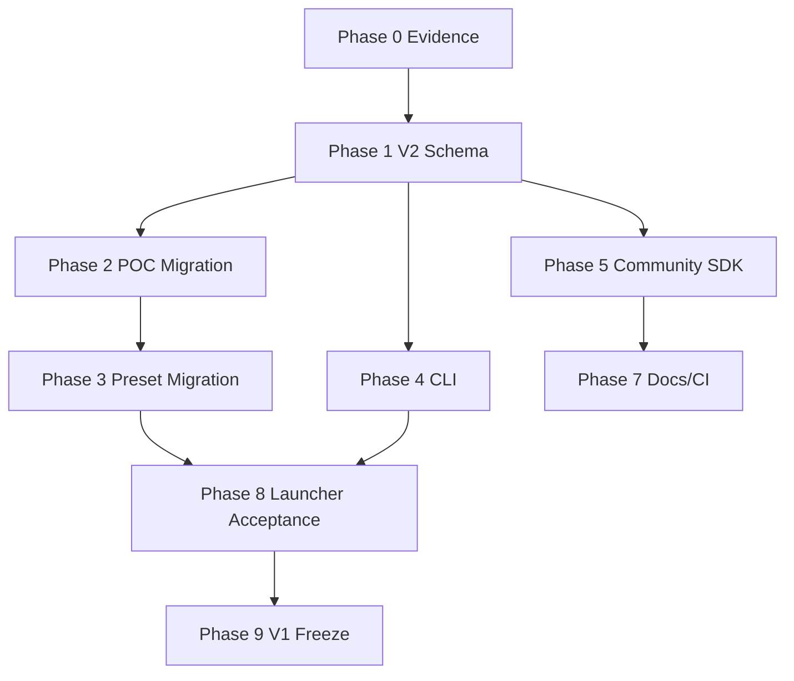

# Предложения по улучшению PROJECT_ROADMAP_V2

Дата: 2026-05-12  
Базовый файл: `docs/_internal/PROJECT_ROADMAP_V2_2026-05-12_RU.md`  
Тип документа: отдельные предложения, замечания и усиления к roadmap.  
Статус: не заменяет roadmap, а дополняет его как список точечных решений.

## Краткое мнение

Обновленный `PROJECT_ROADMAP_V2_2026-05-12_RU.md` стал заметно лучше: в нем появилась Phase 0 с evidence ledger, учтены layered config V2, community SDK, docs stale scan, engine boundary check и часть local/server convergence. Это правильное направление.

Главная оставшаяся проблема: roadmap все еще местами звучит как уже подтвержденный production-state, хотя часть фактов должна быть доказана отдельным evidence ledger. Нужно сделать документ более строгим: убрать неподтвержденные hardcoded цифры, закрыть противоречия по фазам, явно разделить release gates, private/public границы, security gates и patch proof.

Если кратко: roadmap улучшен, но ему не хватает жесткой инженерной дисциплины вокруг доказательств, релизных критериев и единого runtime/config контракта.

## Что уже улучшено

### 1. Появилась Phase 0 — Evidence Gate

Почему это важно: раньше roadmap мог фиксировать "green/clean/done" как утверждение. Теперь появляется механизм доказательства через команды, host, commit, дату и вывод.

Что дает:

- снижает риск самообмана;
- позволяет сравнивать состояние до и после V2;
- помогает другому инженеру понять, что реально работало;
- делает roadmap не просто планом, а проверяемым журналом качества.

Плюсы:

- хорошая основа для production readiness;
- подходит для local/server dual-state;
- можно встроить в `make evidence`.

Минусы:

- требует дисциплины обновления;
- может стать формальным, если ledger не будет обязательным gate;
- нужно решить, где хранить логи и как не засорять repo.

Что улучшить еще:

- не дублировать тестовые числа в roadmap;
- сделать evidence ledger единственным источником актуальных цифр;
- добавить правило: если ledger устарел, baseline считается unknown, а не green.

### 2. Runtime вынесен в hardware layer

Почему это важно: runtime описывает как запускать систему, а profile описывает что запускать и какие patches включать. Если смешать runtime и profile, количество профилей быстро взорвется.

Что дает:

- меньше дублирования;
- проще поддерживать Docker/Podman/K8s/Proxmox;
- проще community configs;
- понятнее модель разделения: model + hardware + profile + deployment.

Плюсы:

- архитектурно правильное разделение;
- снижает риск cross-product конфигов;
- хорошо подходит для homelab и server setups.

Минусы:

- нужен строгий composer;
- потребуется миграция старых presets;
- нужны тесты на merge/override semantics.

Что улучшить еще:

- добавить единый `RuntimeCommandSpec`;
- все renderers должны строиться из него: docker, compose, quadlet, k8s, proxmox, bare-metal;
- `sndr launch --dry-run` и docs должны использовать тот же источник, что и реальный launch.

### 3. Добавлены docs stale scan и engine boundary check

Почему это важно: проект быстро менял структуру `_genesis` → `sndr_core` → `sndr_engine`, и документация легко начинает врать.

Что дает:

- меньше старых команд в README/docs;
- меньше private IP/path в public документах;
- меньше риска, что пользователь запустит несуществующую команду;
- core не начнет случайно зависеть от private engine.

Плюсы:

- быстрая отдача;
- легко автоматизировать;
- хорошо подходит как CI gate.

Минусы:

- нужен allowlist для archived/internal docs;
- простой `rg` может давать false positives;
- придется поддерживать список запрещенных токенов.

Что улучшить еще:

- сделать `scripts/docs_stale_scan.py`, а не только raw `rg`;
- добавить режим `--public-release`;
- разделить ошибки: stale command, private path, private IP, archived allowed.

## Что еще не хватает

## P0. Сделать evidence ledger единственным источником baseline

### Проблема

В текущем roadmap одновременно встречаются разные тестовые числа:

- `Local 5544 passed`;
- `Server 5574 passed`;
- `5622 local / 5652 server`;
- `5500+`.

Это создает слабое место: непонятно, какие цифры актуальны и когда они были получены.

### Почему это нужно

Production roadmap не должен хранить живые метрики как текст, если эти метрики меняются после каждого коммита. Иначе документ быстро становится устаревшим.

### Что сделать

Заменить hardcoded baseline-цифры на ссылку:

```markdown
Актуальный baseline: см. последнюю запись
`docs/_internal/ROADMAP_EVIDENCE_LEDGER_2026-05-12_RU.md`.
```

В самом ledger хранить:

- commit;
- branch;
- dirty status;
- host;
- command;
- result;
- stdout excerpt;
- дата;
- кто запускал;
- решение.

### Что дает

- roadmap не устаревает от каждого нового test count;
- любой инженер видит доказательства;
- easier regression tracking;
- меньше споров local/server.

### Плюсы

- высокая надежность;
- проще аудит;
- удобно для release notes.

### Минусы

- нужно реально поддерживать ledger;
- файл может быстро расти;
- нужно решить retention policy для больших логов.

### Влияние на проект

Сильно повышает управляемость. Это один из главных шагов от "личного проекта" к production-процессу.

### Критерий приемки

Roadmap не содержит конкретных test counts, кроме примеров. Все реальные counts берутся из ledger.

## P0. Исправить порядок Phase 8

### Проблема

В фазах Phase 8 стоит как Day 19, но в execution priority она попадает в Day 1-6. Это создает логическое противоречие.

### Почему это нужно

Фазы должны быть исполнимыми. Если smoke acceptance зависит от V2 schema, composer, CLI и docs, ее нельзя ставить раньше этих фаз. Если это early smoke, надо переименовать и сузить scope.

### Что сделать

Вариант A, рекомендуемый:

- Phase 8 оставить как финальный `Installer + launcher acceptance`;
- в Day 1-6 добавить отдельный `Phase 0.5 — Existing workflow smoke`.

Вариант B:

- Phase 8 перенести раньше;
- ограничить ее только текущим V1 workflow без V2 discovery.

### Что дает

- план становится последовательным;
- уменьшается риск, что исполнитель начнет делать late-stage acceptance до готовности зависимостей;
- легче контролировать прогресс.

### Плюсы

- меньше путаницы;
- точнее dependencies;
- проще распределять работу.

### Минусы

- нужно немного переписать execution order;
- придется явно разделить V1 smoke и V2 smoke.

### Влияние на проект

Улучшает управляемость sprint planning. Это не кодовая правка, но она убирает риск неправильного порядка работ.

## P0. Уточнить no-stub/no-placeholder policy

### Проблема

Roadmap одновременно предлагает:

- `scaffold.py`;
- `plugins/community/.gitkeep + example placeholder`;
- no-stub release scan по `scaffold|placeholder|TODO|NotImplementedError`.

Это конфликт: сам roadmap создает сущности, которые потом запрещает gate.

### Почему это нужно

Проект уже переживал период, где placeholder/partial implementations путали реальную готовность. Для public release это критичный риск: пользователь видит команду или patch и думает, что он работает.

### Что сделать

Разделить понятия:

- `template` - допустимый шаблон генератора;
- `draft` - локальная заготовка пользователя, не попадает в release registry;
- `experimental` - реализовано, но не production;
- `stable` - production-ready;
- `placeholder/scaffold` - запрещено в release tree.

Для community SDK:

```text
scaffold.py разрешен только как generator implementation.
Generated scaffold не является tracked release artifact.
plugins/community/.gitkeep допустим.
example placeholder недопустим, если он выглядит как реальный patch.
```

### Что дает

- меньше ложных "реализаций";
- чище registry;
- понятнее contributor workflow;
- безопаснее public release.

### Плюсы

- жесткая дисциплина качества;
- меньше технического долга;
- проще объяснять статус patches.

### Минусы

- сложнее обучающие примеры;
- нужно делать реальные minimal examples вместо placeholders;
- contributor SDK потребует больше документации.

### Влияние на проект

Сильно повышает доверие. Особенно важно, если проект будет делиться на public core и private engine: public часть должна быть честной и полностью рабочей.

## P0. Зафиксировать local/server convergence как жесткий gate

### Проблема

В roadmap написано `git status --short | wc -l ≤ N tolerated`, но `N` не определен.

### Почему это нужно

Неопределенный tolerance превращает gate в формальность. Для release нужно понимать, какие изменения допустимы, а какие блокируют релиз.

### Что сделать

Ввести три режима:

| Режим | Допуск dirty state | Где применимо |
|---|---:|---|
| `dev` | allowlist | локальная разработка |
| `audit` | allowlist + documented diff | аудит local/server |
| `release` | `N=0` или строго documented generated files | public release |

Добавить файл:

`docs/_internal/LOCAL_SERVER_ALLOWED_DIRTY_STATE_2026-05-12_RU.md`

### Что дает

- понятный статус server/local;
- меньше случайных divergence;
- проще понять, что можно переносить;
- лучше контроль работы других агентов на сервере.

### Плюсы

- сильная воспроизводимость;
- меньше риска потерять server-only изменения;
- проще merge/release.

### Минусы

- требует дисциплины;
- надо вести allowlist;
- generated artifacts нужно правильно исключить.

### Влияние на проект

Повышает надежность разработки на двух состояниях: local и server. Это важно, потому что server используется как runtime-площадка, а local как рабочая зона.

## P1. Добавить RuntimeCommandSpec

### Проблема

Roadmap правильно кладет runtime в hardware layer, но пока нет единого объекта, из которого строятся реальные команды запуска.

### Почему это нужно

Без общего контракта Docker, Compose, Quadlet, K8s, Proxmox, dry-run, docs и report bundle начнут расходиться.

### Что сделать

Добавить в план объект:

```python
RuntimeCommandSpec(
    runtime,
    image,
    image_digest,
    env,
    mounts,
    ports,
    devices,
    ulimits,
    shm_size,
    security,
    command,
)
```

Все renderers должны брать данные из него:

- `sndr launch --runtime docker`;
- `sndr launch --runtime compose`;
- `sndr launch --runtime quadlet`;
- `sndr launch --runtime kubernetes`;
- `sndr launch --runtime proxmox-lxc`;
- `sndr launch --dry-run`;
- `sndr report bundle`;
- public docs examples.

### Что дает

- один источник истины для запуска;
- меньше расхождений между dry-run и real launch;
- проще тестировать;
- проще добавлять новые runtimes.

### Плюсы

- сильная архитектура;
- хорошо масштабируется;
- делает launcher профессиональным.

### Минусы

- требует аккуратного дизайна;
- придется мигрировать существующие emitters;
- возможны breaking changes в CLI.

### Влияние на проект

Это одно из самых важных улучшений launcher/install слоя. Оно превращает проект из набора скриптов в управляемую runtime-систему.

## P1. Поднять `sndr memory explain` из research в обязательный MVP

### Проблема

В roadmap `sndr memory explain` отложен на 2-4 недели как research-level. Но для проекта, который работает с A5000/3090, long context, KV cache, TQ/DFlash/MTP, memory planning является одной из главных ценностей.

### Почему это нужно

Пользователю важнее понимать "запустится ли модель и где будет OOM", чем иметь красивый community SDK на раннем этапе.

### Что сделать

Сделать MVP:

```bash
sndr memory explain --profile a5000-2x-35b-prod
sndr memory explain --model <model> --tp 2 --ctx 32768 --dtype fp8 --kv-dtype fp8
```

MVP считает:

- weights estimate;
- KV cache estimate;
- activation reserve;
- cudagraph reserve;
- quantization overhead;
- fragmentation reserve;
- recommended max context/concurrency;
- obvious OOM risks.

### Что дает

- меньше trial-and-error;
- лучше onboarding;
- меньше OOM на сервере;
- сильная утилита, которая привязывает пользователей к core.

### Плюсы

- высокий практический эффект;
- можно сделать постепенно;
- хорошо ложится на configs.

### Минусы

- оценки будут приблизительными;
- нужны реальные calibration data;
- придется явно показывать uncertainty.

### Влияние на проект

Сильно повышает ценность public core. Это именно та утилита, которая может быть бесплатной и полезной, а private engine потом добавит продвинутые оптимизации.

## P1. Добавить patch proof / dead-patch detector

### Проблема

`patches doctor` и registry validation не доказывают, что patch реально влияет на runtime. Возможен сценарий: patch зарегистрирован, apply проходит, но vLLM путь уже изменился или upstream содержит другой код.

### Почему это нужно

Для patcher-проекта самый опасный баг - "патч включен, но ничего не делает" или "патч применился не туда".

### Что сделать

Добавить команду:

```bash
sndr patches prove --patch PN95 --profile a5000-2x-35b-prod
sndr patches prove --changed
```

Проверять:

- anchor найден;
- replacement применен;
- marker установлен;
- runtime log подтверждает path;
- ON/OFF behavior отличается;
- test/reproducer проходит;
- retire condition не наступил.

### Что дает

- меньше no-op patches;
- лучше upgrade к новым vLLM pins;
- быстрее диагностика;
- выше доверие к patch registry.

### Плюсы

- закрывает реальный класс скрытых ошибок;
- хорошо подходит для CI;
- помогает external integration.

### Минусы

- для некоторых patches proof сложно автоматизировать;
- нужны короткие reproducible scenarios;
- часть проверок потребует GPU.

### Влияние на проект

Критично для production. Без этого patcher остается уязвимым к upstream drift.

## P1. Добавить env/config key canonical registry

### Проблема

В проекте уже были проблемы YAML vs runtime env drift и неизвестных runtime knobs. Roadmap это упоминает частично, но нужен отдельный механизм.

### Почему это нужно

Если env keys разбросаны по коду, docs и YAML, рано или поздно появятся опечатки, старые `GENESIS_*`, новые `SNDR_*`, и профили начнут вести себя непредсказуемо.

### Что сделать

Добавить единый registry ключей:

```bash
sndr config keys list
sndr config keys validate
sndr config env explain <KEY>
sndr config env migrate --from genesis --to sndr
```

Каждый key должен иметь:

- canonical name;
- aliases;
- type;
- default;
- scope;
- deprecated_since;
- removal_target;
- docs string;
- validation rule.

### Что дает

- меньше опечаток;
- понятная migration from GENESIS to SNDR;
- docs можно генерировать из кода;
- configs становятся надежнее.

### Плюсы

- высокий эффект на стабильность;
- легко тестировать;
- хорошо ложится на V2 schema.

### Минусы

- нужно пройтись по всем текущим env keys;
- возможны breaking changes;
- compatibility aliases придется поддерживать.

### Влияние на проект

Улучшает связанность CLI, configs, docs и runtime. Это один из важных шагов к профессиональной структуре.

## P1. Усилить security/license/release gate

### Проблема

В roadmap есть trust anchor rotation, но не хватает полной security модели для public core/private engine, license keys, report bundles и secrets.

### Почему это нужно

Если проект будет иметь private engine и криптографический ключ, нужно заранее сделать правильную trust model. Иначе потом придется ломать API.

### Что сделать

Добавить gates:

- license payload schema validation;
- public key in core, private key never in repo;
- offline verification;
- no telemetry by default;
- report bundle redaction;
- secret scan;
- SBOM/constraints;
- image digest pinning;
- no `curl | sh`;
- explicit approval для system-level install actions.

Команды:

```bash
sndr license status --json
sndr license verify --file sample.license --offline
sndr report bundle --redact --dry-run
python3 scripts/security_scan.py --public-release
```

### Что дает

- безопасное разделение free/private;
- доверие пользователей;
- меньше риска утечки ключей;
- готовность к коммерческой модели без давления на public core.

### Плюсы

- правильная основа для monetization;
- снижает репутационные риски;
- можно внедрять постепенно.

### Минусы

- требует аккуратного дизайна;
- нельзя торопиться с hardware binding;
- больше тестов и edge cases.

### Влияние на проект

Сильно повышает зрелость. Особенно важно, если private engine будет давать платные patches, а core останется открытым.

## P1. Добавить public/private docs boundary

### Проблема

В проекте много внутренних документов, audit files, server notes и private paths. Roadmap говорит про docs cleanup, но нужен строгий release boundary.

### Почему это нужно

Public repo не должен тащить внутренние IP, `/home/sander`, server names, private notes, временные audit conclusions и старые команды.

### Что сделать

Добавить проверку:

```bash
python3 scripts/release_public_docs_check.py
```

Проверяет:

- private IP;
- private paths;
- old commands;
- internal docs links;
- TODO/stub/placeholder;
- references to non-release files;
- examples with real secrets.

### Что дает

- чище public repo;
- меньше путаницы у пользователей;
- меньше риска раскрыть внутреннюю инфраструктуру;
- проще готовить releases.

### Плюсы

- простой и полезный gate;
- можно быстро внедрить;
- снижает репутационные риски.

### Минусы

- нужны allowlists;
- придется чистить старые docs;
- часть внутренних документов нужно перенести/архивировать.

### Влияние на проект

Улучшает качество public-facing слоя. Это важно для доверия и роста community.

## P1. Добавить external integration pipeline

### Проблема

Roadmap перечисляет vLLM PR и внешние идеи, но не описывает процесс превращения внешнего наблюдения в задачу проекта.

### Почему это нужно

Без pipeline внешние источники становятся хаотичным списком ссылок. Нужен способ решать: что брать, что ждать, что игнорировать, что превращать в doctor rule или patch.

### Что сделать

Добавить:

```bash
sndr upstream scan --topic memory,cache,spec-decode,gemma,qwen,mtp,fp8,fp4
```

И файл:

`docs/_internal/UPSTREAM_AND_CLUB_FINDINGS_2026-05-12_RU.md`

Статусы:

- `backport-now`;
- `watch`;
- `skip`;
- `needs-reproducer`;
- `needs-bench`;
- `retire-local-patch`;
- `doctor-rule`;
- `config-recipe`.

### Что дает

- vLLM PR не теряются;
- `club-3090` issues превращаются в полезные проверки;
- external ideas не попадают в код без теста;
- проще управлять patch roadmap.

### Плюсы

- системность;
- лучше связь с upstream;
- больше пользы от community.

### Минусы

- требует регулярного обновления;
- внешние API могут быть нестабильны;
- нужно отделять идеи от готовых решений.

### Влияние на проект

Делает проект более живым и технически актуальным. Это особенно важно для vLLM, где upstream меняется быстро.

## P1. Уточнить production-ready definition

### Проблема

Текущее определение production-ready хорошее, но неполное: оно больше проверяет tests/docs/install, чем full operator journey.

### Почему это нужно

Production-ready для такого проекта означает не только "pytest green", а "новый человек может поставить, проверить, запустить, собрать отчет, понять ошибку и откатиться".

### Что добавить

Production-ready должен включать:

- fresh clone install;
- `sndr host doctor`;
- `sndr deps plan`;
- `sndr launch --dry-run --all-builtins`;
- `sndr report bundle --redact`;
- docs stale scan clean;
- security scan clean;
- no private paths/IP;
- engine absent mode works;
- at least one short GPU smoke on server;
- rollback docs for Docker/Compose/Quadlet/K8s/Proxmox.

### Что дает

- реальную готовность к пользователям;
- меньше ручной поддержки;
- понятные release gates;
- лучше качество документации.

### Плюсы

- очень практично;
- повышает доверие;
- уменьшает количество повторных вопросов.

### Минусы

- больше работы до release;
- часть checks требует server/GPU;
- нужно поддерживать rollback docs.

### Влияние на проект

Переводит проект из "работает у автора" в "может работать у других".

## P2. Добавить benchmark methodology contract

### Проблема

Roadmap говорит про bench/log integration, но нужно запретить сравнение результатов, полученных разной методикой.

### Почему это нужно

TPS, memory и OOM выводы легко становятся ложными, если отличаются warmup, max_tokens, context, cache state, image digest или prompt set.

### Что сделать

Каждый bench artifact должен хранить:

- git ref;
- vLLM ref/image digest;
- model path;
- GPU/driver/CUDA;
- profile;
- env keys;
- prompt set;
- context;
- max_tokens;
- warmup;
- concurrency;
- cache state;
- runtime;
- command line.

Команды:

```bash
sndr bench run --profile <profile> --quick --json
sndr bench compare --baseline a.json --candidate b.json
sndr bench report --redact
```

### Что дает

- честные сравнения;
- понятный A/B bench;
- меньше ложных оптимизаций;
- лучше release notes.

### Плюсы

- сильная инженерная база;
- помогает external integrations;
- полезно для users/community.

### Минусы

- больше metadata;
- нужно хранить baseline artifacts;
- потребуется нормализация старых результатов.

### Влияние на проект

Повышает качество технических решений. Особенно важно для patches, которые дают 1-2% TPS: без строгой методики такой эффект нельзя доказать.

## P2. Добавить release risk registry

### Проблема

В roadmap есть risks table, но она пока короткая и не покрывает самые опасные классы.

### Что добавить

Риски:

- evidence ledger устарел, но roadmap говорит green;
- public docs содержат private paths/IP;
- core случайно импортирует private engine;
- patch applied but no runtime effect;
- upstream merge делает local patch вредным;
- benchmark methodology drift;
- installer выполняет system changes без dry-run;
- community patch ломает registry;
- V1/V2 config drift;
- generated artifacts попадают в repo;
- license failure ломает public core.

### Что дает

- меньше неожиданных провалов;
- проще планировать gates;
- понятнее приоритеты.

### Плюсы

- быстро добавить;
- полезно для любого исполнителя;
- помогает не забыть важные классы ошибок.

### Минусы

- risk table нужно поддерживать;
- без owner/status она может устареть.

### Влияние на проект

Повышает управляемость и помогает не терять критичные проблемы при длинной разработке.

## Что улучшить в структуре roadmap

### 1. Исправить нумерацию разделов

Сейчас в Quality Gates есть `6.4`, потом `6.3`, потом снова `6.4`. Это мелочь, но для master plan такие мелочи создают ощущение небрежности.

Решение:

- `6.1 Per-commit`;
- `6.2 Per-PR`;
- `6.3 Extended gates`;
- `6.4 Per-release`;
- `6.5 CHANGELOG`.

### 2. Добавить dependency graph фаз

Сейчас фазы перечислены линейно, но часть из них может идти параллельно. Нужна маленькая Mermaid-схема:



Что дает:

- лучше видно, что блокирует что;
- проще делить задачи;
- меньше ошибок в order.

### 3. Добавить owner/status колонку

Для каждого крупного item:

- owner;
- status;
- evidence;
- blocked_by;
- acceptance.

Это нужно, если на сервере параллельно работает другой агент или инженер.

## Рекомендуемый порядок внедрения предложений

### Сначала

1. Убрать hardcoded baseline counts из roadmap.
2. Исправить Phase 8 order.
3. Уточнить no-stub/scaffold policy.
4. Определить `N` для local/server convergence.
5. Исправить нумерацию Quality Gates.

### Затем

6. Добавить RuntimeCommandSpec.
7. Поднять `sndr memory explain` MVP в P1.
8. Добавить patch proof/dead-patch detector.
9. Добавить env/config key registry.
10. Добавить public/private docs boundary.

### После

11. Добавить security/license gate.
12. Добавить external integration pipeline.
13. Добавить benchmark methodology contract.
14. Расширить production-ready checklist.
15. Добавить release risk registry.

## Итог

Roadmap V2 стал сильнее и уже может быть основой работы. Но до уровня production master plan ему нужно добавить:

- один источник истины для baseline;
- строгий local/server convergence;
- единый runtime command contract;
- честную no-placeholder policy;
- memory explain MVP;
- patch proof;
- security/license gates;
- public/private docs boundary;
- external findings pipeline;
- benchmark methodology contract.

Самое важное: не начинать массовую V2 migration, пока Phase 0 не стала реальным gate, а не просто разделом документа. Если Phase 0 будет честной и воспроизводимой, дальнейшая работа станет намного безопаснее.
