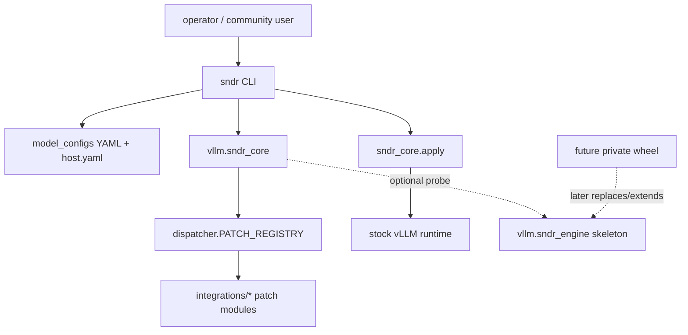

# Комплексный dual-state аудит проекта Genesis / SNDR Core

Дата: 2026-05-12  
Локальная копия: `/Users/sander/Documents/Visual Studio Code/genesis-vllm-patches`  
Серверная копия: `sander@192.168.1.10:/home/sander/genesis-vllm-patches-v11`  
Ошибочно проверенный старый серверный checkout: `/home/sander/genesis-vllm-patches`  
Режим: аудит, анализ, короткие проверки; файлы проекта и сервера не изменялись. Создан только этот MD-файл.

## 1. Executive Summary

Проект в текущем состоянии уже имеет правильное стратегическое направление: `_genesis` удаляется, публичный слой собран вокруг `vllm/sndr_core`, а `vllm/sndr_engine` оставлен пустым резервным namespace под будущий приватный overlay. Это соответствует выбранной модели: весь существующий функционал остается в public core, engine не является runtime-зависимостью и пока не должен содержать патчей.

Но до production-ready состояния проект еще не дошел. Основные блокеры:

1. **Local и server-v11 расходятся по тестам и части документов.** Локальные legacy-тесты уже почти полностью переведены с `vllm.sndr_core.patches` на `vllm.sndr_core.integrations`, а серверная `v11` содержит 108 ссылок на удаленный alias `vllm.sndr_core.patches`. Из-за этого полный серверный pytest падает: `114 failed, 5242 passed, 99 skipped, 2 errors`.
2. **Локальный полный pytest почти чистый, но один реальный runtime-дефект остается:** `PN26` импортирует torch-зависимый kernel до проверки env-флага и падает без torch.
3. **License/trust-anchor инфраструктура пока тестовая:** публичный Ed25519 ключ в `vllm/sndr_core/license.py` является zero-key placeholder. Подписанные engine-токены будут отвергаться как `BAD_SIGNATURE`.
4. **Runtime endpoint работает, но behavior для коротких ответов проблемный:** при `max_tokens=32/96/192` сервер возвращал `message.content = null`, а все токены уходили в `message.reasoning`. Только при `max_tokens=512` появился content, но `finish_reason=length`, то есть ответ все еще был обрезан. Для пользователей OpenAI-compatible API это выглядит как пустой ответ.
5. **Операционная обвязка не production-clean:** `nvidia-gpu-exporter` постоянно падает из-за невалидных metric names, `docker-sandbox-1` перезапускается из-за отсутствия `conf/config.yaml`, в kernel journal есть старые OOM kill и NVIDIA Xid 31 от vLLM-процессов.
6. **Launcher/service/K8s/Proxmox слой функционален частично:** `sndr launch` и config-render уже полезны, но compose/quadlet/k8s/proxmox пока в основном render/advice, а не полноценное управляемое развертывание.
7. **Документы все еще смешивают v7 `_genesis` инструкции и v11 `sndr_core`.** Это опасно: пользователь может следовать устаревшим install/mount/symlink рекомендациям.

Оценка готовности:

| Слой | Готовность | Комментарий |
|---|---:|---|
| `sndr_core` API / registry / shadow gate | 80% | static/self-test/shadow clean, но есть PN26 import bug и metadata debt |
| Патчи и apply-loop | 70% | 136 entries, 123 с apply_module, но 13 spec-only и мало full-status metadata |
| Tests локально | 85% | `4773 passed`, 1 fail, 96 skipped |
| Tests server-v11 | 55% | static clean, targeted pass, full pytest red из-за stale tests |
| Installer/launcher/config | 65% | полезный каркас есть, production automation неполная |
| Runtime на 2x A5000 | 65% | endpoint живой, quick bench ранее хороший, но reasoning/content и ops-логи требуют правок |
| Public/private разделение | 75% | концепция правильная, но нужно зафиксировать tracked skeleton и убрать stale references |

Главный вывод: **сейчас это хороший pre-production / beta проект, но не production release.** Первый sprint должен закрыть не новые фичи, а согласованность: local/server sync, тестовые импорты, PN26 torch-less contract, trust anchor, docs v11 cleanup, reasoning/content policy.

## 2. Что было проверено

### 2.1 Локально

Коммит: `f9576df`  
Файлы в основных зонах `vllm/sndr_core`, `vllm/sndr_engine`, `scripts`, `tools`, `docs`, `tests`: 1217  
Python-файлы в `vllm/sndr_core`: 332  
Python-файлы в `vllm/sndr_core/integrations`: 146  
Тестовые файлы: 263  
Git tree сильно dirty: много модификаций, удаление старого `vllm/_genesis`, новые `pyproject.toml`, `vllm/sndr_core`, `tests/unit`, `tests/legacy`, docs/upstream.

Результаты:

| Проверка | Результат |
|---|---|
| AST compile всех `.py` | `PY_AST files=712 errors=0` |
| JSON/TOML/YAML parse | `{'json': 39, 'toml': 4, 'yaml': 30, 'sample_yaml': 2} errors=0` |
| `bash -n` для shell scripts | ошибок нет |
| `python3 -m vllm.sndr_core.compat.cli self-test --json` | 8 passed, 0 failed |
| `python3 -m vllm.sndr_core.apply.shadow --strict` | CLEAN |
| `python3 -m pytest -q` | `1 failed, 4773 passed, 96 skipped` |
| Targeted installer/config tests | `86 passed, 23 skipped` |

Локальный `shadow --strict`:

```text
Legacy apply registrations:   133
Spec-driven entries:          136
Specs with apply_module:      123  (90%)
Specs without apply_module:    13
CLEAN — no unexpected divergence
```

### 2.2 На сервере v11

Правильная директория: `/home/sander/genesis-vllm-patches-v11`  
Коммит: `f9576df`, branch `dev`  
Git status: 507 dirty entries  
Файлы в основных зонах: 677  
Python-файлы в `vllm/sndr_core`: 332  
Python-файлы в `vllm/sndr_engine`: 2  
Python-файлы в `vllm/_genesis`: 0

Результаты:

| Проверка | Результат |
|---|---|
| AST compile всех `.py` | `PY_AST 712 errors 0` |
| JSON/TOML/YAML parse | `{'json': 48, 'toml': 4, 'yaml': 29} errors 0` |
| `bash -n` shell scripts | ошибок нет |
| `python3 -m vllm.sndr_core.compat.cli self-test --json` | 8 passed, 0 failed |
| `python3 -m vllm.sndr_core.apply.shadow --strict` | CLEAN |
| Targeted tests | `75 passed, 23 skipped` |
| Full pytest | `114 failed, 5242 passed, 99 skipped, 2 errors` |

Серверная `v11` по коду ядра похожа на локальную, но тесты и часть документов отстают. Это не runtime-синтаксис, а проблема миграции тестов и документации.

### 2.3 Старый серверный checkout

Путь `/home/sander/genesis-vllm-patches` оказался старой/legacy рабочей копией. Там есть `_genesis`, и self-test падает на `P5b.lifecycle = "coordinator"`, потому что legacy validator не знает lifecycle `coordinator`. После уточнения пользователя этот путь не используется как источник истины, но его стоит оставить в отчете как операционный риск: на сервере есть несколько похожих checkout, и легко запустить тест/bench не из той директории.

Рекомендация: в `v11` добавить `scripts/doctor_checkout.sh` или `sndr doctor-system` check:

```text
expected repo root: /home/sander/genesis-vllm-patches-v11
ref: f9576df
layout: no vllm/_genesis, has vllm/sndr_core
```

## 3. Local / Server расхождения

| Область | Local | Server v11 | Риск | Решение |
|---|---|---|---|---|
| Test imports | 1 leftover mention of `vllm.sndr_core.patches` in schema description | 108 imports in tests | Full pytest red on server | Sync local test migration to server |
| `sndr_engine/__init__.py` docs | Points PN72 to `vllm.sndr_core.integrations...` | Points PN72 to stale `vllm.sndr_core.patches...` | misleading docs and potential copy/paste failures | Replace server text with local version |
| Full pytest | 1 fail | 114 fail + 2 errors | server CI signal unusable | migrate server tests or copy local test tree |
| Benchmark artifacts | mostly repo docs and generated caches | many root `genesis_bench_quick_*.json/md` | public repo noise / accidental commit | move to `benchmarks/runs/` or ignore root artifacts |
| `__pycache__` | present in workspace | present in workspace | dirty release hygiene | ignore/clean before release |
| Docs | more recent but still stale areas | more stale v7/v11 mix | users follow wrong install flow | docs v11 cleanup sprint |

Серверный grep:

```text
grep -RIn "vllm\.sndr_core\.patches" tests vllm/sndr_core
=> 108 matches
```

Локальный grep:

```text
grep -RIn "vllm\.sndr_core\.patches" tests vllm/sndr_core
=> 1 match, only schema description
```

## 4. Архитектура проекта

Текущее целевое разделение правильное:



Правильные правила:

1. `sndr_core` public, Apache-2.0, содержит все, что уже есть сегодня.
2. `sndr_engine` пока пустой skeleton. Core может проверять наличие engine, но не должен зависеть от него.
3. Все реальные патчи должны жить под `vllm/sndr_core/integrations/*`.
4. Старое имя `patches` не должно быть runtime API. Если нужно сохранить compatibility, нужен явный thin alias package, но лучше добить миграцию тестов и docs.
5. `_genesis` больше не должен возвращаться в active code. Допускается только в archived docs и миграционных пояснениях.

Состояние `sndr_engine`:

Локально:

```text
vllm/sndr_engine/__init__.py:45-59
engine_available() returns False unless vllm.sndr_engine.private.AVAILABLE exists
```

Это корректно для текущей стратегии. Однако `.gitignore` игнорирует весь `vllm/sndr_engine/`:

```text
.gitignore:78-87
vllm/sndr_engine/
pyproject-engine.toml
```

Риск: skeleton может не попасть в public wheel/repo, а `pyproject-engine.toml` и docs будут ссылаться на пакет, которого нет. Нужно выбрать один вариант:

1. **Рекомендуемый:** force-add только skeleton files:
   - `vllm/sndr_engine/__init__.py`
   - `vllm/sndr_engine/version.py`
   - `vllm/sndr_engine/LICENSE-NOTICE`
   - ignore оставить для `vllm/sndr_engine/private/`, `vllm/sndr_engine/patches/`, `vllm/sndr_engine/kernels/`.
2. **Альтернатива:** вообще убрать public skeleton из repo и сделать `sndr_core.license` устойчивым к `ImportError`. Тогда docs не должны обещать пакет `vllm.sndr_engine` в public tree.

## 5. P0 / P1 / P2 дефекты

### P0-1. Server-v11 full pytest red из-за stale imports `vllm.sndr_core.patches`

Симптом:

```text
ModuleNotFoundError: No module named 'vllm.sndr_core.patches'
```

Примеры:

```text
server:/home/sander/genesis-vllm-patches-v11/tests/legacy/test_pN29_gdn_chunk_o_scale_fold.py:30
from vllm.sndr_core.patches.attention.gdn import pn29_gdn_chunk_o_scale_fold

server:/home/sander/genesis-vllm-patches-v11/tests/legacy/test_pN31_fa_varlen_persistent_out.py:12
from vllm.sndr_core.patches.attention.turboquant import pn31_fa_varlen_persistent_out

server:/home/sander/genesis-vllm-patches-v11/tests/legacy/test_tq_continuation_memory.py:341
from vllm.sndr_core.patches.attention.turboquant import p38_tq_continuation_memory
```

Правильный локальный вариант:

```python
from vllm.sndr_core.integrations.attention.gdn import pn29_gdn_chunk_o_scale_fold
```

Последствие: серверная full test suite не является надежным gate. Точечные тесты проходят, но полный pytest красный.

Решение:

1. Перенести локально обновленные tests на сервер.
2. Добавить grep-gate:

```bash
grep -RIn "vllm\.sndr_core\.patches" tests vllm/sndr_core docs scripts tools \
  --exclude-dir=__pycache__ \
  --exclude='*.pyc'
```

3. Разрешить только schema description или заменить там пример тоже на `integrations`.

Acceptance:

```bash
python3 -m pytest -q tests/legacy tests/unit
python3 -m pytest -q
```

### P0-2. Local PN26 нарушает torch-less apply contract

Файл:

```text
vllm/sndr_core/integrations/attention/turboquant/pn26_sparse_v_kernel.py:109-121
```

Текущий код:

```python
def apply() -> tuple[str, str]:
    from vllm.sndr_core.kernels.triton_turboquant_decode_sparse_v import (
        should_apply,
        is_pn26_sparse_v_enabled,
    )

    if not is_pn26_sparse_v_enabled():
        return "skipped", ...
```

Проблема: import kernel-модуля происходит до env gate. Kernel импортирует torch/Triton на top-level, поэтому тест `env disabled -> apply returns tuple` падает в окружении без torch:

```text
tests/unit/test_patch_apply_contracts.py::TestApplyModule::test_apply_returns_tuple_when_env_disabled[PN26]
ModuleNotFoundError: No module named 'torch'
```

Правильная форма:

```python
def _pn26_env_enabled() -> bool:
    raw = os.environ.get("GENESIS_ENABLE_PN26_SPARSE_V", "")
    return raw.strip().lower() in {"1", "true", "yes", "on"}


def apply() -> tuple[str, str]:
    if not _pn26_env_enabled():
        return "skipped", (
            "opt-in: set GENESIS_ENABLE_PN26_SPARSE_V=1 to enable sparse-V "
            "tile-skip kernel"
        )

    try:
        from vllm.sndr_core.kernels.triton_turboquant_decode_sparse_v import (
            should_apply,
        )
    except ImportError as e:
        return "skipped", f"runtime dependency unavailable for PN26 sparse-V: {e}"

    if not should_apply():
        return "skipped", "platform gate: NVIDIA SM >= 8.0 required"
```

Acceptance:

```bash
python3 -m pytest -q tests/unit/test_patch_apply_contracts.py -k PN26
python3 -m pytest -q
```

### P0-3. Runtime smoke: short responses return `content=null`

Server endpoint:

```text
container: vllm-pn95-2xa5000
port: 8101
model: qwen3.6-27b
max_model_len: 131072
```

Короткий smoke:

```text
max_tokens=32  -> finish=length, tokens=32, content_is_none=True, reasoning_len>0
max_tokens=96  -> finish=length, tokens=96, content_is_none=True, reasoning_len=351
max_tokens=192 -> finish=length, tokens=192, content_is_none=True, reasoning_len=704
max_tokens=512 -> finish=length, content_len=116, reasoning_len=1782
```

Последствие: OpenAI-compatible клиенты, ожидающие `message.content`, видят пустой ответ при коротких лимитах. Это особенно критично для IDE agents, tool routers, health smoke и evaluation harness.

Вероятная причина: Qwen reasoning parser / thinking mode не принудительно отключается для no-think сценариев, и reasoning budget съедает max_tokens. Есть `PN16 Lazy-reasoner`, но текущий live container не демонстрирует корректного no-think behavior для простого запроса.

Решение:

1. В config для non-reasoning профилей добавить явный no-think режим:
   - chat template kwargs, если vLLM поддерживает;
   - системный prompt недостаточен, проверено;
   - `GENESIS_PN16_CLASSIFIER_MAX_TOKENS=0` сейчас есть в launch script, но live behavior нужно перепроверить.
2. Добавить smoke-test:

```python
assert choice["message"]["content"]
assert len(choice["message"].get("reasoning") or "") == 0 or allow_reasoning
```

3. Для Qwen/Gemma профилей разделить:
   - `reasoning=true`: допускается reasoning, но content должен появляться до budget cliff;
   - `reasoning=false`: reasoning parser должен быть отключен или suppressed.

### P1-1. Trust anchor placeholder

Файл:

```text
vllm/sndr_core/license.py:58-60
```

Текущий код:

```python
_TRUST_ANCHOR_PUBKEY_B64URL = (
    "AAAAAAAAAAAAAAAAAAAAAAAAAAAAAAAAAAAAAAAAAAA"  # 32 zero bytes — placeholder
)
```

Проблема: engine license gate существует, но production crypto activation еще не включена. Подписанные токены будут отвергаться как `BAD_SIGNATURE`; legacy plain key возможен только если явно разрешен.

Решение:

1. Offline generate Ed25519 keypair.
2. Запустить `scripts/generate_trust_anchor.py --update-license`.
3. Создать fixture signed token для tests.
4. Добавить release gate:

```bash
python3 -m pytest -q tests/unit/test_license.py
python3 - <<'PY'
from vllm.sndr_core.license import _is_placeholder_anchor
assert not _is_placeholder_anchor()
PY
```

### P1-2. Registry metadata почти вся без `implementation_status`

Локальная статистика registry:

```text
REGISTRY_COUNT 136
tier: community=136
lifecycle: experimental=86, legacy=33, retired=11, research=3, stable=2, coordinator=1
implementation_status: missing=129, full=4, retired=1, partial=1, placeholder=1
```

Проблема: нельзя автоматически строить production matrix, если registry не говорит, что full/partial/scaffold/placeholder. Сейчас lifecycle и реальная готовность смешаны.

Решение:

1. Для каждого patch entry добавить:
   - `implementation_status`: `full | partial | scaffold | placeholder | retired | coordinator`
   - `test_status`: `unit | integration | bench | none`
   - `production_default`: `eligible | blocked | research_only`
2. Gate:

```bash
sndr patches doctor --production
```

3. Не считать `experimental` автоматически плохим, но требовать явный `implementation_status`.

### P1-3. Service/K8s/Proxmox неполные

Файлы:

```text
vllm/sndr_core/cli/service.py:192-202
vllm/sndr_core/cli/service.py:223-278
vllm/sndr_core/cli/proxmox.py:162-240
```

Текущий service behavior:

```python
if backend in ("docker_compose", "podman_quadlet"):
    info("Genesis does NOT generate compose files; use sndr launch --dry-run ...")
```

```python
if cfg.service.backend in ("docker_compose", "podman_quadlet"):
    return _docker_cmd("start", container, dry_run=dry_run)
```

Проблема:

1. `docker_compose` backend не использует `docker compose up/down/logs`.
2. `podman_quadlet` не генерирует `.container` / systemd user units.
3. `kubernetes` только обещает `sndr k8s render`, но это не завершенный apply path.
4. `proxmox render` печатает команды review-only, нет `plan/apply/status/logs`, нет проверки storage/network/IOMMU/device passthrough.

Решение:

| Backend | Что реализовать |
|---|---|
| Docker | `sndr compose render/up/down/logs/ps`, healthcheck, image digest verify |
| Podman Quadlet | render `.container`, `systemctl --user daemon-reload`, status/logs |
| K8s | Deployment/Service/PVC/ConfigMap/Secret, nodeSelector GPU, runtimeClass nvidia |
| Proxmox LXC | detect PVE, validate nesting/cgroup/devices, render + optional apply |
| Proxmox VM | q35/OVMF/IOMMU/GPU passthrough template, rollback docs |

### P1-4. Hardcoded private paths/IP in active tools/docs

Active files:

```text
tools/long_ctx_smoke.sh:9,17
tools/soak.sh:6,14
docs/CONTRIBUTING.md:320
docs/reference/DEFERRED_P50_DEPLOY.md:28-42
tools/audit_yaml_vs_runtime.sh:21
```

Example:

```bash
HOST="${HOST:-http://192.168.1.10:8101}"
```

Проблема: public tools по умолчанию должны использовать `127.0.0.1` или требовать `HOST`, а не personal LAN IP. Иначе community user запускает smoke против чужого адреса/мертвого host.

Решение:

```bash
HOST="${HOST:-http://127.0.0.1:${PORT:-8000}}"
```

Для docs private IP оставить только в `docs/_internal` или `docs/reference/operator_sander_*`.

### P1-5. Docs v7/v11 conflict

Файлы с активными устаревшими инструкциями:

```text
docs/INSTALL.md:178-192
docs/INSTALL.md:539-543
docs/INSTALL.md:573
scripts/launch/README.md:10,110
docs/BENCHMARK_GUIDE.md:406
```

Проблема: docs одновременно говорят:

1. `_genesis` удален в v11.
2. Нужно bind-mount/symlink `_genesis`.

Это ломает доверие и приводит к неправильным deployment scripts.

Решение:

1. `docs/INSTALL.md` разделить:
   - `v11+ install`: только `sndr`, `vllm/sndr_core`, plugin entrypoint.
   - `legacy v7 archive`: отдельный archived doc.
2. В active docs запретить инструкции `python3 -m vllm._genesis...`.
3. Добавить doc sync test:

```bash
python3 scripts/check_doc_sync.py --forbid "_genesis" --allow docs/reference scripts/_archive
```

### P1-6. Operational logs: broken monitoring and old OOM/Xid

Серверные логи:

1. `nvidia-gpu-exporter` restart loop:

```text
failed to register exporter: descriptor ... "nvidia_smi_power_smoothing_window_multiplier [ms]" is not a valid metric name
```

2. `docker-sandbox-1` restart loop:

```text
failed to init config: open conf/config.yaml: no such file or directory
```

3. Kernel journal:

```text
Out of memory: Killed process ... VLLM::EngineCor
Out of memory: Killed process ... VLLM::Worker_TP
NVRM: Xid 31 ... VLLM::EngineCor ... MMU Fault
```

Проблема: даже если vLLM container сейчас живой, ops-среда не чистая. Monitoring GPU не работает, один сторонний контейнер рестартит, а история OOM/Xid должна попасть в acceptance criteria для long-context profiles.

Решение:

1. Заменить `utkuozdemir/nvidia_gpu_exporter:1.3.0` или ограничить query fields до валидных Prometheus names.
2. Dify sandbox починить отдельно или убрать из общего health dashboard проекта.
3. Добавить `sndr doctor-system logs`:
   - last OOM killer,
   - last NVRM Xid,
   - docker restarting containers,
   - vLLM 401/5xx rate,
   - GPU temperature/power throttling.

## 6. Патч-карта и качество реализации

### 6.1 Общая картина

136 registry entries — это уже серьезная база. Сильная сторона проекта: есть централизованный registry, family layout, shadow gate, patch metadata, model configs, self-test. Слабая сторона: часть патчей все еще выглядит как research patch-set, а не productized module set.

Требуется довести каждый патч до карточки:

| Поле | Зачем |
|---|---|
| `source` | upstream PR / issue / original |
| `implementation_status` | full/partial/scaffold/placeholder |
| `test_status` | unit/integration/runtime/bench |
| `risk` | boot/runtime/quality/perf/security |
| `default_policy` | off/on/profile-only |
| `retirement_condition` | upstream merged version / symbol detected |
| `acceptance` | exact tests and bench thresholds |

### 6.2 TurboQuant

Состояние:

1. TQ k8v4 profiles существуют и дают хорошие recorded TPS.
2. Есть риск correctness collapse при сочетании TQ KV + MTP/ngram. Это подтверждается vLLM issue [#40831](https://github.com/vllm-project/vllm/issues/40831): TurboQuant KV с speculative decoding может давать token loops и broken tool-calls.
3. PN26 sparse-V имеет текущий import bug без torch.
4. P65/P67/P82/P99 связаны с spec decode / acceptance / workspace behavior, но должны иметь явную matrix совместимости.

Что сделать:

1. В model config ввести `compatibility_matrix`:

```yaml
compatibility:
  turboquant_k8v4:
    mtp: allowed_with_tests
    ngram: blocked_until_verified
    dflash: blocked_for_qwen_next
```

2. Для каждого TQ profile добавить acceptance:
   - tool-call clean rate,
   - NIAH 32K/64K,
   - no repeated token loop detector,
   - content not null under short answer smoke.

3. PN26 fixed import contract перед любыми GPU bench.

### 6.3 DFlash / PFlash / speculative decode

Внешний PR [vLLM #42102](https://github.com/vllm-project/vllm/pull/42102) напрямую релевантен. Он предлагает DFlash drafter coexistence with quantized target KV через:

1. partition DFlash draft KV specs before page-size unify,
2. drafter `cache_dtype="auto"` when target global KV dtype is quantized,
3. per-spec dtype in FlashAttention metadata scheduler.

Это хорошо ложится на Genesis/SNDR roadmap, потому что проект уже имеет DFlash, MTP, TQ, KV page-size/hybrid patches. Нужно не копировать вслепую, а завести integration branch:

```text
PNxx_dflash_independent_kv_groups
PNxx_dflash_drafter_dtype_override
PNxx_flash_attn_per_spec_kv_dtype
```

Acceptance:

1. Gemma 4 + DFlash + INT8/FP8 target KV boots.
2. Qwen/Gemma profiles не заставляют drafter наследовать target `TRITON_ATTN`/quantized dtype.
3. Non-DFlash page-size unify byte-equivalent.
4. Long-context code prompt 32K/65K smoke.

Связанные upstream items:

| Источник | Смысл для проекта |
|---|---|
| [#42068](https://github.com/vllm-project/vllm/issues/42068) | Gemma 4 + DFlash ломается из-за TRITON_ATTN propagation |
| [#40624](https://github.com/vllm-project/vllm/issues/40624) | Gemma4 + hybrid attention + DFlash дает 0% prefix cache hits |
| [#42069](https://github.com/vllm-project/vllm/pull/42069) | DFlash drafter autoselect non-causal backend on Gemma 4 |
| [#42006](https://github.com/vllm-project/vllm/pull/42006) | Gemma4 MTP streaming multi-tool calls |
| [#42079](https://github.com/vllm-project/vllm/pull/42079) | MTP draft model local cache path vs S3 URL |

### 6.4 Tool calling / structured output

Проект уже имеет сильную линию P61/P64/P68/P69/PN51/PN56/PN58/PN70. Но runtime smoke показал, что простая chat completion может возвращать `content=null`, потому что reasoning съедает budget. Tool quality в quick bench ранее была 7/7, но это не отменяет content smoke.

Добавить обязательные tests:

1. `content_not_null_no_tool_short_answer`.
2. `tool_calls_present_when_required`.
3. `literal_tool_call_text_does_not_silence_stream` из club-3090 issue [#72](https://github.com/noonghunna/club-3090/issues/72).
4. `patternProperties` downgrade/skip для P68 из club-3090 issue [#57](https://github.com/noonghunna/club-3090/issues/57).

### 6.5 Memory / KV cache / eviction

У проекта много точечных memory patches, но нужен единый memory policy layer:

1. KV budget estimator.
2. Dynamic max_model_len proposer.
3. Profile-specific cliff detector.
4. Prefix cache hit telemetry.
5. Per-request memory accounting.
6. OOM preflight from actual free host RAM, swap, GPU VRAM, and active Docker containers.

Переносимые идеи из TensorRT-LLM:

1. KV cache reuse across requests through block/radix lookup.
2. Priority-based eviction for important prompt ranges.
3. KV cache event API for external routing/scheduling.
4. Separate pools for different attention window/head layouts.

Источники:

- [TensorRT-LLM KV cache reuse](https://github.com/NVIDIA/TensorRT-LLM/blob/main/docs/source/legacy/advanced/kv-cache-reuse.md)
- [TensorRT-LLM KV Cache System](https://nvidia.github.io/TensorRT-LLM/latest/features/kvcache.html)

Переносимые идеи из FlashInfer:

1. Strict paged KV layout contracts.
2. Explicit int32 requirement for `indptr`, page indices and last page lengths.
3. Separate decode/prefill wrappers with planning step.

Источник:

- [FlashInfer attention / paged KV docs](https://docs.flashinfer.ai/api/attention.html)

## 7. Launcher / Installer / Config Automation

### 7.1 Что уже есть

1. Root `pyproject.toml` делает проект pip-installable как `vllm-sndr-core`.
2. `install.sh` локально уже thin bootstrap:
   - checks Python/git,
   - clones into `$SNDR_HOME`,
   - `pip install -e`,
   - delegates to `sndr install`.
3. `sndr` CLI имеет команды:
   - `install`, `launch`, `doctor`, `verify`,
   - `model-config`, `patches`,
   - `deps`, `model`, `upstream`, `caveats`,
   - `service`, `tune`, `migrate`, `image`, `k8s`, `proxmox`, `bootstrap`, `host`.
4. Model configs включают 11 профилей, из них 9 working и 2 QA-only.
5. `sndr launch --dry-run --non-interactive a5000-2x-35b-prod` на server-v11 рендерит docker run script.

### 7.2 Чего не хватает

1. Единый config должен описывать не только vLLM flags, но и:
   - Docker image digest,
   - Docker runtime / compose backend,
   - host mounts,
   - NVIDIA container toolkit,
   - Python/torch/vLLM pin,
   - system package dependencies,
   - Proxmox/LXC/VM constraints,
   - K8s node selectors/runtimeClass/PVC/resources,
   - GPU tuning/power cap/clocks,
   - benchmark acceptance thresholds.
2. Installer должен строить plan:

```text
detect -> compare required versions -> propose apt/pip/docker actions -> dry-run -> apply -> verify
```

3. Нужен `sndr deps plan <config>`:

```yaml
requires:
  os:
    ubuntu: ">=22.04"
  python: ">=3.10,<3.14"
  nvidia_driver: ">=570"
  cuda_runtime: ["12.8", "13.0"]
  docker: ">=25"
  nvidia_container_toolkit: ">=1.17"
  vllm:
    source: docker_digest
    pin: sha256:...
```

4. Нужен `sndr install --apply-system` только с explicit consent. По умолчанию dry-run.

### 7.3 K8 / Kubernetes

Из club-3090 несколько раз всплывает Kubernetes/K8 окружение и multi-engine deployment. Для проекта стоит сделать не enterprise-heavy Helm сначала, а простой manifest renderer:

```text
sndr k8s render <config> --namespace llm --gpu 2 --pvc models-pvc
```

Файлы:

1. `Deployment` с `resources.limits.nvidia.com/gpu`.
2. `Service` для OpenAI endpoint.
3. `ConfigMap` для non-secret env.
4. `Secret` для API key/HF token.
5. `PVC` references для models/cache.
6. Optional `ServiceMonitor` if Prometheus operator exists.

### 7.4 Proxmox / VM / LXC

Текущий `proxmox render` полезен как заметка, но не как готовая автоматизация. Нужно:

1. `sndr proxmox doctor`:
   - is PVE host,
   - IOMMU enabled,
   - NVIDIA devices visible,
   - container nesting,
   - `/dev/nvidia*` cgroup rules,
   - storage exists,
   - bridge exists.
2. `sndr proxmox render --mode lxc|vm`.
3. `sndr proxmox apply --yes` только после dry-run.
4. `sndr proxmox status/logs`.

## 8. Club-3090: что взять

Репозиторий [noonghunna/club-3090](https://github.com/noonghunna/club-3090) полезен не как источник кода для копирования, а как база реальных failure modes и community workflows.

Ключевые идеи:

| Issue / файл | Что взять |
|---|---|
| `scripts/preflight.sh` | простая preflight философия: Python, CUDA/Torch, GPU visibility |
| `scripts/report.sh` | support bundle для issue: hardware, docker, GPU, bench, redaction |
| `tools/kv-calc.py` | VRAM/KV estimator как часть `sndr memory plan` |
| `scripts/power-cap-sweep.sh` | GPU tuning profiles: power cap vs TPS/CV |
| issue #1 | Estimated VRAM Usage Per Configuration |
| issue #7 | launch must respect `.env` / config overrides |
| issue #20 | ports/container names must be config-driven |
| issue #35/#58 | boot OOM / long-ctx defaults too aggressive |
| issue #37 | host-specific bind mounts must not leak into public compose |
| issue #47 | TurboQuant long-context cliff, fp8_e5m2 fallback |
| issue #57 | P68 can turn xgrammar limitation into hard failure |
| issue #72 | qwen3coder parser can hang stream on literal `<tool_call>` |
| issue #82 | missing PN34 env flag caused first decode assertion |
| issue #87 | verify/soak scripts too coupled to vLLM Docker |
| issue #89 | setup did not know Gemma profile |
| issue #101 | verify-full broken pipe should be quiet |
| issue #106 | nightly vLLM regression fixed by downgrade |
| issue #112 | stamp git commit in bench reports |

Рекомендации:

1. В `sndr report` добавить redaction + commit stamping.
2. В `sndr launch` запретить hardcoded mounts; все через host.yaml/config.
3. В `model_configs` добавить community profile schema:

```yaml
community:
  source: club-3090
  reporter: github_user
  gpu: RTX 3090
  driver: ...
  benchmark:
    narrative_tps:
    code_tps:
    tool_pass:
    max_context:
```

4. В `sndr verify` добавить engine abstraction:
   - vLLM,
   - llama.cpp,
   - SGLang,
   - external OpenAI endpoint.

## 9. vLLM upstream watchlist

Обязательные PR/issues:

| Upstream | Статус | Действие |
|---|---|---|
| [#42102](https://github.com/vllm-project/vllm/pull/42102) DFlash + quantized target KV | open | backport/watch, очень релевантно |
| [#42069](https://github.com/vllm-project/vllm/pull/42069) Gemma4 DFlash backend autoselect | open | integrate with DFlash matrix |
| [#42006](https://github.com/vllm-project/vllm/pull/42006) Gemma4 MTP streaming multi-tool calls | open | compare with P64/PN56/PN70 |
| [#42124](https://github.com/vllm-project/vllm/pull/42124) ModelOpt LM head quantization for Qwen/Nemotron | open | relevant for Nemotron/Qwen FP8 |
| [#42030](https://github.com/vllm-project/vllm/pull/42030) AutoRound GPTQ TP shard routing | open | relevant to AutoRound Qwen profiles |
| [#42029](https://github.com/vllm-project/vllm/pull/42029) Gemma4 AutoRound/GPTQ router/MoE | open | relevant to Gemma 4 |
| [#42028](https://github.com/vllm-project/vllm/pull/42028) Gemma4 per-layer embedding dtype/device | open | relevant to quantized Gemma |
| [#42074](https://github.com/vllm-project/vllm/pull/42074) offloader singleton GPU memory leak | closed | check if included in pinned vLLM |
| [#42076](https://github.com/vllm-project/vllm/pull/42076) GDN KKT precision loss Hopper | closed | GDN correctness watch |
| [#42070](https://github.com/vllm-project/vllm/pull/42070) nested torch.compile in GDN causing CUDA graph capture failure | closed | compare with compile-safety patches |
| [#42044](https://github.com/vllm-project/vllm/pull/42044) token-budget-bounded early KV prefetch | open | memory/KV roadmap |
| [#42050](https://github.com/vllm-project/vllm/pull/42050) kv_offload request_finished / store policy | open | offload integration |
| [#42080](https://github.com/vllm-project/vllm/pull/42080) FP8 per-tensor Q scale in Triton attention | open | TQ/FP8 attention |

Решение: завести `docs/upstream/UPSTREAM_WATCHLIST.yaml` как source of truth и CI job:

```bash
python3 scripts/audit_upstream_status.py --watchlist docs/upstream/UPSTREAM_WATCHLIST.yaml
```

## 10. Готовые фрагменты исправлений

### 10.1 PN26 torch-less guard

Файл:

```text
vllm/sndr_core/integrations/attention/turboquant/pn26_sparse_v_kernel.py
```

Текущий код импортирует kernel до env gate. Предлагаемая замена начала `apply()`:

```python
def _pn26_env_enabled() -> bool:
    raw = os.environ.get("GENESIS_ENABLE_PN26_SPARSE_V", "")
    return raw.strip().lower() in {"1", "true", "yes", "on"}


def apply() -> tuple[str, str]:
    if not _pn26_env_enabled():
        return "skipped", (
            "opt-in: set GENESIS_ENABLE_PN26_SPARSE_V=1 to enable sparse-V "
            "tile-skip kernel"
        )

    try:
        from vllm.sndr_core.kernels.triton_turboquant_decode_sparse_v import (
            should_apply,
        )
    except ImportError as e:
        return "skipped", f"PN26 sparse-V runtime dependency unavailable: {e}"

    if not should_apply():
        return "skipped", (
            "platform gate: NVIDIA SM >= 8.0 required (need Ampere or newer)"
        )
```

### 10.2 Server stale imports

Механическая замена:

```text
vllm.sndr_core.patches.attention.gdn        -> vllm.sndr_core.integrations.attention.gdn
vllm.sndr_core.patches.attention.turboquant -> vllm.sndr_core.integrations.attention.turboquant
vllm.sndr_core.patches.spec_decode          -> vllm.sndr_core.integrations.spec_decode
vllm.sndr_core.patches.kv_cache             -> vllm.sndr_core.integrations.kv_cache
vllm.sndr_core.patches.memory               -> vllm.sndr_core.integrations.memory
vllm.sndr_core.patches.scheduler            -> vllm.sndr_core.integrations.scheduler
```

Лучше не делать это ad-hoc sed по всему repo. Нужно script:

```python
MAPPING = {
    "vllm.sndr_core.patches.attention.gdn": "vllm.sndr_core.integrations.attention.gdn",
    "vllm.sndr_core.patches.attention.turboquant": "vllm.sndr_core.integrations.attention.turboquant",
    "vllm.sndr_core.patches.spec_decode": "vllm.sndr_core.integrations.spec_decode",
    "vllm.sndr_core.patches.kv_cache": "vllm.sndr_core.integrations.kv_cache",
    "vllm.sndr_core.patches.memory": "vllm.sndr_core.integrations.memory",
    "vllm.sndr_core.patches.scheduler": "vllm.sndr_core.integrations.scheduler",
}
```

И acceptance:

```bash
grep -RIn "vllm\.sndr_core\.patches" tests vllm/sndr_core
python3 -m pytest -q tests/legacy tests/unit
```

### 10.3 Hardcoded HOST defaults

Файлы:

```text
tools/long_ctx_smoke.sh:17
tools/soak.sh:14
```

Текущий код:

```bash
HOST="${HOST:-http://192.168.1.10:8101}"
```

Предлагаемый код:

```bash
PORT="${PORT:-8000}"
HOST="${HOST:-http://127.0.0.1:${PORT}}"
```

### 10.4 Reasoning/content smoke

Добавить в `tests/integration` или `tools/genesis_bench_suite.py`:

```python
def assert_content_visible(choice: dict, *, allow_reasoning_only: bool = False) -> None:
    message = choice.get("message") or {}
    content = message.get("content")
    if not allow_reasoning_only and not content:
        reasoning_len = len(message.get("reasoning") or "")
        raise AssertionError(
            f"assistant content is empty; reasoning_len={reasoning_len}; "
            "short OpenAI-compatible replies must produce message.content"
        )
```

## 11. Production acceptance checklist

Перед public release:

```bash
# static
python3 - <<'PY'
import ast, pathlib
for p in pathlib.Path(".").rglob("*.py"):
    if ".git" not in p.parts and "__pycache__" not in p.parts:
        ast.parse(p.read_text(encoding="utf-8"))
PY

python3 -m vllm.sndr_core.compat.cli self-test --json
python3 -m vllm.sndr_core.apply.shadow --strict

# configs
python3 -m vllm.sndr_core.cli model-config list
python3 -m vllm.sndr_core.cli model-config validate a5000-2x-35b-prod
python3 -m vllm.sndr_core.cli launch --dry-run --non-interactive a5000-2x-35b-prod

# tests
python3 -m pytest -q tests/installer tests/bundles tests/unit tests/legacy
python3 -m pytest -q

# forbidden references
grep -RIn "vllm\\.sndr_core\\.patches" tests vllm/sndr_core docs scripts tools
grep -RIn "vllm\\._genesis" vllm/sndr_core tests scripts tools docs \
  --exclude-dir=docs/reference \
  --exclude-dir=scripts/_archive

# runtime smoke
python3 tools/openai_smoke.py \
  --host http://127.0.0.1:8101 \
  --api-key genesis-local \
  --model qwen3.6-27b \
  --max-tokens 128 \
  --assert-content
```

Операционные gates:

```bash
docker ps --format '{{.Names}} {{.Status}}' | grep -E 'Restarting|unhealthy' && exit 1
journalctl -p warning -n 200 --no-pager | grep -Ei 'Out of memory|NVRM|Xid' && exit 1
nvidia-smi --query-gpu=index,memory.used,memory.total,temperature.gpu,power.draw --format=csv
```

## 12. Roadmap исправлений

### Sprint 1: привести local/server и тесты к одному состоянию

1. Sync локальных тестовых правок на server-v11.
2. Убрать все `vllm.sndr_core.patches` imports.
3. Исправить PN26 torch-less env gate.
4. Прогнать full pytest локально и на server-v11.
5. Удалить или ignore root benchmark artifacts и `__pycache__`.

### Sprint 2: runtime correctness

1. Ввести content-not-null smoke.
2. Разделить reasoning/no-reasoning profiles.
3. Проверить PN16 lazy-reasoner на live Qwen3.6.
4. Добавить tool-call + literal `<tool_call>` streaming tests.
5. Добавить repeated-token loop detector для TQ + spec decode.

### Sprint 3: installer/config/service

1. `sndr deps plan/apply`.
2. Полный Docker Compose renderer.
3. K8s renderer MVP.
4. Proxmox doctor/render/apply MVP.
5. Community configs import/export.

### Sprint 4: upstream integration

1. Watch/backport vLLM #42102.
2. Compare #42006 with current Gemma/Qwen tool parser patches.
3. Add ModelOpt/Nemotron quant watch from #42124.
4. Build memory/KV roadmap from TRT-LLM priority eviction + FlashInfer paged layout constraints.

### Sprint 5: release hardening

1. Replace trust anchor placeholder.
2. Signed license token fixtures.
3. SBOM + lockfiles strict.
4. Docs v11 cleanup.
5. GitHub Actions release gates.
6. Support bundle with redaction and commit stamping.

## 13. Финальное состояние после аудита

Файлы проекта не правились. Серверные файлы не правились. Долгий full bench, случайно начатый в старом checkout `/home/sander/genesis-vllm-patches`, был остановлен после уточнения правильной папки и ограничения на короткие GPU-тесты. На правильной папке server-v11 выполнены только статические проверки, pytest и короткие API smoke.

Текущий главный технический фокус: **не добавлять новые патчи до приведения тестов, docs, runtime smoke и server/local состояния к одному стандарту.**
